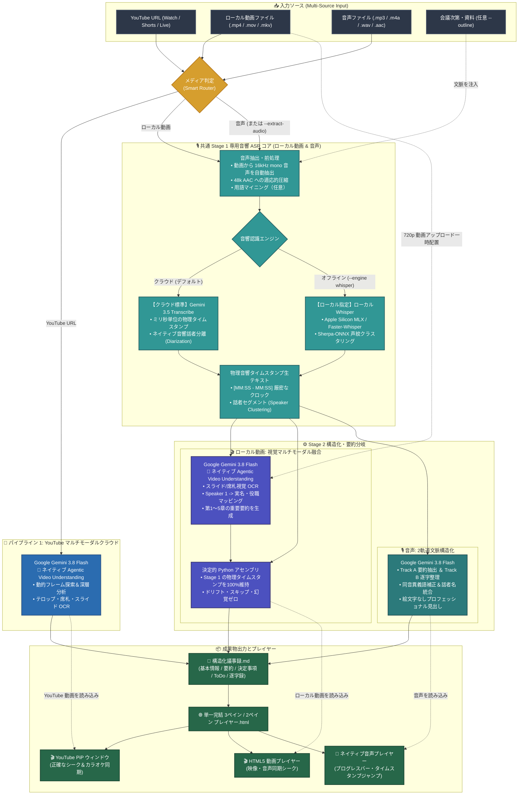

# Meeting Transcribe Agent

[](LICENSE)
[](https://github.com/google-gemini/generative-ai-python)
[](https://ai.google.dev/)
[](https://ai.google.dev/)

[English (en)](README.md) | [繁體中文 (zh-TW)](README.zh-TW.md) | [简体中文 (zh-CN)](README.zh-CN.md) | [日本語 (ja)](README.ja.md) | [한국어 (ko)](README.ko.md)

## プロジェクト概要 (Overview)

**Meeting Transcribe Agent** は、**Gemini 3.5 Transcribe** および **Gemini Agentic Video Understanding** を基盤に構築された、次世代の映像・音声会議録生成 AI エージェントです。「マルチモーダル動画処理（YouTube URL / ローカル動画）」と「高精度音声2層構造パイプライン」を兼ね備え、自治体の市政会議、多国籍チームの技術定例会、インタビューや法務証言録取など、「ミリ秒単位の正確なタイムスタンプ」「高精度な話者分離」「構造化された議事録作成」が求められる専門的な現場向けに設計されています。

### メディアに応じたインテリジェントな2系統パイプライン：

1. **YouTube マルチモーダルクラウドパイプライン (YouTube クラウドネイティブ解析)**：
   - **単一リクエストによる圧倒的な処理効率**：**Gemini 3.8 Flash** によるエンドツーエンドの視覚・音声マルチモーダル分析。プレゼン資料（Slide OCR）、席札、ニュースのテロップ字幕を同時に読み取り、発言者の氏名・役職を100%の精度で特定。処理時間とトークン消費を50%削減（32分の動画を約44秒で処理）。
   - **Agentic Video Understanding (`--agentic`)**：動的なマルチターンフレーム探索とツール呼び出しにより、数時間に及ぶ長編動画や複雑な図表スライドを徹底的に分析。
   - **ピクチャー・イン・ピクチャー対応 YouTube プレイヤー**：生成される単一 HTML プレイヤーに YouTube IFrame コントローラーを内蔵。文字起こしテキストの秒数クリックによるシークとカラオケ風リアルタイムハイライトに対応。

2. **ローカル動画2段階融合パイプライン (音声抽出 + マルチモーダル視覚融合)**：
   - **埋め込み字幕グラウンドトゥルース自動抽出**：動画コンテナから WebRTC 埋め込み字幕トラック（`mov_text`、`srt`、`vtt`）または外部 `.srt` を自動抽出し、確定出席者名簿と全体アジェンダを生成。「テキストはテキスト、話者は話者」の原則に基づき、逐字録本文と物理タイムスタンプは 100% 第1段階 ASR が保持。
   - **第1段階 (専用音響 ASR による厳密なタイムスタンプ)**：16kHz mono 音声を抽出し、**Google Gemini 3.5 Transcribe** (クラウド優先) または **Apple Silicon MLX/Whisper + Sherpa-ONNX Diarization** (オフライン) により、ミリ秒単位の物理タイムスタンプ `[MM:SS - MM:SS]` と話者ターニングを確立。
   - **第2段階 (マルチモーダル視覚・議事録融合)**：720p 動画と生テキスト、自動アウトラインを **Gemini 3.8 Flash** に入力。画面内のスライド・席札を認識し、時間範囲付きマッピング（`Speaker ID` + `Time Range` -> 実名・役職）を出力して音響アンダークラスタリングを解消、第1〜5章の重要要約を生成。
   - **3階層アライメントと決定的アセンブリ**：Python コードが3階層（Level 1: 字幕重なり真値 -> Level 2: マルチモーダル時間枠ルール -> Level 3: 会話バトンタッチ校正）で話者を厳密に同定し、専門用語を補正しながらタイムスタンプドリフトゼロを達成。

3. **高精度純粋音声パイプライン (ボイスレコーダー / ポッドキャスト / 音声ファイル)**：
   - **下層：音響文字起こし (Gemini 3.5 Transcribe)**：ミリ秒単位の「単語レベルタイムスタンプ (Word Timestamps)」と物理音響に基づく「話者ダイアライゼーション (Diarization)」を担当し、発言の聞き漏らしやスキップを完全に防止。
   - **上層：文脈的構造化 (Gemini 3.8 Flash)**：文脈理解による同音異義語・専門用語の補正、話者名の正規化、自然な言語表現への洗練を行い、決定事項やToDoリストを自動抽出。
   - **ローカルオフライン備え**：Apple Silicon GPU (MLX) / faster-whisper と Sherpa-ONNX 音響声紋クラスタリングによるローカル実行をサポート。

---

### なぜアーキテクチャで「YouTube」「ローカル動画」「純粋音声」を明確に区別するのか？

会議の文字起こしにおいて、媒体ごとにインフラストラクチャと情報密度が根本的に異なります：

1. **YouTube (クラウドネイティブ・事前インデックス済み音響クロック)**：
   - Google のクラウド基盤が YouTube 動画の自動字幕と時間インデックスを保持しているため、Gemini 3.8 Flash の直接分析により、動画ダウンロード不要で高速かつ正確な処理が可能です。
2. **ローカル動画ファイル (2段階融合・100%の音画同期とスライド読解)**：
   - ローカル動画には事前の音響クロックが存在しないため、LLM 単体での推論は重大な時間ズレと長文打ち切りを招きます。専用 ASR で不変のタイムスタンプを確保し、視覚モデルで画面情報を読み解く2段階融合が最適解となります。
3. **純粋音声モード (音響物理分離・最大のトークン節約)**：
   - ボイスレコーダーやポッドキャストには映像が一切ありません。専用音響モデル（Gemini 3.5 Transcribe / オフライン Whisper）が毎秒わずか ~32 トークンで厳密なタイムスタンプと声紋分離を提供します。

---

### トークン消費量の目安（実測に基づく経験値）

> [!NOTE]
> 実際のトークン消費量は、発言密度、画面の動き、スライドの細かさによって変動します。以下の倍率は、長編会議の実測に基づく参考値（経験則）です：

* **1. 音声2層パイプライン (Pure Audio Pipeline) — `~1x` 基準消費**:
  - **仕組みと消費量**: 音声は1秒あたり約32トークン（1時間の音声で数万〜十数万トークン程度）。
  - **位置づけ**: **最も経済的でトークンを大幅節約**。画面が不要なボイスレコーダー、ポッドキャスト、インタビュー等に特化し、専用の音響モデルが単語タイムスタンプと話者分離を厳密に処理。
* **2. Gemini Agentic Video Understanding — `~2x` 消費**:
  - **仕組みと消費量**: Google の最新技術 [Gemini Agentic Video](https://blog.google/innovation-and-ai/models-and-research/gemini-models/introducing-agentic-video-in-gemini/) を採用。消費量は音声パイプラインの**約2倍程度**。
  - **位置づけ**: **本プロジェクトの全動画パイプラインにおけるネイティブ標準モード**。全フレームを無差別に処理するのではなく、思考キャッシュ（Thinking Cache）と動的なツール呼び出しを組み合わせ、必要な瞬間のみ高解像度フレームを探索。数時間の長編会議や複雑な図表スライドに最適。
* **3. Traditional Gemini Video Understanding — `~3x` 消費**:
  - **仕組みと消費量**: 従来の動画マルチモーダルでは毎秒1フレーム（1 FPS Uniform Sampling）を固定サンプリングするため、トークン消費量が最大（音声の**3倍以上**）。
  - **位置づけ**: **【本プロジェクトでは非採用・比較対照用】**。固定周期サンプリングは静止画面や冗長なフレームを大量に送信し、トークンと待ち時間を浪費します。本プロジェクトは全動画で Agentic 探索技術（`media_processing=types.MediaProcessing.AGENTIC`）をネイティブ標準採用し、この従来手法を刷新しました。

---

## 主な機能と活用シーン

### コア機能
- **YouTube リンク＆動画ファイルの直接サポート**：URL または動画パスを指定するだけで、構造化議事録と再生プレイヤーを一括生成。
- **埋め込み字幕グラウンドトゥルース抽出と絵文字不使用アウトライン**：動画コンテナ字幕（`mov_text`/`srt`）を自動検出し、確定出席者名簿とタイムラインを生成して LLM 推論を支援。
- **階層的話者アライメントと時間範囲マッピング**：時間範囲付き Scoped Mapping と3階層アライメント（字幕重なり -> 視覚時間枠 -> 会話バトンタッチ）により、音響アンダークラスタリングと辞書上書きバグを根絶。
- **視覚的なネームプレート＆スライド OCR 認識**：テロップ字幕やスライドから、登壇者の本名や公職名を自動特定。
- **高精度な話者分離と発言タイムスタンプ**：発言者ごとの発言区間と名前を正確に整理。
- **文脈理解と自然な文章表現**：LLM の前後関係把握により、専門用語や同音異義語を自動補正し、自然な文章に整形。
- **エグゼクティブ向け構造化議事録**：基本情報、エグゼクティブサマリー、重要決定事項、議題別分析、アクションアイテム（ToDo）を網羅。
- **外部依存ゼロのインタラクティブ HTML プレイヤー**：クリックで該当秒数へジャンプ、話者ごとの色分け、リアルタイム検索、多言語UI切り替えに対応した単一 HTML ファイルを出力。

### 活用シーン
1. **自治体・官公庁の公開会議**：YouTube ライブ配信の市政会議などをダウンロード不要で直接読み込み、役職者の名札を認識して議事録化。
2. **長編ウェビナー・技術カンファレンス**：投影スライドと音声を統合し、技術的要点を効率的に要約。
3. **対面での役員会議・多人数ディスカッション**：多数の発言者が入れ替わる長時間の音声でも、声紋のブレを抑えて記録。
4. **ローカル音声認識のバックアップ**：ネットワーク制限時やローカル処理が必要な場合に、オフライン Whisper によるバックアップ処理が可能。

---

## デュアルエンジン設計 (Dual-Engine Architecture)

### 1. クラウド高速モード（デフォルト）
* **2段階モデル連携**：**Google Gemini 3.5 Transcribe**（音響認識・話者分離）＋ **Gemini 3.8 Flash**（構造化・議事録作成）。
* **スマート音声前処理 (Smart Ingestion)**：ビットレートを自動判定。低ビットレートはそのまま送信し、高ビットレートは最適な 16kHz mono へ自動圧縮。
* **デュアルトラック並行処理（話者識別を統一）**：まず唯一の権威ある話者対応表を確定し、その上で「要約・決定事項」と「長文逐字録の校正」を非同期並行で生成——両トラックが同じ話者識別を共有するため表記のブレがなく、待機時間も大幅に短縮。
* **完全プライベート（ゼロ保持）**：Google Cloud Storage への一時アップロードデータは、処理完了後に `finally` 処理で自動削除。

### 2. ローカル音声認識バックアップモード（Whisper + Sherpa-ONNX）
* **オフライン音響認識**：クラウド接続が制限されている環境で、第1段階の文字起こしと話者分離をローカルモデルで実行。
* **ハードウェアアクセラレーション**：Apple Silicon GPU (`mlx-whisper`) または CPU/CUDA (`faster-whisper`) に対応。
* **声紋ベクトルクラスタリング**：**Sherpa-ONNX (3D-Speaker / PyAnnote)** によるローカル声紋抽出。
* **スライディングウィンドウ整列**：単語タイムスタンプと声紋区間をミリ秒精度で正確にマッチング。

---

## エージェント対話プロンプト集 (Prompt Guide)

本プロジェクトは **AI Agent Skill** としての利用を前提としています。複雑なコマンドを手動入力する必要はなく、エージェントへ自然言語で指示するだけで自動実行されます：

### よく使われるプロンプト例：

1. **YouTube 動画の会議書き起こし（名札・スライドの視覚認識）**：
   > 「YouTube の市政会議 `https://www.youtube.com/watch?v=VIDEO_ID` を文字起こしして、画面のネームプレートやスライドを参考に構造化議事録とプレイヤーを作成してください。」

2. **YouTube 長編会議の深層探索（Agentic Video Understanding）**：
   > 「この 3 時間の YouTube カンファレンス `https://www.youtube.com/watch?v=...` について、Agentic Video モードを使って重要なスライドを探索し、各スピーカーの結論をまとめてください。」

3. **ローカル動画ファイルの処理（スライド内容の抽出）**：
   > 「会議動画 `tech_summit.mp4` を文字起こししてください。スライド画面も確認して、専門用語と話者名を正しく反映してください。」

4. **動画から音声を抽出して高速処理（トークン節約）**：
   > 「この動画 `interview.mp4` は定点カメラなので、音声を抽出して純粋音声モードで処理し、トークンを節約して要約を作成してください。」

5. **標準的な音声会議の文字起こし（クラウド高速処理）**：
   > 「会議録音 `meeting.mp3` を文字起こしして、重要要約、決定事項、逐字録プレイヤーを生成してください。」

6. **アジェンダ／次第の事前読み込み（推奨：名前・専門用語の精度向上）**：
   > 「技術会議の録音 `backend_sync.m4a` と次第 `agenda.md` です。参加者の役職や専門用語を照合しながら文字起こししてください。」

7. **議事録出力言語の指定（多国籍チーム向け）**：
   > 「Please transcribe `executive_call.mp3`. Keep the verbatim transcript in original languages, but generate the executive summary and action items in Japanese.」

---

## 処理パイプライン概要 (Pipeline Architecture)



### パイプラインの詳細ステップ (Pipeline Steps Explained)

#### ステップ 1：入力メディアの自動判定 (Smart Router)
- **YouTube URL**：**🎥 パイプライン 1: YouTube マルチモーダルクラウド** へ自動ルーティング。
- **ローカル動画ファイル**（`.mp4`, `.mov`, `.mkv`, `.webm`）：**🎬 パイプライン 2: ローカル動画2段階融合パイプライン** へルーティング。
- **音声ファイル**（`.mp3`, `.m4a`, `.wav` 等）または `--extract-audio` 指定時：**🎙️ パイプライン 3: 音声2層パイプライン** へルーティング。

---

#### ステップ 2A：YouTube マルチモーダルクラウドパイプライン処理
1. **クラウド直接解析 / ダウンロード不要**：API へ直接 URL を渡し、ダウンロード不要で解析（429制限を回避）。
2. **ネイティブ Agentic Video Understanding**：
   - `types.MediaProcessing.AGENTIC` を全面標準採用。動的フレーム探索とツール呼び出しにより、スライド・テロップ・席札を重要局面で高精度 OCR し、数十秒で高品質要約を生成。
3. **ワンステップ抽出**：実名・役職付きの6大章構成の構造化議事録とタイムスタンプ付き逐字録を一括生成。

---

#### ステップ 2B：ローカル動画2段階融合パイプライン処理
1. **第1段階 (共通専用音響 ASR コア)**：
   - 自動で 16kHz mono 音声を抽出（キャッシュ機能により重複抽出を回避）。
   - **純粋な音声パイプラインと100%同一の Stage 1 音響 ASR コアを共有**（48k AAC 圧縮、Cloud Storage 一時配置、`gemini-3.5-transcribe` またはローカル `whisper`）。ミリ秒単位の物理タイムスタンプ `[MM:SS - MM:SS]` を生成し、`--only-transcript` による逐字録先行出力にも完全対応。
2. **第2段階 (マルチモーダル視覚融合)**：
   - 720p H.264 に圧縮して Cloud Storage へ一時配置（完了後即時削除）。
   - 動画と第1段階のテキストを `gemini-3.8-flash` に渡し、**ネイティブ Agentic Video Understanding** で画面内のスライド・席札を OCR。`Speaker 1` を実名・役職へマッピングし、第1〜5章の重要要約を生成。
3. **決定的アセンブリ**：
   - Python コードが視覚的マッピングを逐字録へ適用。物理タイムスタンプを厳格に保持し、時間ズレ 0 を達成。

---

#### ステップ 2C：音声2層処理 (純粋な音声録音)
1. **第1段階 (共通専用音響 ASR コア)**：
   - ローカル動画と完全に同一の Stage 1 音響 ASR コアを使用：ビットレート判定、48k AAC 圧縮、`gemini-3.5-transcribe`（クラウド）または `mlx-whisper` + Sherpa-ONNX（ローカルオフライン）。
   - 用語・次第ファイルの事前マイニング（`--outline`）に対応。
2. **第2段階 (文脈構造化)**：
   - `gemini-3.8-flash` による2軌道並行構造化（Track A 要約抽出 ＆ Track B 逐字整理）。同音異義語補正、話者名統合、絵文字なしのプロフェッショナルな議事録を出力。

---

#### ステップ 3：成果物の出力 (Delivery)
- **構造化議事録 Markdown**：`<ファイル名>_會議記錄.md` として保存。
- **インタラクティブ HTML プレイヤー**：`<ファイル名>_player.html` を出力。YouTube 映像との同期や、ローカル動画・音声再生バー、カラオケハイライトを標準搭載。

---

## インストールとデプロイガイド (Installation & Deployment)

Meeting Transcribe Agent は、2つの異なる実行・インストール形態をサポートしています：

| 実行プラットフォーム | インストール・デプロイ方式 | 必須環境変数設定 | 主な操作インターフェース |
| :--- | :--- | :--- | :--- |
| **Google Antigravity** | AI Agent Skill として作業スペースにインストール | プロジェクト直下 `.env` 設定ファイル | Antigravity IDE / CLI 対話ウィンドウ（自然言語指示 `SKILL.md`） |
| **Gemini Enterprise** | `deploy.sh` 経由で Vertex AI Agent Runtime へデプロイ | `deploy.sh` 引数または `gemini-enterprise/.env` | Gemini Enterprise 企業ポータル、Vertex AI Agent Engine、A2A プロトコル |

---

### 前提条件 (Common Prerequisites)

1. **FFmpeg**（音声・動画のメタデータ解析および最適圧縮）：
   - **macOS**: `brew install ffmpeg`
   - **Ubuntu/Debian**: `sudo apt update && sudo apt install ffmpeg`
   - **Windows**: `winget install Gyan.FFmpeg`

2. **Google Cloud 認証 (ADC)**：
   Gemini API は Vertex AI および Application Default Credentials (ADC) を使用します：
   ```bash
   gcloud auth application-default login
   ```

---

### 方法 1：Google Antigravity インストール (ローカル AI Agent スキル & CLI)

AI Agent のローカルスキルとして Antigravity に導入し、IDE や CLI から自然言語で会議録を生成、または Python CLI からスタンドアロンで実行します：

1. **Skill を Antigravity にインストール**：
   - **グローバルスキル (Global Skill)**（すべての作業スペースで利用可能、推奨）：
     ```bash
     git clone https://github.com/sylphlin/meeting-transcribe-agent.git ~/.gemini/config/skills/meeting-transcribe-agent
     ```
   - **ワークスペース専用スキル (Workspace Skill)**（現在の作業スペースのみ）：
     ```bash
     git clone https://github.com/sylphlin/meeting-transcribe-agent.git .agent/skills/meeting-transcribe-agent
     ```

2. **Python 依存パッケージのインストール**：
   ```bash
   pip install google-genai google-cloud-storage
   ```
   *（オフライン Whisper バックアップ利用時は `pip install mlx-whisper sherpa-onnx` または `pip install faster-whisper sherpa-onnx`）。*

3. **環境変数の設定 (`.env`)**：
   `.env.example` を `.env` にコピーし、モデル location を `global`、クラウドリソース region を `us-central1` に指定します：
   ```bash
   cp .env.example .env
   ```
   `.env` 設定例：
   ```bash
   GOOGLE_CLOUD_PROJECT=your-gcp-project-id
   GOOGLE_CLOUD_LOCATION=global
   GCP_REGION=us-central1
   MEETING_STORAGE_BUCKET=meeting-transcribe-your-gcp-project-id
   TRANSCRIBE_MODEL=gemini-3.5-transcribe-preview
   SUMMARY_MODEL=gemini-3.8-flash
   ```
   *（クラウド Gemini でローカルファイルを処理する場合、事前にバケットを作成できます：`gcloud storage buckets create gs://meeting-transcribe-your-gcp-project-id --location=us-central1`）。*

4. **Antigravity での利用**：
   Antigravity が `SKILL.md` を自動検出します。チャット欄で自然言語で依頼するだけで完了します：
   > 「役員定例会の録音 `meeting.mp3` を文字起こしして、重要要約、決定事項、逐字録プレイヤーを生成してください。」

---

### 方法 2：Gemini Enterprise インストール (クラウド Vertex AI Agent Runtime デプロイ)

Google ADK 2.0 および `agents-cli` を使用し、Vertex AI Agent Runtime（Agent Engine / Reasoning Engine）へ企業向けマネージドサービスとしてデプロイします。

本デプロイフローは **100% ネイティブ `gcloud`** で実行され、Terraform などの外部ツールに依存せず、Google Cloud Shell からそのままワンクリックで実行可能です：

1. **デプロイ CLI ツールの導入 (`uv` および `google-agents-cli`)**：
   ```bash
   uv tool install google-agents-cli
   ```

2. **`./deploy.sh` による自動ワンクリックデプロイ**：
   内蔵のデプロイスクリプトがエンドツーエンドのデプロイを完全自動で処理します：
   - GCS バケット `gs://meeting-transcribe-${PROJECT_ID}` の作成/検証、24 時間 CORS 設定、および自動ライフサイクル削除ルール（`raw/` 一時ファイルは 2 日後に自動削除、議事録とプレイヤーは 30 日保存）。
   - 専用サービスアカウント `meeting-transcribe-sa` の作成と最小権限の付与 (`roles/storage.objectUser`, `roles/aiplatform.user`, `roles/logging.logWriter`)。
   - `agents-cli deploy` による Vertex AI Agent Runtime へのコードパッケージとデプロイ。
   - Gemini Enterprise へのエージェント自動検出と拡張機能登録。

   ```bash
   chmod +x deploy.sh

   # 自動デプロイ（.env を読み込み、gcloud でクラウドリソースを作成、デプロイ、Gemini Enterprise 連携を一括実行）：
   ./deploy.sh

   # またはプロジェクトとリージョンを指定：
   ./deploy.sh --project YOUR_GCP_PROJECT_ID --region us-central1

   # ドライラン確認：
   ./deploy.sh --dry-run
   ```

3. **エンタープライズ統合と成果物共有**：
   - **Web インターフェース**：Gemini Enterprise ポータルのエージェント一覧から選択して即座に利用可能。
   - **Agent Engine**：Vertex AI Reasoning Engine API または Agent-to-Agent (A2A) プロトコル経由で他のエージェントと連携可能。
   - **成果物の安全共有**：生成された Markdown 議事録と HTML プレイヤーは GCS に自動保存され、**24 時間有効な署名付き URL (Signed URLs)** が返却されます。ログイン不要で即座にブラウザで確認できます。

---

## プロジェクトディレクトリ構造

```text
meeting-transcribe-agent/
├── SKILL.md                          # Agent Skill 運用マニュアル・引数定義
├── README.md                         # 英語版プロジェクト概要・技術仕様
├── README.ja.md                      # 日本語版プロジェクトドキュメント
├── LICENSE                           # MIT ライセンス
├── .gitignore                        # テストメディア・ローカルキャッシュの除外
├── .env.example                      # Antigravity Skill 用環境変数サンプル
├── meeting_transcribe.py             # ルート CLI エントリポイント
├── deploy.sh                         # 100% ネイティブ gcloud 自動デプロイスクリプト (Cloud Shell 対応)
├── scripts/                          # コアモジュール
│   ├── __init__.py
│   ├── meeting_transcribe.py         # パイプライン制御スクリプト
│   ├── audio_utils.py                # 音声ビットレート検出・FFmpeg 前処理
│   ├── gemini_engine.py              # Gemini 3.5 Transcribe 認識 & 3.8 Flash 再構成
│   ├── diarization.py                # ローカル話者分離 (Sherpa-ONNX)
│   ├── glossary.py                   # 専門用語・人名マイニング
│   ├── canonicalizer.py              # 話者名の正規化・名寄せ
│   └── html_generator.py             # 独立 HTML プレイヤー生成
├── assets/                           # テンプレートおよびプロンプト
│   ├── audio_player_template.html    # 音声用 2 ペインプレイヤーテンプレート
│   ├── video_player_template.html    # 動画用 3 ペインプレイヤーテンプレート
│   └── prompts/                      # プロンプトテンプレート群
└── gemini-enterprise/                # Gemini Enterprise (ADK 2.0 / Vertex AI) デプロイ一式
    ├── deploy.sh                     # ルート deploy.sh への転送スクリプト
    ├── agents-cli-manifest.yaml      # agents-cli デプロイ定義
    └── app/                          # エンタープライズエージェント実装
```

---

## 発展：開発者向けコマンドライン実行 (Developer & Headless CLI)

> [!TIP]
> **一般ユーザーの方へ**：AI Agent（Antigravity 等）経由で利用する場合、**手動でコマンドを入力する必要はありません**。エージェントが対話内容に応じて `SKILL.md` を参照し最適なパラメータを自動構成します。

### 基本的な実行（YouTube 動画）
```bash
# YouTube 動画の直接文字起こし＆プレイヤー生成（ネイティブ Agentic Video 認識）
python3 meeting_transcribe.py "https://www.youtube.com/watch?v=VIDEO_ID"
```

### 基本的な実行（音声およびローカル動画ファイル）
```bash
# クラウドデフォルトモード（純粋な音声）
python3 meeting_transcribe.py "meeting_record.mp3"

# ローカル動画2段階融合（音声を抽出し Stage 1 ASR を共用、動画をステージングして Agentic 視覚融合）
python3 meeting_transcribe.py "presentation.mp4"

# ローカルオフラインバックアップ実行（Apple Silicon GPU / Sherpa-ONNX）
python3 meeting_transcribe.py "meeting_record.mp3" --engine whisper --whisper-backend auto
```

### 主な引数一覧

| 引数 | 説明 | デフォルト値 |
| :--- | :--- | :--- |
| `input_source` | 音声/動画ファイルパス または YouTube URL | *(必須)* |
| `-o, --output` | 出力先 Markdown ファイルパス | `<ファイル名>_minutes.md` |
| `--agentic` | すべての動画ソースで Agentic Video 理解モードが標準でネイティブ有効化 | `True` |
| `--extract-audio` | 動画から音声を抽出して音声パイプラインで処理 | `False` |
| `--engine` | 音声認識エンジン：`gemini` (クラウド) または `whisper` (ローカル) | `gemini` |
| `--whisper-backend` | オフラインバックエンド：`auto`, `mlx`, `faster-whisper` | `auto` |
| `--whisper-model` | Whisper モデルサイズ (`tiny`, `base`, `small`, `medium`, `large-v3`) | `small` |
| `--no-diarization` | 話者分離を無効化 | `False` |
| `--clustering-threshold` | Sherpa-ONNX クラスタリング閾値 | `0.68` |
| `--num-speakers` | 参加人数（既知の場合指定、-1 は自動検出） | `-1` |
| `--embedding-type` | Sherpa-ONNX 声紋抽出モデル (`eres2net`, `cam++`) | `eres2net` |
| `--project` | Vertex AI 用 Google Cloud プロジェクト ID | `None` (ADC/環境変数) |
| `--region` | Vertex AI 用 Google Cloud リージョン | `global` |
| `--bucket` | ローカル音声/動画のステージング用 GCS bucket 名 | `MEETING_STORAGE_BUCKET` 環境変数 |
| `--transcribe-model` | クラウド音声認識モデル (デフォルト: `TRANSCRIBE_MODEL`) | `gemini-3.5-transcribe-preview` |
| `--summary-model` | 構造化議事録・視覚理解モデル (デフォルト: `SUMMARY_MODEL`) | `gemini-3.8-flash` |
| `--outline` | 会議通知・次第ファイルパス (.txt / .md) | `None` |
| `--no-player` | インタラクティブ HTML プレイヤーの出力を無効化 | `False` |
| `--summary-language` | 議事録の出力言語指定 (`auto`, `ja`, `en`, `zh-TW` 等) | `None` (auto) |
| `--serve` | ローカル HTTP サーバーを自動起動しブラウザを開く (YouTube 再生推奨) | `False` |

---

## ライセンス (License)

本プロジェクトは [MIT License](LICENSE) のもとで公開されています。
