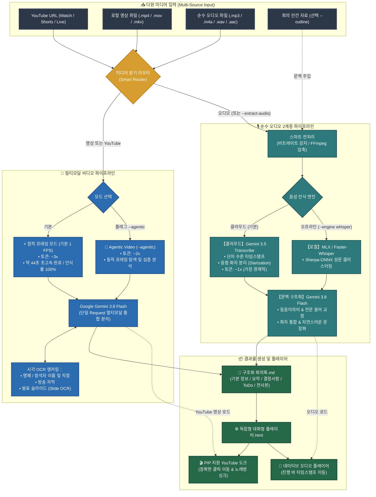

# Meeting Transcribe Agent

[](LICENSE)
[](https://github.com/google-gemini/generative-ai-python)
[](https://ai.google.dev/)
[](https://ai.google.dev/)

[English (en)](README.md) | [繁體中文 (zh-TW)](README.zh-TW.md) | [简体中文 (zh-CN)](README.zh-CN.md) | [日本語 (ja)](README.ja.md) | [한국어 (ko)](README.ko.md)

## 📖 프로젝트 개요 (Overview)

**Meeting Transcribe Agent**는 **Gemini 3.5 Transcribe** 및 **Gemini Agentic Video Understanding**을 기반으로 구축된 올인원 영상 및 음성 회의록 생성 AI 에이전트입니다. "멀티모달 비디오 처리 (YouTube URL 및 로컬 영상)"와 "고정밀 순수 오디오 2계층 파이프라인"을 갖추고 있으며, 공공 시정 회의, 글로벌 테크 싱크업, 심층 인터뷰 및 법적 증언 녹취 등 "밀리초 단위의 정확한 타임스탬프", "화자 분리 (Diarization)", "구조화된 회의록 요약"이 필수적인 전문 업무 환경을 위해 설계되었습니다.

### 미디어 유형별 듀얼 트랙 파이프라인：

1. **🎥 멀티모달 비디오 파이프라인 (YouTube 링크 / 로컬 영상 파일)**:
   - **단일 Request 극상의 효율**: **Gemini 3.8 Flash**를 통해 엔드투엔드 시각-음성 멀티모달 분석을 직접 수행합니다. 발표 슬라이드(Slide OCR), 발표자 명패 및 자막을 동시에 인식하여 화자의 이름과 직함을 100% 식별하며, 토큰 소모와 대기 시간을 50% 절감합니다 (32분 영상 기준 약 44초 소요).
   - **Agentic Video Understanding (`--agentic`)**: 동적 프레임 탐색 및 도구 호출을 지원하여, 수 시간 분량의 장시간 영상이나 복잡한 아키텍처 슬라이드를 심층 분석합니다.
   - **PIP(화면 속 화면) 지원 YouTube 플레이어**: 생성된 단일 독립형 HTML 플레이어에 YouTube IFrame 컨트롤러를 내장하여 타임스탬프 클릭 이동 및 노래방 스타일 실시간 하이라이트를 지원합니다.

2. **🎙️ 순수 오디오 고정밀 파이프라인 (녹음기 / 팟캐스트 / 음성 파일)**:
   - **하위 음향 전사 (Gemini 3.5 Transcribe)**: 밀리초 단위의 단어 수준 타임스탬프(Word Timestamps)와 물리 음향 기반 화자 분리(Diarization)를 수행하여 음성 누락을 완벽히 차단합니다.
   - **상위 의미론적 재구성 (Gemini 3.8 Flash)**: 문맥 이해를 바탕으로 동음이의어 및 전문 용어를 교정하고 화자명을 정규화하여 구조화된 결정 사항과 액션 아이템을 도출합니다.
   - **로컬 오프라인 백업**: Apple Silicon GPU (MLX) / faster-whisper와 Sherpa-ONNX 음향 성문 클러스터링을 통한 로컬 실행을 지원합니다.

---

### 💡 왜 "비디오(YouTube/로컬 영상)"와 "순수 오디오"를 분리하여 처리하는가?

실제 회의 전사 환경에서 "영상이 있는 미디어"와 "순수 음성"이 담고 있는 정보의 밀도는 근본적인 차이가 있습니다:

1. **비디오 모드 (시각적 맥락 유지, 화자 식별률 100%)**:
   - **시각적 OCR 기반 화자 식별**: 회의에는 명패, 방송 자막, 발표 슬라이드가 포함되어 있습니다. 음원만 추출할 경우 시각적 단서가 유실되어 자기소개를 하지 않는 발표자의 신원을 파악할 수 없습니다.
   - **단일 Request의 극대화된 효율**: 비디오를 멀티모달 모델(Gemini 3.8 Flash)에 직접 전달하면 시각적 텍스트와 음성을 단일 호출로 통합 분석하여, "ASR 전사 후 LLM 재가공" 방식의 2회 호출 지연과 토큰 낭비를 제거합니다.
2. **순수 오디오 모드 (음향 물리 분리 및 토큰 비용 최적화)**:
   - **시각 정보 부재 시 음향 물리 앵커링**: 녹음기나 팟캐스트는 영상이 없습니다. 전용 음향 모델(Gemini 3.5 Transcribe / 오프라인 Whisper + Sherpa-ONNX)이 정밀한 타임스탬프와 화자 분리를 제공합니다.
   - **극대화된 토큰 절감**: 순수 오디오는 초당 약 32 토큰만 소비하므로 장시간 음성을 최저 비용으로 전사할 수 있습니다.

---

### 📊 토큰 소비량 추정치 (경험적 벤치마크)

> [!NOTE]
> 실제 토큰 소비량은 발언 밀도, 화면 움직임, 슬라이드 복잡도에 따라 달라집니다. 아래 배율은 장시간 회의 실측에 기반한 아키텍처 참고용 추정치입니다:

* **1. 순수 오디오 2계층 파이프라인 (Pure Audio Pipeline) — `~1x` 기준 소비량**:
  - **작동 원리 및 소비량**: 음성은 초당 약 32 토큰을 소모합니다 (1시간 기준 수만~십수만 토큰 수준).
  - **포지셔닝**: **가장 경제적이며 토큰을 극대화하여 절약**. 영상이 필요 없는 녹음기, 팟캐스트, 인터뷰 등에 특화되어 전용 음향 모델이 단어 타임스탬프와 화자 분리를 엄격하게 처리합니다.
* **2. Gemini Agentic Video Understanding — `~2x` 소비량**:
  - **작동 원리 및 소비량**: Google의 최신 [Gemini Agentic Video](https://blog.google/innovation-and-ai/models-and-research/gemini-models/introducing-agentic-video-in-gemini/) 기술을 적용했습니다. 소비량은 순수 오디오 기준 **약 2배 수준**입니다.
  - **포지셔닝**: **본 프로젝트 권장 영상 심층 이해 모드 (`--agentic`)**. 모든 프레임을 무차별 스캔하는 대신 씽킹 캐시(Thinking Cache)와 동적 도구 호출을 결합하여 필요한 순간에만 고해상도 프레임을 탐색합니다. 수 시간 길이의 영상이나 복잡한 슬라이드 분석에 최적화되어 있습니다.
* **3. Traditional Gemini Video Understanding — `~3x` 소비량**:
  - **작동 원리 및 소비량**: 기존 영상 멀티모달은 초당 1프레임(1 FPS Uniform Sampling)을 고정 샘플링하므로 토큰 소모량이 가장 큽니다 (순수 오디오 대비 **약 3배 이상**).
  - **포지셔닝**: **【본 프로젝트 미적용, 비교 참조용】**. 고정 주기 샘플링은 정지 화면이나 불필요한 프레임을 과도하게 전송하여 토큰과 대기 시간을 낭비합니다. 본 프로젝트는 YouTube 직접 스트리밍과 Agentic 탐색을 통해 이 기존 방식을 완전히 대체했습니다.

---

## 🎯 핵심 기능 및 적용 시나리오

### 주요 기능
- 📺 **YouTube 링크 및 비디오 파일 직접 지원**: URL 또는 영상 파일 경로를 입력하면 구조화된 회의록과 대화형 플레이어를 원클릭으로 생성합니다.
- 👁️ **시각적 명패 및 슬라이드 OCR 인식**: 영상 화면의 자막, 명패, 발표 자료를 분석하여 발언자의 실명과 직책을 자동 매핑합니다.
- 🎙️ **정밀한 화자 분리 및 타임스탬프 전사**: 각 참석자의 발언 구간과 발언 내용을 명확하게 정리합니다.
- ✍️ **문맥 이해 및 자연스러운 문장 다듬기**: LLM의 문맥 이해를 통해 전문 용어와 동음이의어를 교정하고 매끄러운 텍스트를 완성합니다.
- 📋 **임원급 구조화 회의록**: 회의 개요, 핵심 요약, 주요 결정 사항, 안건별 논의 분석 및 액션 아이템(ToDo)을 제공합니다.
- 🌐 **외부 의존성 제로 대화형 HTML 플레이어**: 클릭 이동, 화자별 색상 구분, 실시간 검색, 다국어 UI 전환이 가능한 단일 HTML 파일을 생성합니다.

### 추천 활용 시나리오
1. **지자체 및 공공기관 공개 회의**: YouTube 라이브 스트리밍 영상을 다운로드 없이 바로 입력하여 단체장 및 간부들의 명패를 인식하고 회의록 작성.
2. **기술 세미나 및 제품 발표회**: 발표 자료와 음성을 통합하여 핵심 기술 요약 도출.
3. **다자간 대면 회의 녹음**: 다수의 참석자가 번갈아 발언하는 장시간 회의에서도 음향 성문 드리프트를 억제하여 기록.
4. **로컬 전사 백업 요구 환경**: 네트워크가 제한된 환경에서 오프라인 Whisper + Sherpa-ONNX를 활용하여 로컬 전사 수행.

---

## 🚀 듀얼 엔진 아키텍처

### 1. 클라우드 고속 모드 (기본)
* **듀얼 모델 협업**: **Google Gemini 3.5 Transcribe** (음향 전사 및 화자 분리) + **Gemini 3.8 Flash** (구조화 및 회의록 작성).
* **스마트 오디오 전처리 (Smart Ingestion)**: 비트레이트를 자동 감지하여 저비트레이트는 원본 전송, 고비트레이트는 16kHz mono로 최적 압축.
* **듀얼 트랙 비동기 병렬 처리 (화자 식별 통일)**: 먼저 하나의 권위 있는 화자 매핑 표를 확정한 뒤, "요약/결정사항"과 "장문 전사 교정"을 병렬로 분리 생성 — 두 트랙이 동일한 화자 식별을 공유하므로 표기가 어긋나지 않으며, 응답 대기 시간도 단축.
* **데이터 잔여물 제로 (Zero-Retention)**: Google Files API로 전송된 데이터는 처리가 끝나면 `finally` 블록에서 자동 영구 삭제.

### 2. 로컬 음성 전사 백업 모드 (Whisper + Sherpa-ONNX)
* **로컬 음향 전사 백업**: 클라우드 연결이 불가능하거나 로컬 처리가 필요할 때 1단계 전사 및 화자 분리를 로컬에서 수행.
* **하드웨어 가속**: Apple Silicon GPU (`mlx-whisper`) 또는 CPU/CUDA (`faster-whisper`) 가속 지원.
* **성문 벡터 클러스터링**: **Sherpa-ONNX (3D-Speaker / PyAnnote)**를 통합하여 로컬 성문 추출 수행.
* **슬라이딩 윈도우 정렬**: 선형 듀얼 포인터 스캔을 통해 단어 타임스탬프와 성문 구간을 밀리초 단위로 정합.

---

## 🤖 에이전트 대화 프롬프트 가이드

본 프로젝트는 **AI Agent Skill**로 사용하는 것을 권장합니다. 복잡한 명령어를 외울 필요 없이 채팅창에서 에이전트에게 자연어로 요청하면 됩니다:

### 추천 프롬프트 예시:

1. **📺 YouTube 영상 회의 전사 (명패 및 슬라이드 시각 인식)**:
   > "YouTube의 이 시정 회의 `https://www.youtube.com/watch?v=VIDEO_ID`를 전사해줘. 화면 속 명패와 슬라이드를 참조하여 구조화된 회의록과 대화형 플레이어를 만들어줘."

2. **🤖 YouTube 장시간 회의 심층 분석 (Agentic Video Understanding)**:
   > "3시간짜리 YouTube 세미나 `https://www.youtube.com/watch?v=...`야. Agentic Video 모드를 사용해서 주요 발표 슬라이드를 탐색하고 핵심 결론을 정리해줘."

3. **🎥 로컬 영상 파일 처리 (슬라이드 내용 추출)**:
   > "회의 영상 `tech_summit.mp4`를 전사해줘. 화면의 프레젠테이션 자료를 확인해서 전문 용어와 화자 이름을 정확히 반영해줘."

4. **⚡ 영상에서 음성만 추출하여 처리 (토큰 절약)**:
   > "이 영상 `interview.mp4`는 고정 앵글이라 화면 정보가 중요하지 않아. 음성만 추출해서 순수 오디오 파이프라인으로 돌려줘."

5. **🎙️ 표준 오디오 회의 전사 (클라우드 고속 처리)**:
   > "회의 녹음 파일 `meeting.mp3`를 전사하고 핵심 요약, 결정 사항, 플레이어를 만들어줘."

6. **📑 회의 안건/식순 사전 제공 (추천: 이름 및 용어 정확도 극대화)**:
   > "기술 회의 녹음 `backend_sync.m4a`와 안건 파일 `agenda.md`야. 참석자 직함과 기술 용어를 대조하면서 전사해줘."

7. **🌐 회의록 출력 언어 지정 (다국적 팀 지원)**:
   > "Please transcribe `executive_call.mp3`. Keep the verbatim transcript in original languages, but generate the executive summary and action items in Korean."

---

## 🏗️ 파이프라인 아키텍처



### 🔄 처리 파이프라인 단계 설명

#### 1단계: 입력 미디어 감지 및 스마트 라우팅
- **YouTube URL** 또는 **영상 파일**(`.mp4`, `.mov`, `.mkv`): **🎥 비디오 파이프라인**으로 라우팅.
- **오디오 파일**(`.mp3`, `.m4a`, `.wav`) 또는 `--extract-audio` 지정 시: **🎙️ 오디오 파이프라인**으로 라우팅.

#### 2A단계: 비디오 멀티모달 파이프라인 (YouTube 및 로컬 영상)
1. **클라우드 직접 스트리밍 및 최적화**:
   - **YouTube**: 다운로드 없이 API로 URL을 직접 전달하여 429 요청 제한을 회피합니다.
   - **로컬 영상**: 대용량 파일은 720p H.264로 자동 압축하여 Google Files API에 업로드합니다 (완료 후 즉시 자동 삭제).
2. **단일 Request 통합 분석**:
   - `gemini-3.8-flash`가 화면 OCR(명패, 자막, 슬라이드)과 음성을 동시에 분석합니다.
   - 1회 호출로 정확한 화자명이 포함된 회의록과 타임스탬프 전사본을 한 번에 산출합니다.

#### 2B단계: 오디오 2계층 파이프라인 (순수 오디오 녹음)
1. **스마트 전처리**: 비트레이트를 자동 감지하여 필요 시 16kHz mono로 자동 변환합니다.
2. **용어 및 식순 사전 탐색**: 회의 안건 파일(`--outline`)에서 인명과 고유 명사를 사전에 추출합니다.
3. **하위 음향 전사**: Gemini 3.5 Transcribe 또는 로컬 Whisper + Sherpa-ONNX로 단어 수준 타임스탬프와 화자 분리를 실행합니다.
4. **상위 문맥 구조화**: Gemini 3.8 Flash로 동음이의어를 교정하고 결정 사항과 액션 아이템을 정리합니다.

#### 3단계: 결과물 생성 (Delivery)
- **구조화된 회의록 Markdown**: `<파일명>_會議記錄.md`로 저장.
- **대화형 HTML 플레이어**: `<파일명>_player.html`로 저장 (YouTube PIP 창 및 오디오 컨트롤러 내장). (*참고: YouTube 보안 정책으로 인해 HTTP/HTTPS 출처가 필요합니다. `file://`로 직접 열면 오류 153이 발생하므로 `--serve` 플래그 또는 `python3 -m http.server 8000` 사용을 권장합니다.*)

---

## 📦 설치 및 환경 설정

### 1. 시스템 의존성 (FFmpeg)
오디오 변환 및 비디오 압축에 사용됩니다:
- **macOS**: `brew install ffmpeg`
- **Ubuntu/Debian**: `sudo apt update && sudo apt install ffmpeg`
- **Windows**: `winget install Gyan.FFmpeg`

### 2. Python 패키지 설치

**클라우드 기본 모드**:
```bash
pip install google-genai
```

**로컬 오프라인 백업 모드 (선택 사항)**:
```bash
# Apple Silicon (M1/M2/M3/M4) GPU
pip install mlx-whisper sherpa-onnx soundfile numpy

# Linux / Windows / Intel Mac
pip install faster-whisper sherpa-onnx soundfile numpy
```

---

## ⚙️ 환경 변수 설정

Gemini API 키를 설정합니다:

```bash
# macOS / Linux
export GEMINI_API_KEY="your-gemini-api-key"

# Windows PowerShell
$env:GEMINI_API_KEY="your-gemini-api-key"
```

---

## 💻 CLI 명령어 사용 가이드

> [!NOTE]
> AI Agent Skill로 활용할 때는 터미널 명령어를 직접 입력할 필요 없이 채팅창에서 에이전트에게 요청하시면 됩니다!

### 기본 실행 (YouTube 영상)
```bash
# YouTube 영상 직접 전사 및 플레이어 생성 (초고속 멀티모달 모드)
python3 meeting_transcribe.py "https://www.youtube.com/watch?v=VIDEO_ID"

# Agentic Video Understanding 동적 프레임 탐색 활성화
python3 meeting_transcribe.py "https://www.youtube.com/watch?v=VIDEO_ID" --agentic
```

### 기본 실행 (오디오 및 로컬 파일)
```bash
# 클라우드 기본 모드
python3 meeting_transcribe.py "회의녹음.mp3"

# 로컬 오프라인 백업 실행 (Apple Silicon GPU / Sherpa-ONNX)
python3 meeting_transcribe.py "회의녹음.mp3" --engine whisper --whisper-backend auto
```

### 주요 매개변수 안내

| 매개변수 | 설명 | 기본값 |
| :--- | :--- | :--- |
| `input_source` | 오디오/영상 파일 경로 또는 YouTube URL | *(필수)* |
| `-o, --output` | 회의록 출력 Markdown 경로 | `<파일명>_會議記錄.md` |
| `--agentic` | 영상 Agentic Video 동적 프레임 탐색 활성화 | `False` |
| `--extract-audio` | 영상 파일에서 음원을 추출하여 오디오 파이프라인으로 강제 전환 | `False` |
| `--engine` | 오디오 전사 엔진: `gemini` (클라우드) 또는 `whisper` (로컬) | `gemini` |
| `--whisper-backend` | 오프라인 백엔드: `auto`, `mlx`, `faster-whisper` | `auto` |
| `--whisper-model` | Whisper 모델 크기 (`tiny`, `base`, `small`, `medium`, `large-v3`) | `small` |
| `--no-diarization` | 화자 분리 비활성화 | `False` |
| `--clustering-threshold` | Sherpa-ONNX 클러스터링 임계값 | `0.68` |
| `--num-speakers` | 참석자 수 (알고 있는 경우 지정, -1은 자동 감지) | `-1` |
| `--api-key` | Gemini API 키 수동 지정 | `None` |
| `--outline` | 회의 안건/식순 파일 경로 (.txt / .md) | `None` |
| `--no-player` | 대화형 HTML 플레이어 생성 비활성화 | `False` |
| `--summary-language` | 회의록 생성 언어 지정 (`auto`, `ko`, `en`, `zh-TW` 등) | `None` (auto) |
| `--serve` | 로컬 HTTP 서버를 자동 시작하고 브라우저 열기 (YouTube 영상 재생 권장) | `False` |

---

## 📄 라이선스

이 프로젝트는 [MIT License](LICENSE)를 따릅니다.
