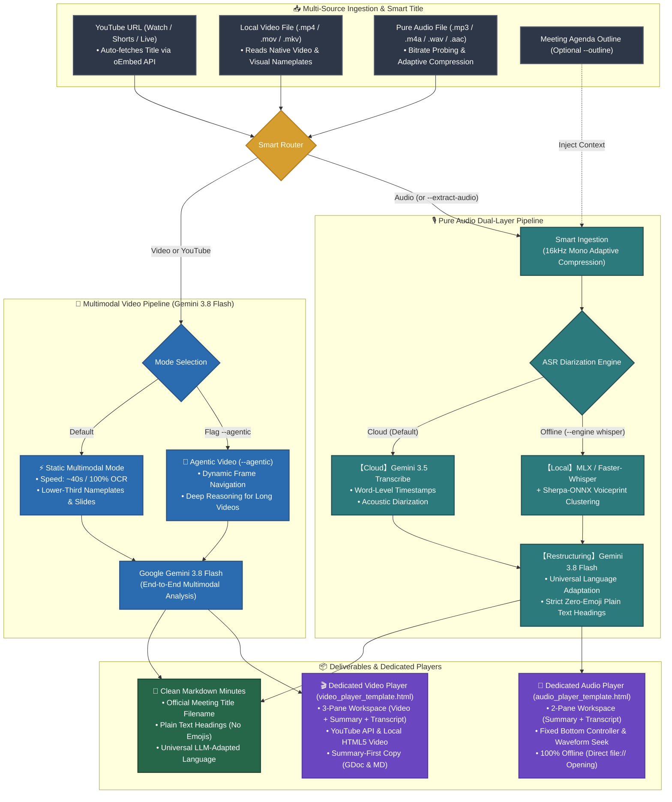

# Meeting Transcribe Agent

[](LICENSE)
[](https://github.com/google-gemini/generative-ai-python)
[](https://ai.google.dev/)
[](https://ai.google.dev/)

[English (en)](README.md) | [繁體中文 (zh-TW)](README.zh-TW.md) | [简体中文 (zh-CN)](README.zh-CN.md) | [日本語 (ja)](README.ja.md) | [한국어 (ko)](README.ko.md)

## 📖 Overview

**Meeting Transcribe Agent** is an end-to-end multimedia meeting minutes generation agent built upon **Gemini 3.5 Transcribe** and **Gemini Agentic Video Understanding**, featuring native **Multimodal Video Processing (YouTube URLs & local video files)** and a **High-Precision Pure Audio Dual-Layer Pipeline**. Designed for municipal executive meetings, cross-border technical standups, and legal depositions requiring exact second-level timestamp precision, canonical speaker diarization, and structured executive minutes.

### Intelligent Bifurcated Pipelines:

1. **🎥 Multimodal Video Pipeline (YouTube URLs / Local Video Files)**:
   - **Single-Request Maximum Efficiency**: Direct end-to-end multimodal analysis powered by **Gemini 3.8 Flash**. Reads slide OCR, speaker desktop nameplates, and TV lower-third captions simultaneously to map speaker names with 100% accuracy, cutting 50% token overhead and latency (~44s for a 32-minute meeting).
   - **Agentic Video Understanding (`--agentic`)**: Dynamic multi-turn frame navigation and tool calling for deep visual exploration across multi-hour videos and intricate technical slides.
   - **Picture-in-Picture YouTube Dock Player**: Standalone zero-dependency HTML player with bidirectional synchronization, seeking, and real-time karaoke scrolling.

2. **🎙️ Pure Audio High-Precision Pipeline (Voice Recorders / Podcasts / Audio Files)**:
   - **Acoustic Transcription (Gemini 3.5 Transcribe)**: Millisecond word-level timestamps and physical acoustic diarization, ensuring every spoken word is physically anchored.
   - **Semantic Restructuring (Gemini 3.8 Flash)**: Contextual homophone correction, speaker role convergence, and natural multilingual fluency, structuring executive summaries and action items.
   - **Local Offline Backup**: Apple Silicon GPU (MLX) / faster-whisper paired with Sherpa-ONNX acoustic speaker embeddings.

---

### 💡 Why Bifurcate "Video (YouTube / Local Files)" and "Pure Audio"?

In real-world meeting transcription, visual video feeds and pure audio streams carry fundamentally different information densities:

1. **Video Mode (Preserves Visual Context with 100% Speaker Recognition)**:
   - **Visual OCR Grounding**: Meetings frequently contain desk nameplates, broadcast lower-third titles, and presentation slides. Demoting video to audio strips away these critical cues, rendering officials who do not self-identify unnamable.
   - **Single-Request Efficiency**: Ingesting video directly into a multimodal model (Gemini 3.8 Flash) fuses visual captions and spoken speech in one pass, eliminating the latency and token overhead of two-step ASR-then-LLM processing.
2. **Pure Audio Mode (Acoustic Diarization & Maximum Token Economy)**:
   - **Acoustic Precision**: Dictaphones and podcasts contain zero visual information. Specialized acoustic models (Gemini 3.5 Transcribe / offline Whisper + Sherpa-ONNX) provide millisecond word-level timestamps and acoustic speaker clustering to prevent skipped lines.
   - **Extreme Token Economy**: Pure audio consumes only ~32 tokens per second, making long audio transcription exceptionally cost-effective.

---

### 📊 Token Consumption Estimates (Empirical Benchmarks)

> [!NOTE]
> Actual token consumption varies based on speech density, visual movement, and slide detail. The multipliers below reflect empirical benchmarks from long-form executive meetings for architectural reference:

* **1. Pure Audio Pipeline — `~1x` Baseline**:
  - **Mechanism & Consumption**: Spoken audio consumes ~32 tokens per second (~tens of thousands to ~100k tokens per hour).
  - **Positioning**: **Most token-efficient and economical**. Designed specifically for audio-only scenarios (dictaphones, podcasts, interviews) where dedicated acoustic models strictly anchor word-level timestamps and speaker boundaries.
* **2. Gemini Agentic Video Understanding — `~2x` Consumption**:
  - **Mechanism & Consumption**: Powered by Google's latest [Gemini Agentic Video](https://blog.google/innovation-and-ai/models-and-research/gemini-models/introducing-agentic-video-in-gemini/) technology. Consumes approximately **2x** the pure audio baseline.
  - **Positioning**: **Recommended deep video understanding mode (`--agentic`)**. Instead of scanning all frames indiscriminately, the model couples thinking cache with dynamic tool calling to inspect high-resolution frames only when relevant. Ideal for multi-hour sessions, slide-dense presentations, and cross-temporal reasoning.
* **3. Traditional Gemini Video Understanding — `~3x` Consumption**:
  - **Mechanism & Consumption**: Traditional video multimodal processing relies on rigid 1 FPS uniform frame sampling, incurring the highest token footprint (approximately **3x or more** compared to pure audio).
  - **Positioning**: **[Not adopted in this project; listed for benchmark comparison only]**. Uniform sampling transmits high volumes of static and redundant frames, inflating token costs and latency. This project replaces this approach with cloud-native direct YouTube ingestion and agentic frame navigation.

---

## 🎯 Core Capabilities & Use Cases

### Key Features
- 📺 **Direct YouTube URL & Video File Support**: Paste YouTube URLs or local video paths for one-click markdown minutes and interactive playback.
- 👁️ **Visual Nameplate & Slide OCR Recognition**: Automatically derives real participant names and official titles from screen lower thirds, desk nameplates, and slides.
- 🎙️ **Precise Speaker Diarization & Verbatim Transcription**: Distinctly maps each participant's speech interval and name.
- ✍️ **Contextual Understanding & Natural Fluency**: Corrects homophone errors and terminology via LLM context awareness, producing naturally flowing text in the target language.
- 📋 **Executive-Grade Structured Minutes**: Automatically generates meeting metadata, executive summaries, decision matrices, topic analyses, and actionable task tables.
- 🌐 **Zero-Dependency Interactive HTML Player**: Generates a self-contained HTML file supporting click-to-seek playback, speaker color highlights, full-text instant search, and multilingual UI switching.

### Ideal Scenarios
1. **Government & Public Municipal Meetings**: Process livestreamed council meetings directly from YouTube, auto-detecting officials' names without downloading files.
2. **Keynotes & Technical Seminars**: Synthesize presentation slides with spoken discourse into crisp technical takeaways.
3. **Multi-Speaker Executive Recordings**: Normalize dozens of alternating speakers, mitigating acoustic voiceprint drift over long sessions.
4. **Local ASR Backup Requirements**: Utilize offline Whisper + Sherpa-ONNX for local acoustic transcription when network connectivity is constrained.

---

## 🚀 Dual-Engine Architecture

### 1. Cloud-Native Turbo Mode (Default)
* **Dual-Model Synergy**: Powered by **Google Gemini 3.5 Transcribe** (acoustic transcription & diarization) and **Gemini 3.8 Flash** (structured synthesis).
* **Smart Audio Ingestion**: Probes audio bitrate automatically. Low-bitrate files pass through directly; high-bitrate audio is adaptively compressed to 16kHz mono.
* **Dual-Track Concurrency**: Separates executive summaries and long verbatim transcription into concurrent tracks with zero thinking budget pre-warming for instant response.
* **Zero-Retention Privacy**: Media uploaded via Google Files API is automatically purged in `finally` blocks upon completion.

### 2. Local ASR Backup Mode (Whisper + Sherpa-ONNX)
* **Local Acoustic Transcription**: Provides offline acoustic transcription and word-level timestamps when cloud ASR is unavailable.
* **Hardware Acceleration**: Supports Apple Silicon GPU native acceleration (`mlx-whisper`) or cross-platform CPU/CUDA (`faster-whisper`).
* **Speaker Clustering**: Integrates **Sherpa-ONNX (3D-Speaker / PyAnnote)** for local voiceprint feature extraction.
* **Sliding Window Alignment**: Linear dual-pointer scanning matches word timestamps with acoustic speaker boundaries.

---

## 🤖 Agent Dialogue & Prompt Guide

This project is primarily designed as an **AI Agent Skill**. You do not need to memorize CLI parameters—simply instruct your Agent in natural language:

### Recommended Prompts:

1. **📺 YouTube Video Transcription (Visual Nameplate & Slide OCR)**:
   > "Please transcribe this municipal meeting on YouTube `https://www.youtube.com/watch?v=Xff98Q5bki8`, using the visual desk nameplates and slides to generate structured minutes and an interactive player."

2. **🤖 YouTube Deep Dive (Agentic Video Understanding)**:
   > "This 3-hour YouTube symposium `https://www.youtube.com/watch?v=...` has complex slides. Please use Agentic Video mode to navigate key frames and summarize architecture diagrams and discussion outcomes."

3. **🎥 Local Video File Processing (Extract Slide Text)**:
   > "Transcribe this conference recording `tech_summit.mp4`. Review the presentation slides on screen to verify speaker names and architecture terms."

4. **⚡ Video Audio Extraction (Maximum Token Economy)**:
   > "This recording `interview.mp4` has a static camera. Please extract the audio track directly and run the pure audio pipeline for maximum token economy."

5. **🎙️ Standard Pure Audio Transcription**:
   > "Please transcribe this meeting audio `meeting.mp3`, and provide an executive summary, action items, and an interactive transcript player."

6. **📑 Ingesting Meeting Agendas / Outlines (Recommended for Exact Names)**:
   > "Here is today's technical meeting audio `backend_sync.m4a` along with the agenda `agenda.md`. Please transcribe it and cross-reference participant titles and technical terms."

7. **🌐 Specifying Summary Language (Multilingual Teams)**:
   > "Please transcribe `executive_call.mp3`. Keep the verbatim transcript in original languages, but generate the executive summary and action items in English."

---

## 🏗️ Pipeline Architecture



### 🔄 Pipeline Steps Explained

The system categorizes processing into **Routing**, **Dual-Track Execution**, and **Delivery**:

#### Step 1: Input Detection, Title Discovery & Smart Routing
- **YouTube URLs** (`youtube.com/watch`, `youtu.be/`, Shorts, Live): Automatically queries YouTube's official oEmbed API to discover the official meeting title (e.g., `臺南市政府第 764 次市政會議`), and routes to the **🎥 Multimodal Video Pipeline**.
- **Local Video Files** (`.mp4`, `.mov`, `.mkv`, `.webm`): Uses file stem or extracts title from visual slides/Section 1, routing directly to the **🎥 Multimodal Video Pipeline** (playable natively in HTML5).
- **Pure Audio Files** (`.mp3`, `.m4a`, `.wav`, `.aac`, `.flac`) or commands with `--extract-audio`: Routed to the **🎙️ Pure Audio Pipeline**.

---

#### Step 2A: Multimodal Video Pipeline (YouTube & Local Video)
1. **Cloud Direct Streaming & Ingestion**:
   - **YouTube**: Streams URL directly into Gemini Multimodal API without downloading files or triggering YouTube 429 rate limits.
   - **Local Video**: Compresses files >250MB to 720p H.264 before uploading to Google Files API (purged automatically in `finally` blocks).
2. **Single-Request End-to-End Analysis**:
   - **Default (Static Multimodal)**: Fast (~40-50s) synthesis aligning visual OCR (desk nameplates, slide text) with audio dialogue.
   - **Agentic Mode (`--agentic`)**: Dynamic multi-turn frame navigation for slide-dense or multi-hour videos.
3. **Universal Plain-Text Formatting**: Emits 6 structured sections with canonical speaker names, contiguous turn consolidation, and timestamped verbatim turns. Headings and labels are dynamically translated into the target language with **zero emojis/icons**.

---

#### Step 2B: Pure Audio Dual-Layer Pipeline (Voice Recordings)
1. **Smart Ingestion**: Probes audio bitrate; low-bitrate passes through, high-bitrate adaptively converts to 16kHz mono.
2. **Terminology Pre-Mining (Optional)**: Extracts participant rosters and specialized vocabulary from `--outline`.
3. **Acoustic Transcription (ASR & Diarization)**:
   - **Cloud Mode (Default)**: Calls `gemini-3.5-transcribe` for acoustic speaker separation and word-level timestamps.
   - **Local Mode (`--engine whisper`)**: Runs Whisper locally on Apple Silicon GPU or CPU with Sherpa-ONNX voiceprint clustering.
4. **Universal Restructuring**:
   - `gemini-3.8-flash` corrects homophones, merges contiguous speaker turns, and synthesizes executive minutes in the target language with clean, professional plain text headings.

---

#### Step 3: Artifact Delivery & Dedicated Interactive Players
1. **Structured Markdown Minutes (`<Meeting Title>_minutes.md`)**:
   - Clean, professional markdown without decorative emojis in headings.
   - Dynamic language localization matching the meeting/user preference.
2. **Dedicated Video Player (`<Meeting Title>_player.html`)**:
   - **3-Pane Workspace**: Top-left video player (YouTube IFrame or local `<video controls>`), bottom-left independent scrolling summary, and right full-height synchronized transcript.
   - **Summary-First Copy Workflow**: Top copy buttons default to copying the Executive Summary, with dropdowns for Full Record or Transcript.
   - *(Note: YouTube security policies require an HTTP/HTTPS referer; use `--serve` or `python3 -m http.server 8000` when streaming YouTube videos).*
3. **Dedicated Audio Player (`<Meeting Title>_player.html`)**:
   - **2-Pane Workspace**: Left executive summary, right synchronized verbatim transcript.
   - **Bottom Audio Controller**: Fixed floating player with keyboard shortcuts, volume slider, playback rate, and waveform seeking.
   - **100% Offline Ready**: Fully functional when opened directly via local file protocol (`file:///...`) without any HTTP server.

### Generated Deliverables:
1. **📄 `<Meeting Title>_minutes.md`**: Clean, structured meeting minutes.
2. **🌐 `<Meeting Title>_player.html`**: Dedicated standalone interactive review player.
3. **📚 `<Meeting Title>_glossary.md`**: Global authoritative terminology table (when mining is enabled).

---

## 📦 Installation & Setup

### 1. System Dependency (FFmpeg)
Used for audio probing and adaptive compression:
- **macOS**: `brew install ffmpeg`
- **Ubuntu/Debian**: `sudo apt update && sudo apt install ffmpeg`
- **Windows**: `winget install Gyan.FFmpeg`

### 2. Python Packages

**Cloud Default Mode**:
```bash
pip install google-genai
```

**Local Offline Backup Mode (Optional)**:
```bash
# Apple Silicon (M1/M2/M3/M4) GPU Acceleration
pip install mlx-whisper sherpa-onnx soundfile numpy

# Linux / Windows / Intel Mac
pip install faster-whisper sherpa-onnx soundfile numpy
```

---

## ⚙️ Environment Variables

Configure your Gemini API key:

```bash
# macOS / Linux
export GEMINI_API_KEY="your-gemini-api-key"

# Windows PowerShell
$env:GEMINI_API_KEY="your-gemini-api-key"
```

---

## 💻 Command-Line Usage

> [!NOTE]
> When used inside Antigravity as an AI Agent Skill, you do not need to run commands manually—simply instruct the agent in the chat!

### Basic Execution (YouTube Video)
```bash
# Direct YouTube processing (Fast multimodal mode)
python3 meeting_transcribe.py "https://www.youtube.com/watch?v=Xff98Q5bki8"

# Enable Agentic Video Understanding for dynamic frame navigation
python3 meeting_transcribe.py "https://www.youtube.com/watch?v=Xff98Q5bki8" --agentic
```

### Basic Execution (Audio & Local Files)
```bash
# Cloud default mode
python3 meeting_transcribe.py "meeting_record.mp3"

# Local offline backup (Apple Silicon GPU / Sherpa-ONNX)
python3 meeting_transcribe.py "meeting_record.mp3" --engine whisper --whisper-backend auto
```

### With Meeting Agenda & Target Summary Language
```bash
python3 meeting_transcribe.py "meeting_record.mp3" --outline "agenda.txt" --summary-language en
```

### CLI Argument Reference

| Argument | Description | Default |
| :--- | :--- | :--- |
| `input_source` | Audio/video path (mp3, m4a, wav, mp4, mov) or YouTube URL | *(Required)* |
| `-o, --output` | Custom markdown output path | `<filename>_會議記錄.md` |
| `--agentic` | Enable Agentic Video Understanding frame navigation (Video/YouTube) | `False` |
| `--extract-audio` | Force extracting audio track to run pure audio pipeline | `False` |
| `--engine` | Audio ASR engine: `gemini` (cloud default) or `whisper` (local backup) | `gemini` |
| `--whisper-backend` | Offline backend: `auto` (auto-detects Apple Silicon MLX), `mlx`, `faster-whisper` | `auto` |
| `--whisper-model` | Offline model size (`tiny`, `base`, `small`, `medium`, `large-v3`) | `small` |
| `--no-diarization` | Disable acoustic voiceprint diarization | `False` |
| `--clustering-threshold` | Sherpa-ONNX clustering threshold | `0.68` |
| `--num-speakers` | Exact speaker count (-1 for auto-detection) | `-1` |
| `--embedding-type` | Sherpa-ONNX model (`eres2net`, `pyannote`, `cam++`) | `eres2net` |
| `--api-key` | Explicit Gemini API Key (defaults to `GEMINI_API_KEY`) | `None` |
| `--transcribe-model` | Cloud ASR model | `gemini-3.5-transcribe` |
| `--summary-model` | Synthesis and vision model | `gemini-3.8-flash` |
| `--outline` | Meeting agenda / outline file path (.txt / .md) | `None` |
| `--force-glossary` | Force re-extracting global glossary | `False` |
| `--no-glossary` | Skip glossary extraction | `False` |
| `--no-player` | Disable interactive HTML player generation | `False` |
| `--no-compress` | Disable FFmpeg pre-compression | `False` |
| `--summary-language` | Summary language (`auto` to follow audio; or `en`, `zh-TW`, `ja`) | `None` (auto) |
| `--only-transcript` | Only output verbatim transcript without structured minutes | `False` |
| `--language` | Offline Whisper language code (`auto`, `en`, `zh`, `ja`) | `auto` |
| `--serve` | Automatically spin up local HTTP server and open browser (recommended for YouTube) | `False` |

---

## 📄 License

This project is licensed under the [MIT License](LICENSE).
