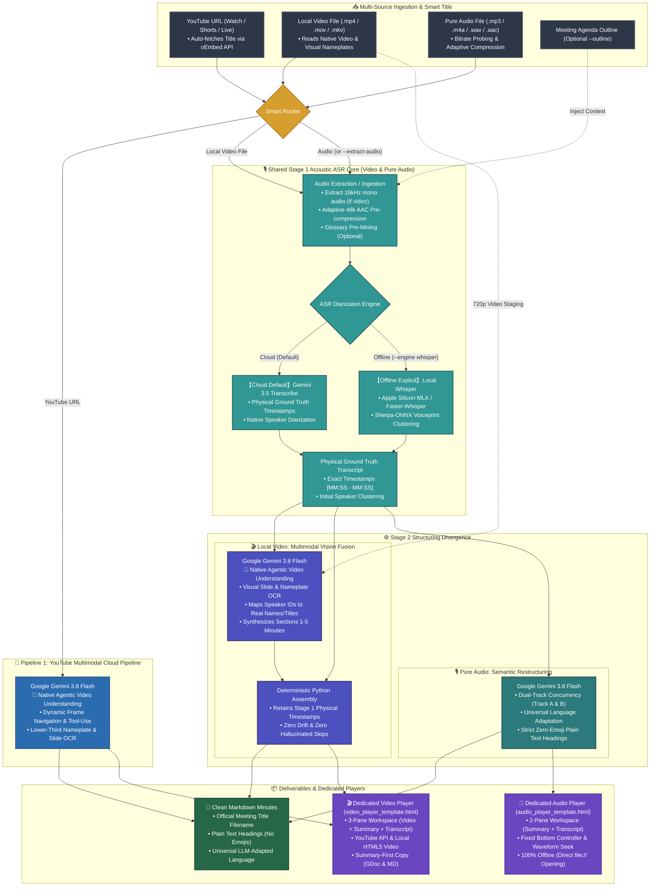

# Meeting Transcribe Agent

[](LICENSE)
[](https://github.com/google-gemini/generative-ai-python)
[](https://ai.google.dev/)
[](https://ai.google.dev/)

[English (en)](README.md) | [繁體中文 (zh-TW)](README.zh-TW.md) | [简体中文 (zh-CN)](README.zh-CN.md) | [日本語 (ja)](README.ja.md) | [한국어 (ko)](README.ko.md)

## Overview

**Meeting Transcribe Agent** is an end-to-end multimedia meeting minutes generation agent built upon **Gemini 3.5 Transcribe** and **Gemini Agentic Video Understanding**, featuring native **Multimodal Video Processing (YouTube URLs & local video files)** and a **High-Precision Pure Audio Dual-Layer Pipeline**. Designed for municipal executive meetings, cross-border technical standups, and legal depositions requiring exact second-level timestamp precision, canonical speaker diarization, and structured executive minutes.

### Intelligent Bifurcated Pipelines:

1. **YouTube Multimodal Pipeline (Cloud Ingestion)**:
   - **Single-Request Maximum Efficiency**: Direct end-to-end multimodal analysis powered by **Gemini 3.8 Flash**. Reads slide OCR, speaker desktop nameplates, and TV lower-third captions simultaneously to map speaker names with 100% accuracy, cutting 50% token overhead and latency (~44s for a 32-minute meeting).
   - **Agentic Video Understanding (`--agentic`)**: Dynamic multi-turn frame navigation and tool calling for deep visual exploration across multi-hour videos and intricate technical slides.
   - **Picture-in-Picture YouTube Dock Player**: Standalone zero-dependency HTML player with bidirectional synchronization, seeking, and real-time karaoke scrolling.

2. **Local Video Two-Stage Fusion Pipeline (Audio Extraction + Multimodal Vision Fusion)**:
   - **Embedded Subtitle Ground Truth Extraction**: Automatically probes video containers for WebRTC embedded captions (`mov_text`, `srt`, `vtt`) or sidecar `.srt` files. Extracted captions serve as ground-truth attendee registers and macro agendas, while Stage 1 ASR retains 100% authority over spoken text and physical timestamps ("Text is text, speakers are speakers").
   - **Stage 1 (Acoustic Ground Truth ASR)**: Extracts 16kHz mono audio and runs speech transcription via **Google Gemini 3.5 Transcribe** (Cloud Primary) or **Local Apple Silicon MLX/Whisper + Sherpa-ONNX Diarization** (Offline Mode) to establish millisecond-accurate physical timestamps `[MM:SS - MM:SS]` and speaker turns.
   - **Stage 2 (Multimodal Vision & Minutes Fusion)**: Ingests the 720p video file alongside the Stage 1 transcript and auto-extracted agenda into **Gemini 3.8 Flash**. Reads visual presentation slides, architecture diagrams, and speaker nameplates, outputting time-scoped speaker mappings (`Speaker ID` + `Time Range` -> Real Name/Title) to eliminate acoustic under-clustering and synthesize Executive Sections 1–5.
   - **3-Level Hierarchical Alignment & Deterministic Assembly**: Python code deterministically reconciles speaker identities using a 3-level hierarchy (Level 1: Subtitle Event Overlap -> Level 2: Multimodal Scoped Rules -> Level 3: Forward Handover Calibration), applying phonetic entity corrections while strictly preserving physical timestamps with 0 drift.

3. **Pure Audio High-Precision Pipeline (Voice Recorders / Podcasts / Audio Files)**:
   - **Acoustic Transcription (Gemini 3.5 Transcribe)**: Millisecond word-level timestamps and physical acoustic diarization, ensuring every spoken word is physically anchored.
   - **Semantic Restructuring (Gemini 3.8 Flash)**: Contextual homophone correction, speaker role convergence, and natural multilingual fluency, structuring executive summaries and action items.
   - **Local Offline Backup**: Apple Silicon GPU (MLX) / faster-whisper paired with Sherpa-ONNX acoustic speaker embeddings.

---

### Why the Architecture Distinguishes "YouTube", "Local Video Files", and "Pure Audio"?

In real-world meeting transcription, visual video feeds and pure audio streams carry fundamentally different information densities:

1. **YouTube (Cloud Native with Pre-computed Acoustic Clock)**:
   - Google's cloud backbone already indexes YouTube videos with pre-computed acoustic timing. Direct cloud ingestion via Gemini 3.8 Flash achieves instantaneous analysis without downloading files.
2. **Local Video Files (Two-Stage Fusion for 100% Temporal Sync & Slide Grounding)**:
   - Local videos lack pre-computed cloud ASR clocks. Single-pass LLM analysis suffers from severe clock drift and output token truncation. Two-stage fusion uses acoustic ASR for immutable timestamps and vision fusion for slide/nameplate reading.
3. **Pure Audio Mode (Acoustic Diarization & Maximum Token Economy)**:
   - Dictaphones and podcasts contain zero visual information. Specialized acoustic models (Gemini 3.5 Transcribe / offline Whisper + Sherpa-ONNX) provide millisecond word-level timestamps and acoustic speaker clustering at only ~32 tokens per second.

---

### Token Consumption Estimates (Empirical Benchmarks)

> [!NOTE]
> Actual token consumption varies based on speech density, visual movement, and slide detail. The multipliers below reflect empirical benchmarks from long-form executive meetings for architectural reference:

* **1. Pure Audio Pipeline — `~1x` Baseline**:
  - **Mechanism & Consumption**: Spoken audio consumes ~32 tokens per second (~tens of thousands to ~100k tokens per hour).
  - **Positioning**: **Most token-efficient and economical**. Designed specifically for audio-only scenarios (dictaphones, podcasts, interviews) where dedicated acoustic models strictly anchor word-level timestamps and speaker boundaries.
* **2. Gemini Agentic Video Understanding — `~2x` Consumption**:
  - **Mechanism & Consumption**: Powered by Google's latest [Gemini Agentic Video](https://blog.google/innovation-and-ai/models-and-research/gemini-models/introducing-agentic-video-in-gemini/) technology. Consumes approximately **2x** the pure audio baseline.
  - **Positioning**: **Native video understanding mode across all video pipelines**. Instead of scanning all frames indiscriminately, the model couples thinking cache with dynamic tool calling to inspect high-resolution frames only when relevant. Ideal for multi-hour sessions, slide-dense presentations, and cross-temporal reasoning.
* **3. Traditional Gemini Video Understanding — `~3x` Consumption**:
  - **Mechanism & Consumption**: Traditional video multimodal processing relies on rigid 1 FPS uniform frame sampling, incurring the highest token footprint (approximately **3x or more** compared to pure audio).
  - **Positioning**: **[Not adopted in this project; listed for benchmark comparison only]**. Uniform sampling transmits high volumes of static and redundant frames, inflating token costs and latency. This project natively uses Agentic Video Understanding (`media_processing=types.MediaProcessing.AGENTIC`) across all video workflows.

---

## Core Capabilities & Use Cases

### Key Features
- **Direct YouTube URL & Video File Support**: Paste YouTube URLs or local video paths for one-click markdown minutes and interactive playback.
- **Embedded Subtitle Ground Truth Extraction**: Automatically probes video containers for WebRTC embedded captions (`mov_text`/`srt`) or sidecar SRTs to establish confirmed attendee registers and macro timelines without emojis.
- **Hierarchical Speaker Alignment & Scoped Mapping**: Resolves acoustic under-clustering via time-scoped rules (`spk_0` across time ranges) and 3-level hierarchical alignment (SRT overlap -> multimodal rules -> handover calibration) while strictly preserving Stage 1 acoustic text.
- **Visual Nameplate & Slide OCR Recognition**: Automatically derives real participant names and official titles from screen lower thirds, desk nameplates, and slides.
- **Precise Speaker Diarization & Verbatim Transcription**: Distinctly maps each participant's speech interval and name.
- **Contextual Understanding & Natural Fluency**: Corrects homophone errors and terminology via LLM context awareness, producing naturally flowing text in the target language.
- **Executive-Grade Structured Minutes**: Automatically generates meeting metadata, executive summaries, decision matrices, topic analyses, and actionable task tables.
- **Zero-Dependency Interactive HTML Player**: Generates a self-contained HTML file supporting click-to-seek playback, speaker color highlights, full-text instant search, and multilingual UI switching.

### Ideal Scenarios
1. **Government & Public Municipal Meetings**: Process livestreamed council meetings directly from YouTube, auto-detecting officials' names without downloading files.
2. **Keynotes & Technical Seminars**: Synthesize presentation slides with spoken discourse into crisp technical takeaways.
3. **Multi-Speaker Executive Recordings**: Normalize dozens of alternating speakers, mitigating acoustic voiceprint drift over long sessions.
4. **Local ASR Backup Requirements**: Utilize offline Whisper + Sherpa-ONNX for local acoustic transcription when network connectivity is constrained.

---

## Dual-Engine Architecture

### 1. Cloud-Native Turbo Mode (Default)
* **Dual-Model Synergy**: Powered by **Google Gemini 3.5 Transcribe** (acoustic transcription & diarization) and **Gemini 3.8 Flash** (structured synthesis).
* **Smart Audio Ingestion**: Probes audio bitrate automatically. Low-bitrate files pass through directly; high-bitrate audio is adaptively compressed to 16kHz mono.
* **Dual-Track Concurrency with Unified Speaker Identity**: Resolves one authoritative speaker mapping first, then generates executive summaries and long verbatim transcription in concurrent tracks (zero thinking budget pre-warming) that both reuse the same resolved identities for instant, consistent response.
* **Zero-Retention Privacy**: Media staged via Cloud Storage (Vertex AI reads local files through a `gs://` URI) is deleted in `finally` blocks immediately after processing, with the bucket's own lifecycle rule as a backstop.

### 2. Local ASR Backup Mode (Whisper + Sherpa-ONNX)
* **Local Acoustic Transcription**: Provides offline acoustic transcription and word-level timestamps when cloud ASR is unavailable.
* **Hardware Acceleration**: Supports Apple Silicon GPU native acceleration (`mlx-whisper`) or cross-platform CPU/CUDA (`faster-whisper`).
* **Speaker Clustering**: Integrates **Sherpa-ONNX (3D-Speaker / PyAnnote)** for local voiceprint feature extraction.
* **Sliding Window Alignment**: Linear dual-pointer scanning matches word timestamps with acoustic speaker boundaries.

---

## Agent Dialogue & Prompt Guide

This project is primarily designed as an **AI Agent Skill**. You do not need to memorize CLI parameters—simply instruct your Agent in natural language:

### Recommended Prompts:

1. **YouTube Video Transcription (Visual Nameplate & Slide OCR)**:
   > "Please transcribe this municipal meeting on YouTube `https://www.youtube.com/watch?v=VIDEO_ID`, using the visual desk nameplates and slides to generate structured minutes and an interactive player."

2. **YouTube Deep Dive (Agentic Video Understanding)**:
   > "This 3-hour YouTube symposium `https://www.youtube.com/watch?v=...` has complex slides. Please use Agentic Video mode to navigate key frames and summarize architecture diagrams and discussion outcomes."

3. **Local Video File Processing (Extract Slide Text)**:
   > "Transcribe this conference recording `tech_summit.mp4`. Review the presentation slides on screen to verify speaker names and architecture terms."

4. **Video Audio Extraction (Maximum Token Economy)**:
   > "This recording `interview.mp4` has a static camera. Please extract the audio track directly and run the pure audio pipeline for maximum token economy."

5. **Standard Pure Audio Transcription**:
   > "Please transcribe this meeting audio `meeting.mp3`, and provide an executive summary, action items, and an interactive transcript player."

6. **Ingesting Meeting Agendas / Outlines (Recommended for Exact Names)**:
   > "Here is today's technical meeting audio `backend_sync.m4a` along with the agenda `agenda.md`. Please transcribe it and cross-reference participant titles and technical terms."

7. **Specifying Summary Language (Multilingual Teams)**:
   > "Please transcribe `executive_call.mp3`. Keep the verbatim transcript in original languages, but generate the executive summary and action items in English."

---

## Pipeline Architecture



### Pipeline Steps Explained

The system categorizes processing into **Routing**, **Pipeline Execution**, and **Delivery**:

#### Step 1: Input Detection, Title Discovery & Smart Routing
- **YouTube URLs** (`youtube.com/watch`, `youtu.be/`, Shorts, Live): Automatically queries YouTube's official oEmbed API to discover the official meeting title (e.g., `City_Council_Meeting_2026`), and routes to the **🎥 YouTube Multimodal Cloud Pipeline**.
- **Local Video Files** (`.mp4`, `.mov`, `.mkv`, `.webm`): Routes to the **🎬 Local Video Two-Stage Fusion Pipeline** (playable natively in HTML5).
- **Pure Audio Files** (`.mp3`, `.m4a`, `.wav`, `.aac`, `.flac`) or commands with `--extract-audio`: Routed to the **🎙️ Pure Audio Pipeline**.

---

#### Step 2A: YouTube Multimodal Cloud Pipeline
1. **Cloud Direct Streaming & Ingestion**:
   - Streams URL directly into Gemini Multimodal API without downloading files or triggering YouTube 429 rate limits.
2. **Native Agentic Video Understanding**:
   - Uses `types.MediaProcessing.AGENTIC` natively: dynamic multi-turn frame navigation and tool calling inspect presentation slides, lower-third titles, and visual nameplates only when relevant, producing high-accuracy synthesis in ~40-50s.
3. **Universal Plain-Text Formatting**: Emits 6 structured sections with canonical speaker names, paragraph-level turn consolidation, and timestamped verbatim turns. Headings and labels are dynamically translated into the target language with **zero emojis/icons**.

---

#### Step 2B: Local Video Two-Stage Fusion Pipeline
1. **Stage 1 (Shared Acoustic ASR Core)**:
   - Extracts 16kHz mono audio (cached to avoid redundant extraction).
   - Routes through the **Shared Stage 1 Acoustic ASR Engine** alongside pure audio (48k AAC pre-compression, Cloud Storage staging, and `gemini-3.5-transcribe` or local `whisper`), establishing millisecond-accurate physical timestamps `[MM:SS - MM:SS]` and speaker turns. Supports `--only-transcript` early exit.
2. **Stage 2 (Multimodal Vision & Minutes Fusion)**:
   - Compresses video to 720p H.264 if needed and stages to Cloud Storage (cleaned up in `finally`).
   - Ingests video + Stage 1 transcript into `gemini-3.8-flash` with **Native Agentic Video Understanding** (`types.MediaProcessing.AGENTIC`) to inspect visual slides, nameplates, and participant feeds.
   - Maps speaker roles (`Speaker 1` -> Real Name/Title) and generates Executive Sections 1–5.
3. **Deterministic Assembly**:
   - Python code combines Sections 1–5 with the verbatim Section 6, applying visual speaker mappings while strictly preserving physical timestamps with 0 drift.

---

#### Step 2C: Pure Audio Pipeline (Voice Recordings)
1. **Stage 1 (Shared Acoustic ASR Core)**:
   - Shares the exact same Stage 1 Acoustic ASR engine as local video (smart bitrate probing, adaptive 48k AAC pre-compression, and `gemini-3.5-transcribe` or local `whisper` + Sherpa-ONNX diarization).
   - Ingests optional terminology context (`--outline`).
2. **Stage 2 (Semantic Restructuring)**:
   - `gemini-3.8-flash` corrects homophones, regroups continuous speech into paragraph-level turns (each keeping its own accurate timestamp), and synthesizes executive minutes in the target language with clean, professional plain text headings.

---

#### Step 3: Artifact Delivery & Dedicated Interactive Players
1. **Structured Markdown Minutes (`<Meeting Title>_minutes.md`)**:
   - Clean, professional markdown without decorative emojis in headings.
   - Dynamic language localization matching the meeting/user preference.
2. **Dedicated Video Player (`<Meeting Title>_player.html`)**:
   - **3-Pane Workspace**: Top-left video player (YouTube IFrame or local `<video controls>`), bottom-left independent scrolling summary, and right full-height synchronized transcript.
   - **Summary-First Copy Workflow**: Top copy buttons default to copying the Executive Summary, with dropdowns for Full Record or Transcript.
   - *(Note: YouTube security policies require an HTTP/HTTPS referer; use `--serve` or `python3 -m http.server 8000` when streaming YouTube videos).*
3. **Dedicated Audio Player (`<Meeting Title>_player.html`)**:
   - **2-Pane Workspace**: Left executive summary, right synchronized verbatim transcript.
   - **Bottom Audio Controller**: Fixed floating player with keyboard shortcuts, volume slider, playback rate, and progress-bar seeking.
   - **100% Offline Ready**: Fully functional when opened directly via local file protocol (`file:///...`) without any HTTP server.

### Generated Deliverables:
1. **📄 `<Meeting Title>_minutes.md`**: Clean, structured meeting minutes.
2. **🌐 `<Meeting Title>_player.html`**: Dedicated standalone interactive review player.
3. **📚 `<Meeting Title>_glossary.md`**: Global authoritative terminology table (when mining is enabled).

---

## Installation & Deployment

## Installation & Deployment

Meeting Transcribe Agent provides two installation and deployment methods:

| Method | Target Environment | Setup Vehicle | Primary Interface |
| :--- | :--- | :--- | :--- |
| **Method 1: Google Antigravity** | Local IDE / CLI / Agent Skill | Python environment (`pip` / `uv`) & `.env` | Conversational chat in Antigravity IDE / CLI |
| **Method 2: Gemini Enterprise** | Cloud Vertex AI Agent Runtime | 100% native `gcloud` one-click `./deploy.sh` | Gemini Enterprise Web UI, Vertex AI Agent Engine, A2A |

---

### Common System Prerequisites

1. **FFmpeg** (Required for audio probing, duration analysis, and adaptive compression):
   - **macOS**: `brew install ffmpeg`
   - **Ubuntu/Debian**: `sudo apt update && sudo apt install ffmpeg`
   - **Windows**: `winget install Gyan.FFmpeg`

2. **Google Cloud Authentication**:
   Gemini API calls strictly use Vertex AI with Application Default Credentials (ADC):
   ```bash
   gcloud auth application-default login
   ```

---

### Method 1: Google Antigravity Installation (Local AI Agent Skill & CLI)

Install directly into Google Antigravity as an Agent Skill for conversational meeting transcription in your IDE, or run standalone via Python CLI:

1. **Install Skill into Antigravity**:
   - **Global Skill** (available across all projects and workspaces):
     ```bash
     git clone https://github.com/sylphlin/meeting-transcribe-agent.git ~/.gemini/config/skills/meeting-transcribe-agent
     ```
   - **Workspace Skill** (scoped to current workspace):
     ```bash
     git clone https://github.com/sylphlin/meeting-transcribe-agent.git .agent/skills/meeting-transcribe-agent
     ```

2. **Install Python Dependencies**:
   ```bash
   pip install google-genai google-cloud-storage
   ```
   *(Optional offline Whisper backup: `pip install mlx-whisper sherpa-onnx` on Apple Silicon, or `pip install faster-whisper sherpa-onnx` on Linux/Windows).*

3. **Configure Environment Variables (`.env`)**:
   Copy `.env.example` to `.env` in the repository or skill root:
   ```bash
   cp .env.example .env
   ```
   Example `.env`:
   ```bash
   GOOGLE_CLOUD_PROJECT=your-gcp-project-id
   GOOGLE_CLOUD_LOCATION=global
   GCP_REGION=us-central1
   MEETING_STORAGE_BUCKET=meeting-transcribe-your-gcp-project-id
   TRANSCRIBE_MODEL=gemini-3.5-transcribe-preview
   SUMMARY_MODEL=gemini-3.8-flash
   ```
   *(If processing local files with cloud Gemini, create your bucket via: `gcloud storage buckets create gs://meeting-transcribe-your-gcp-project-id --location=us-central1`).*

4. **Usage in Antigravity**:
   Antigravity automatically discovers and loads `SKILL.md`. Simply instruct the agent in the chat:
   > "Please transcribe this meeting recording `meeting.mp3` and generate executive minutes and the interactive player."

---

### Method 2: Gemini Enterprise Installation (Cloud Vertex AI Agent Runtime)

Deploy as an enterprise managed service on Google Cloud Vertex AI Agent Runtime (Agent Engine / Reasoning Engine) powered by Google ADK 2.0 and `agents-cli`.

This deployment is **100% native `gcloud`**—requiring zero external tools (no Terraform), making it fully compatible with Google Cloud Shell out-of-the-box:

1. **Install Deployment Tooling (`uv` and `google-agents-cli`)**:
   ```bash
   uv tool install google-agents-cli
   ```

2. **One-Click Automated Deployment (`./deploy.sh`)**:
   The automated deployment script handles the entire lifecycle end-to-end:
   - Provisions/verifies GCS bucket `gs://meeting-transcribe-${PROJECT_ID}` with 24-hour CORS and automated lifecycle deletion rules (2 days for `raw/` ephemeral uploads, 30 days for minutes and interactive players).
   - Creates dedicated service account `meeting-transcribe-sa` with least-privilege IAM bindings (`roles/storage.objectUser`, `roles/aiplatform.user`, `roles/logging.logWriter`).
   - Packages and deploys code to Vertex AI Agent Runtime via `agents-cli deploy`.
   - Automatically registers and binds the extension into Gemini Enterprise.

   ```bash
   chmod +x deploy.sh

   # Automated deployment (reads .env, provisions cloud resources via gcloud, deploys, and links to Gemini Enterprise):
   ./deploy.sh

   # Or specify explicit project and region:
   ./deploy.sh --project YOUR_GCP_PROJECT_ID --region us-central1

   # Dry-run preview:
   ./deploy.sh --dry-run
   ```

3. **Enterprise Capabilities & Delivery**:
   - **Web Interface**: Discoverable directly within Gemini Enterprise under registered Agent extensions.
   - **Cloud Agent Engine**: Accessible via standard Vertex AI Reasoning Engine SDK endpoints and Agent-to-Agent (A2A) protocol.
   - **Cloud Deliverables**: Executive minutes (`.md`) and interactive HTML playback players (`.html`) are uploaded to GCS and returned with **24-hour signed URLs** for instant browser review.

---

## Command-Line Usage (Standalone CLI)

> [!NOTE]
> When used inside Antigravity as an AI Agent Skill or via Gemini Enterprise, you do not need to run commands manually—simply instruct the agent in the chat!

### Basic Execution (YouTube Video)
```bash
# Direct YouTube processing (Fast multimodal mode)
python3 meeting_transcribe.py "https://www.youtube.com/watch?v=VIDEO_ID"
```

### Basic Execution (Audio & Local Video Files)
```bash
# Cloud default mode (Pure Audio)
python3 meeting_transcribe.py "meeting_record.mp3"

# Local Video Two-Stage Fusion (extracts audio, stages video for Agentic vision fusion)
python3 meeting_transcribe.py "presentation.mp4"

# Local offline backup (Apple Silicon GPU / Sherpa-ONNX)
python3 meeting_transcribe.py "meeting_record.mp3" --engine whisper --whisper-backend auto
```

### With Meeting Agenda & Target Summary Language
```bash
python3 meeting_transcribe.py "meeting_record.mp3" --outline "agenda.txt" --summary-language en
```

### CLI Argument Reference

| Argument | Description | Default |
| :--- | :--- | :--- |
| `input_source` | Audio/video path (mp3, m4a, wav, mp4, mov) or YouTube URL | *(Required)* |
| `-o, --output` | Custom markdown output path | `<filename>_minutes.md` |
| `--agentic` | Agentic Video Understanding is natively enabled by default for all video sources | `True` |
| `--extract-audio` | Force extracting audio track to run pure audio pipeline | `False` |
| `--engine` | Audio ASR engine: `gemini` (cloud default) or `whisper` (local backup) | `gemini` |
| `--whisper-backend` | Offline backend: `auto` (auto-detects Apple Silicon MLX), `mlx`, `faster-whisper` | `auto` |
| `--whisper-model` | Offline model size (`tiny`, `base`, `small`, `medium`, `large-v3`) | `small` |
| `--no-diarization` | Disable acoustic voiceprint diarization | `False` |
| `--clustering-threshold` | Sherpa-ONNX clustering threshold | `0.68` |
| `--num-speakers` | Exact speaker count (-1 for auto-detection) | `-1` |
| `--embedding-type` | Sherpa-ONNX model (`eres2net`, `cam++`) | `eres2net` |
| `--project` | Google Cloud project for Vertex AI (defaults to `GOOGLE_CLOUD_PROJECT`/`GCP_PROJECT` or the ADC default project) | `None` |
| `--region` | Google Cloud region for Vertex AI (defaults to `GOOGLE_CLOUD_LOCATION` or `global`) | `global` |
| `--bucket` | GCS bucket for staging local audio/video (defaults to `MEETING_STORAGE_BUCKET`) | `None` |
| `--transcribe-model` | Cloud ASR model (defaults to `TRANSCRIBE_MODEL`) | `gemini-3.5-transcribe-preview` |
| `--summary-model` | Synthesis and vision model (defaults to `SUMMARY_MODEL`) | `gemini-3.8-flash` |
| `--outline` | Meeting agenda / outline file path (.txt / .md) | `None` |
| `--force-glossary` | Force re-extracting global glossary | `False` |
| `--no-glossary` | Skip glossary extraction | `False` |
| `--no-player` | Disable interactive HTML player generation | `False` |
| `--no-compress` | Disable FFmpeg pre-compression | `False` |
| `--summary-language` | Summary language (`auto` to follow audio; or `en`, `zh-TW`, `ja`) | `None` (auto) |
| `--only-transcript` | Only output verbatim transcript without structured minutes | `False` |
| `--language` | Offline Whisper language code (`auto`, `en`, `zh`, `ja`) | `auto` |
| `--serve` | Automatically spin up local HTTP server and open browser (recommended for YouTube) | `False` |

---

## License

This project is licensed under the [MIT License](LICENSE).

