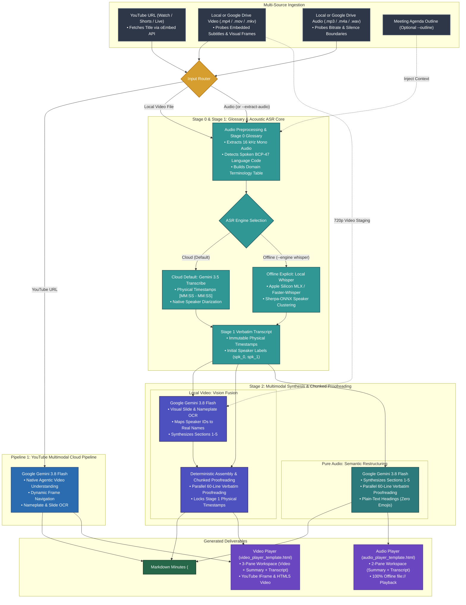

# Meeting Transcribe Agent

[](LICENSE)
[](https://github.com/google-gemini/generative-ai-python)
[](https://ai.google.dev/)
[](https://ai.google.dev/)

[English (en)](README.md) | [繁體中文 (zh-TW)](README.zh-TW.md) | [简体中文 (zh-CN)](README.zh-CN.md) | [日本語 (ja)](README.ja.md) | [한국어 (ko)](README.ko.md)

## Overview

**Meeting Transcribe Agent** generates structured meeting minutes and verbatim transcripts from video and audio recordings. The system uses **Google Gemini 3.5 Transcribe** for acoustic speech recognition and **Gemini 3.8 Flash** for multimodal synthesis. It processes YouTube URLs, local video files, Google Drive links, and audio recordings. Each run produces a clean Markdown report and a standalone interactive HTML player.

### Three Specialized Processing Pipelines

1. **YouTube Multimodal Pipeline (Cloud Direct Ingestion)**:
   - **Direct Cloud Streaming**: Sends the YouTube URL directly to **Gemini 3.8 Flash** without downloading local video files.
   - **Agentic Video Understanding (`--agentic`)**: Navigates relevant video frames to read presentation slides, desktop nameplates, and lower-third titles.
   - **Interactive YouTube Player**: Generates a standalone 3-pane HTML player with synchronized transcript scrolling and click-to-seek navigation.

2. **Local Video Two-Stage Fusion Pipeline (Acoustic Ground Truth + Vision Fusion)**:
   - **Embedded Subtitle Probe**: Extracts embedded subtitle tracks (`mov_text`, `srt`, `vtt`) or sidecar `.srt` files as attendee and agenda references.
   - **Stage 0 (Glossary & Language Detection)**: Builds a domain terminology table and detects the primary spoken `BCP-47` language code (for example, `cmn-Hant-TW`, `en-US`, `ja-JP`).
   - **Stage 1 (Acoustic Ground Truth ASR)**: Extracts 16 kHz mono audio and transcribes speech via **Gemini 3.5 Transcribe** (default) or **Local Whisper + Sherpa-ONNX** (`--engine whisper`). This stage anchors physical timestamps `[MM:SS - MM:SS]` and speaker turns.
   - **Stage 2 (Multimodal Vision & Chunked Verbatim Proofreading)**: Sends the 720p video and Stage 1 transcript to **Gemini 3.8 Flash**. The model reads visual slides and nameplates, generates Sections 1–5, and proofreads Section 6 in parallel 60-line batches while locking original timestamps.
   - **Deterministic Speaker Assembly**: Reconciles speaker identities across subtitle overlaps, multimodal scoped rules, and handover cues with zero timestamp drift.

3. **Pure Audio High-Precision Pipeline (Voice Recorders & Podcasts)**:
   - **Stage 0 (Glossary & Language Detection)**: Extracts terminology and identifies the primary spoken language code from the audio stream.
   - **Stage 1 (Acoustic Transcription)**: Uses **Gemini 3.5 Transcribe** (or explicit offline Whisper + Sherpa-ONNX) to produce timestamped speaker turns.
   - **Stage 2 (Executive Synthesis & Script Proofreading)**: Uses **Gemini 3.8 Flash** to synthesize executive summaries, action items, and orthographically consistent verbatim transcripts.

---

### Why Separate Pipelines for YouTube, Local Video, and Audio?

Different media sources contain different timing metadata and visual signals:

1. **YouTube Videos**:
   - Google Cloud indexes YouTube streams with pre-computed acoustic clocks.
   - Direct ingestion via **Gemini 3.8 Flash** analyzes video and audio in one request without local file transfers.
2. **Local Video Files**:
   - Local video files do not have pre-indexed cloud clocks.
   - Stage 1 acoustic ASR locks physical timestamps first, and Stage 2 vision fusion reads slides and nameplates without timestamp drift.
3. **Pure Audio Recordings**:
   - Audio recordings contain no visual frames.
   - Dedicated acoustic models process speech at approximately 32 tokens per second for maximum token efficiency.

---

### Token Consumption Benchmarks

> [!NOTE]
> Token usage varies with speech density and visual complexity. The multipliers below provide reference estimates for long-form meetings.

* **1. Pure Audio Pipeline (`~1x` Baseline)**:
  - **Consumption**: Approximately 32 tokens per second (~100,000 tokens per hour).
  - **Use Case**: Audio-only recordings (`meeting_recording.mp3`, podcasts, interviews) requiring exact word timestamps and low token cost.
* **2. Gemini Agentic Video Understanding (`~2x` Baseline)**:
  - **Consumption**: Approximately 2x the pure audio baseline.
  - **Use Case**: Default mode for all video pipelines (`media_processing=types.MediaProcessing.AGENTIC`). The model inspects high-resolution frames dynamically when slides or speakers change.
* **3. Uniform 1 FPS Video Sampling (`~3x+` Baseline)**:
  - **Consumption**: 3x or more above the pure audio baseline.
  - **Status**: Not used in this project. Listed for benchmark comparison only.

---

## Core Capabilities & Use Cases

### Key Features
- **Multi-Source Ingestion**: Process YouTube URLs, Google Drive share links, local video files, and local audio files.
- **Embedded Caption Extraction**: Probe video containers for `mov_text`, `srt`, and `vtt` tracks to build attendee lists and macro timelines.
- **Hierarchical Speaker Canonicalization**: Map generic labels (`spk_0`, `spk_1`) to real participant names and official titles using visual nameplates and spoken introductions.
- **Stage 2 Chunked Verbatim Proofreading**: Proofread Section 6 in parallel 60-line batches to enforce target script consistency (such as Traditional Chinese vs. Simplified Chinese) and domain terminology without altering timestamps.
- **Universal Dynamic Localization**: Generate Section 1–5 headings, metadata labels, and tables in the target language while preserving the original spoken language in Section 6.
- **Strict Plain-Text Formatting**: Produce enterprise Markdown reports with zero decorative emojis in headings or tables.
- **Standalone Interactive HTML Players**: Generate a 3-pane video player (`video_player_template.html`) or a 2-pane offline audio player (`audio_player_template.html`).

### Target Scenarios
1. **Public & Municipal Sessions**: Transcribe livestreamed council meetings from YouTube and identify speakers from desk nameplates.
2. **Technical Seminars & Keynotes**: Combine presentation slide text with spoken explanations into structured summaries.
3. **Multi-Speaker Executive Meetings**: Track speaker changes and action items across multi-hour recordings.
4. **Offline Local Transcription**: Run local `mlx-whisper` or `faster-whisper` with Sherpa-ONNX when cloud access is restricted.

---

## Dual-Engine Architecture

### 1. Cloud Vertex AI Mode (`--engine gemini`, Default)
* **Model Pairing**: Uses **Gemini 3.5 Transcribe** (`TRANSCRIBE_MODEL`) for acoustic transcription and **Gemini 3.8 Flash** (`SUMMARY_MODEL`) for multimodal analysis and proofreading.
* **Adaptive Audio Preprocessing**: Probes input audio bitrates and splits recordings longer than 25 minutes at silence boundaries into 20-minute chunks.
* **Deterministic Prefix Locking**: Re-attaches the exact Stage 1 `[MM:SS - MM:SS] **spk_X**:` prefix to every proofread turn in Section 6 to prevent timestamp alteration or token truncation.
* **Two-Tier GCS Lifecycle Management**: Stages raw media under `gs://<bucket>/raw/` (auto-deleted after 2 days) and stores deliverables for 15 days.

### 2. Local Offline Mode (`--engine whisper`, Explicit Only)
* **Explicit Activation**: Runs only when you specify `--engine whisper`. The system never falls back silently from cloud mode to local mode.
* **Hardware Acceleration**: Uses `mlx-whisper` on Apple Silicon GPUs or `faster-whisper` on CPU/CUDA systems.
* **Acoustic Voiceprint Diarization**: Extracts speaker embeddings with **Sherpa-ONNX** (`eres2net` or `cam++`) and aligns word timestamps to speaker turns.

---

## Agent Prompt Guide

Use natural language prompts when running this project as an **Antigravity Plugin** or **Agent Skill**:

1. **YouTube Video Transcription**:
   > "Transcribe `https://www.youtube.com/watch?v=VIDEO_ID`. Read the desk nameplates and slides to generate meeting minutes and an interactive player."

2. **YouTube Deep Slide Analysis**:
   > "Analyze `https://www.youtube.com/watch?v=VIDEO_ID` in Agentic Video mode. Extract the architecture diagrams and summarize all decisions."

3. **Local Video File Processing**:
   > "Transcribe `conference_video.mp4`. Use the presentation slides on screen to verify speaker names and technical terms."

4. **Video Audio-Only Extraction (Token Economy)**:
   > "Extract the audio track from `conference_video.mp4` and run the pure audio pipeline."

5. **Standard Audio Transcription**:
   > "Transcribe `meeting_recording.mp3` and generate an executive summary, action items, and an interactive audio player."

6. **Audio with Meeting Agenda**:
   > "Transcribe `meeting_recording.mp3` with the agenda `agenda.md`. Match speaker titles and technical terms against the agenda."

7. **Cross-Language Executive Summary**:
   > "Transcribe `meeting_recording.mp3`. Keep Section 6 in the original spoken language, and write Sections 1 to 5 in English."

---

## Pipeline Architecture



### Pipeline Workflow Steps

#### Step 1: Input Detection and Routing
- **YouTube URLs** (`youtube.com/watch`, `youtu.be/`, Shorts, Live): Queries the YouTube oEmbed API for the meeting title and routes to the **YouTube Multimodal Cloud Pipeline**.
- **Local or Google Drive Video Files** (`.mp4`, `.mov`, `.mkv`, `.webm`): Routes to the **Local Video Two-Stage Fusion Pipeline**.
- **Pure Audio Files** (`.mp3`, `.m4a`, `.wav`, `.aac`, `.flac`) or `--extract-audio`: Routes to the **Pure Audio Pipeline**.

#### Step 2A: YouTube Multimodal Cloud Pipeline
1. **Direct Cloud Ingestion**: Sends the YouTube URL directly to the Vertex AI Gemini endpoint without local downloading.
2. **Agentic Frame Inspection**: Uses `types.MediaProcessing.AGENTIC` to inspect slides, lower-third captions, and speaker nameplates.
3. **Structured Output**: Generates Sections 1–6 in clean Markdown with zero decorative emojis.

#### Step 2B: Local Video Two-Stage Fusion Pipeline
1. **Stage 0 & Stage 1 (Shared Acoustic Core)**:
   - Extracts 16 kHz mono audio and builds the domain glossary with primary `BCP-47` language detection.
   - Transcribes speech via `gemini-3.5-transcribe-preview` (or local `whisper`) to establish physical `[MM:SS - MM:SS]` timestamps.
2. **Stage 2 (Multimodal Vision Fusion)**:
   - Stages a 720p H.264 copy to Cloud Storage (`gs://<bucket>/raw/`) and deletes it in a `finally` block after inference.
   - Sends the staged video and Stage 1 transcript to `gemini-3.8-flash` to resolve speaker identities and synthesize Sections 1–5.
3. **Chunked Proofreading & Deterministic Assembly**:
   - Proofreads Section 6 in parallel 60-line chunks for orthographic script and terminology consistency.
   - Re-attaches exact Stage 1 timestamps and resolved speaker names with zero timestamp drift.

#### Step 2C: Pure Audio Pipeline
1. **Stage 0 & Stage 1 (Shared Acoustic Core)**:
   - Runs Stage 0 glossary extraction and language detection, followed by Stage 1 acoustic transcription.
2. **Stage 2 (Semantic Restructuring & Proofreading)**:
   - Synthesizes Sections 1–5 and runs parallel 60-line orthographic proofreading on Section 6 via `gemini-3.8-flash`.

#### Step 3: Deliverable Generation
1. **Markdown Report (`<Meeting_Title>_minutes.md`)**: Contains 6 structured sections with plain-text headings.
2. **Interactive Video Player (`<Meeting_Title>_player.html`)**: Provides a 3-pane layout (video, executive summary, and synchronized transcript) with summary-first copy buttons.
3. **Interactive Audio Player (`<Meeting_Title>_player.html`)**: Provides a 2-pane layout and a bottom floating audio controller that runs 100% offline via `file://`.
4. **Terminology Glossary (`<Meeting_Title>_glossary.md`)**: Stores extracted domain terms and detected language metadata.

---

## Installation & Deployment

Select one of the two deployment methods below:

| Method | Target Environment | Setup Tool | Primary Interface |
| :--- | :--- | :--- | :--- |
| **Method 1: Google Antigravity & Agent Plugins** | Local IDE, Agent Skill, or Python CLI | `pip` / `uv` + `./setup.sh` | Antigravity IDE chat or terminal CLI |
| **Method 2: Gemini Enterprise** | Cloud Vertex AI Agent Runtime | `./deploy.sh` (native `gcloud`) | Gemini Enterprise Web UI, Agent Engine, A2A |

---

### System Prerequisites

1. **Install FFmpeg**:
   - **macOS**: `brew install ffmpeg`
   - **Ubuntu / Debian**: `sudo apt update && sudo apt install ffmpeg`
   - **Windows**: `winget install Gyan.FFmpeg`

2. **Authenticate Google Cloud ADC**:
   Authenticate Application Default Credentials (ADC) for Vertex AI and Cloud Storage access:
   ```bash
   gcloud auth application-default login
   ```

---

### Method 1: Google Antigravity Plugin, Skill, and Local CLI Setup

1. **Clone the Repository as an Agent Plugin (Recommended)**:
   - **Global Plugin**:
     ```bash
     git clone https://github.com/sylphlin/meeting-transcribe-agent.git ~/.gemini/config/plugins/meeting-transcribe-agent
     ```
   - **Workspace Plugin**:
     ```bash
     git clone https://github.com/sylphlin/meeting-transcribe-agent.git .agents/plugins/meeting-transcribe-agent
     ```

2. **Or Clone as a Standalone Agent Skill**:
   - **Global Skill**:
     ```bash
     git clone https://github.com/sylphlin/meeting-transcribe-agent.git ~/.gemini/config/skills/meeting-transcribe-agent
     ```
   - **Workspace Skill**:
     ```bash
     git clone https://github.com/sylphlin/meeting-transcribe-agent.git .agent/skills/meeting-transcribe-agent
     ```

3. **Install Python Dependencies**:
   ```bash
   pip install google-genai google-cloud-storage requests
   ```
   *(Optional offline Whisper dependencies: run `pip install mlx-whisper sherpa-onnx` on Apple Silicon, or `pip install faster-whisper sherpa-onnx` on Linux/Windows).*

4. **Initialize Google Cloud Environment (`./setup.sh`)**:
   Run `setup.sh` to configure the cloud environment:
   - Verify ADC authentication.
   - Enable Vertex AI, Cloud Storage, and Google Drive APIs.
   - Create the staging bucket with CORS and two-tier lifecycle rules (`raw/`: 2 days; deliverables: 15 days).
   - Generate the `.env` configuration file.
   ```bash
   chmod +x setup.sh
   ./setup.sh --project YOUR_GCP_PROJECT_ID
   ```

5. **Run in Antigravity**:
   Prompt the agent directly in the Antigravity chat:
   > "Transcribe `meeting_recording.mp3` and generate executive minutes and the interactive player."

### Project Directory Structure (Agent Plugins 1.0 Specification)
```text
meeting-transcribe-agent/
├── plugin.json                                           # Agent Plugins 1.0 manifest
├── rules/
│   └── AGENTS.md                                         # Packaged client execution invariants (<PLUGIN_ROOT> direct CLI & fail-fast)
├── skills/
│   └── meeting-transcribe-agent/                         # Canonical Skill Bundle (Single Source of Truth)
│       ├── SKILL.md                                      # Skill definition and agent reference manual
│       ├── scripts/                                      # Canonical core components (SSOT)
│       │   ├── meeting_transcribe.py                     # Master pipeline orchestrator
│       │   ├── audio_utils.py                            # Video detection, FFmpeg compression, audio extraction
│       │   ├── gcs_utils.py                              # Cloud Storage upload/download & ephemeral cleanup
│       │   ├── gemini_engine.py                          # Multimodal video fusion & Cloud Storage auto-cleanup
│       │   ├── diarization.py                            # Local Sherpa-ONNX acoustic diarization & Whisper/MLX
│       │   ├── glossary.py                               # Dual-track terminology mining
│       │   ├── canonicalizer.py                          # Speaker identity convergence & turn merging
│       │   └── html_generator.py                         # Dedicated audio/video player renderer
│       └── assets/                                       # Canonical player templates & prompts (SSOT)
│           ├── audio_player_template.html                # 2-pane offline audio player template
│           ├── video_player_template.html                # 3-pane video player template
│           └── prompts/                                  # Structured Markdown prompts
├── SKILL.md -> skills/meeting-transcribe-agent/SKILL.md  # Root POSIX symlink
├── scripts -> skills/meeting-transcribe-agent/scripts    # Root POSIX symlink
├── assets -> skills/meeting-transcribe-agent/assets      # Root POSIX symlink
├── AGENTS.md                                             # Workspace & engineering development rules (Part I & Part II)
├── meeting_transcribe.py                                 # Primary CLI entrypoint forwarder
├── setup.sh                                              # Native gcloud setup script
└── deploy.sh                                             # Native gcloud deployment to Vertex AI Agent Runtime
```

---

### Method 2: Gemini Enterprise Deployment (Vertex AI Agent Runtime)

Deploy the agent to Google Cloud Vertex AI Agent Runtime using ADK 2.0 and `agents-cli`. The `deploy.sh` script uses native `gcloud` commands and requires no Terraform setup.

1. **Install `google-agents-cli`**:
   ```bash
   uv tool install google-agents-cli
   ```

2. **Run One-Click Deployment (`./deploy.sh`)**:
   `deploy.sh` runs `setup.sh` to provision cloud resources, deploys the agent to Vertex AI Agent Runtime, and registers the extension with Gemini Enterprise:
   ```bash
   chmod +x setup.sh deploy.sh

   # Deploy using project settings from .env or gcloud config:
   ./deploy.sh

   # Or specify the project ID and region explicitly:
   ./deploy.sh --project YOUR_GCP_PROJECT_ID --region us-central1

   # Preview commands without modifying cloud resources:
   ./deploy.sh --dry-run
   ```

3. **Enterprise Outputs**:
   - **Gemini Enterprise Web UI**: Query the registered agent directly in Gemini Enterprise.
   - **Vertex AI Agent Engine & A2A**: Invoke the agent via Vertex AI SDK endpoints or Agent-to-Agent protocol.
   - **24-Hour Signed URLs**: Receive browser-accessible GCS signed URLs (`v4`) for the generated `.md` minutes and `.html` player.

---

## Command-Line Usage (Standalone CLI)

### YouTube Video Processing
```bash
python3 scripts/meeting_transcribe.py "https://www.youtube.com/watch?v=VIDEO_ID"
```

### Local Audio and Video Processing
```bash
# Pure audio transcription (Cloud Vertex AI default)
python3 scripts/meeting_transcribe.py "meeting_recording.mp3"

# Local video two-stage fusion (audio ASR + Agentic vision fusion)
python3 scripts/meeting_transcribe.py "conference_video.mp4"

# Explicit offline Whisper + Sherpa-ONNX mode
python3 scripts/meeting_transcribe.py "meeting_recording.mp3" --engine whisper --whisper-backend auto
```

### Specify Agenda Outline and Target Summary Language
```bash
python3 scripts/meeting_transcribe.py "meeting_recording.mp3" --outline "agenda.md" --summary-language en
```

### CLI Argument Reference

| Argument | Description | Default |
| :--- | :--- | :--- |
| `input_source` | Local audio/video path, Google Drive link, or YouTube URL | *(Required)* |
| `-o, --output` | Output Markdown file path | `<filename>_minutes.md` |
| `--agentic` | Enable Agentic Video Understanding for video inputs | `True` |
| `--extract-audio` | Extract audio from video and run the pure audio pipeline | `False` |
| `--engine` | Transcription engine: `gemini` (cloud default) or `whisper` (offline explicit) | `gemini` |
| `--whisper-backend` | Offline Whisper backend: `auto`, `mlx`, or `faster-whisper` | `auto` |
| `--whisper-model` | Offline Whisper model size (`tiny`, `base`, `small`, `medium`, `large-v3`) | `small` |
| `--no-diarization` | Disable offline Sherpa-ONNX speaker diarization | `False` |
| `--clustering-threshold` | Set Sherpa-ONNX voiceprint clustering threshold | `0.68` |
| `--num-speakers` | Specify exact speaker count (`-1` for automatic detection) | `-1` |
| `--embedding-type` | Select Sherpa-ONNX embedding model (`eres2net` or `cam++`) | `eres2net` |
| `--project` | Set Google Cloud project ID (`GOOGLE_CLOUD_PROJECT`) | `None` |
| `--region` | Set Vertex AI location (`GOOGLE_CLOUD_LOCATION`) | `global` |
| `--bucket` | Set Cloud Storage staging bucket (`MEETING_STORAGE_BUCKET`) | `None` |
| `--transcribe-model` | Set cloud ASR model (`TRANSCRIBE_MODEL`) | `gemini-3.5-transcribe-preview` |
| `--summary-model` | Set synthesis and vision model (`SUMMARY_MODEL`) | `gemini-3.8-flash` |
| `--outline` | Provide meeting agenda or outline file (`.txt` or `.md`) | `None` |
| `--force-glossary` | Force regeneration of the Stage 0 glossary file | `False` |
| `--no-glossary` | Skip Stage 0 glossary extraction | `False` |
| `--no-player` | Skip interactive HTML player generation | `False` |
| `--no-compress` | Skip FFmpeg audio pre-compression | `False` |
| `--summary-language` | Set target language for Sections 1–5 (for example, `en`, `zh-TW`, `ja`) | `None` (auto) |
| `--only-transcript` | Output Section 6 verbatim transcript only | `False` |
| `--language` | Set language code for offline Whisper (`auto`, `en`, `zh`, `ja`) | `auto` |
| `--serve` | Start a local HTTP server and open the HTML player (required for YouTube embeds) | `False` |

---

## Google Drive Direct Links & GCS Lifecycle Policy

`meeting-transcribe-agent` downloads Google Drive files directly via ADC (`drive.readonly` scope) and caches files locally using MD5 checksum verification.

### 1. Initialize Cloud and Google Drive Access (`./setup.sh`)
```bash
# Authenticate ADC with Google Drive read-only scope
gcloud auth application-default login --scopes="https://www.googleapis.com/auth/cloud-platform,https://www.googleapis.com/auth/drive.readonly"

# Provision Vertex AI, GCS bucket, and two-tier lifecycle rules
./setup.sh --project YOUR_GCP_PROJECT_ID
```

### 2. Supported Google Drive Scenarios

| Scenario | Command Syntax | Processing Behavior |
| :--- | :--- | :--- |
| **Scenario A: Video on Google Drive**<br/>*(MP4 / MOV)* | `python3 scripts/meeting_transcribe.py "https://drive.google.com/file/d/FILE_ID/view"` | Verifies remote `md5Checksum`, caches in `gdrive_inputs/`, recovers UTF-8 CJK filenames, extracts 16 kHz audio, stages 720p video to GCS `raw/`, and runs Stage 1 + Stage 2 fusion. |
| **Scenario B: Audio on Google Drive**<br/>*(M4A / MP3 / WAV)* | `python3 scripts/meeting_transcribe.py "https://drive.google.com/file/d/FILE_ID/view" --outline agenda.md` | Verifies MD5 cache, runs Stage 0 language/glossary detection, transcribes with Gemini 3.5 Transcribe, and synthesizes minutes with Gemini 3.8 Flash. |

#### CLI Examples
```bash
# Scenario A: Transcribe a meeting video from a Google Drive share link
python3 scripts/meeting_transcribe.py "https://drive.google.com/file/d/FILE_ID/view?usp=sharing"

# Scenario B: Transcribe a Google Drive audio link with an agenda outline and English summary
python3 scripts/meeting_transcribe.py "https://drive.google.com/file/d/FILE_ID/view?usp=sharing" \
  --outline agenda.md --summary-language en
```

#### Antigravity Chat Prompt Example
> *"Generate meeting minutes, action items, a verbatim transcript, and an interactive HTML player from this Google Drive recording: `https://drive.google.com/file/d/FILE_ID/view?usp=sharing`"*

### 3. Two-Tier GCS Bucket Lifecycle Policy (`raw/` 2 Days / Deliverables 15 Days)

| GCS Path Prefix (`matchesPrefix`) | Stored Objects | Retention (`age`) | Purpose |
| :--- | :--- | :--- | :--- |
| **`raw/`** | Staged audio chunks and 720p video (`raw/<filename>`) | **2 Days (`age: 2`)** | Keeps temporary media for short-term cache reuse and deletes objects automatically after 2 days. |
| **`minutes/`**, **`players/`**, **`output/`**, **`deliverables/`** | Markdown minutes (`.md`) and HTML players (`.html`) | **15 Days (`age: 15`)** | Retains generated deliverables for 15 days for team review before automatic deletion. |

---

## License

This project is licensed under the [MIT License](LICENSE).
