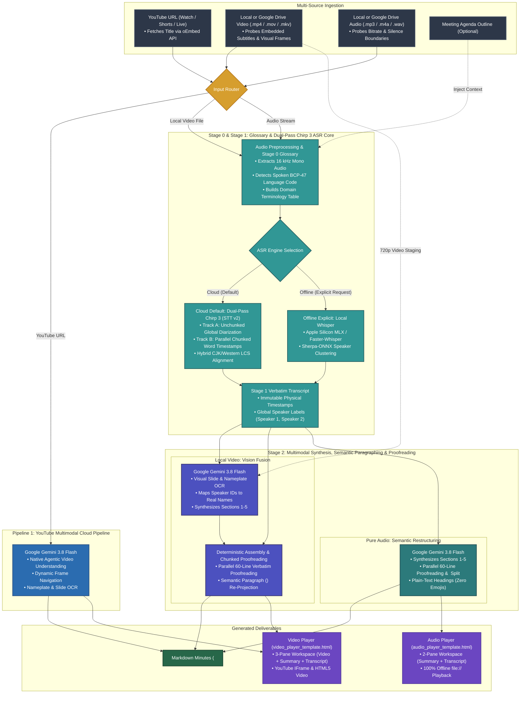

# Meeting Transcribe Agent

[](LICENSE)
[](https://github.com/google-gemini/generative-ai-python)
[](https://cloud.google.com/speech-to-text)
[](https://ai.google.dev/)

[English (en)](README.md) | [繁體中文 (zh-TW)](README.zh-TW.md) | [简体中文 (zh-CN)](README.zh-CN.md) | [日本語 (ja)](README.ja.md) | [한국어 (ko)](README.ko.md)

## Overview

**Meeting Transcribe Agent** generates structured meeting minutes and verbatim transcripts from video and audio recordings. The system uses **Dual-Pass Google Cloud Speech-to-Text v2 Chirp 3 (`chirp_3`)** for acoustic speaker diarization and word-level timestamps, and **Gemini 3.8 Flash (`gemini-3.8-flash`)** for multimodal synthesis, semantic paragraph segmentation, and proofreading. It processes YouTube URLs, local video files, Google Drive links, and audio recordings. Each run produces a clean Markdown report and a standalone interactive HTML player.

### Three Specialized Processing Pipelines

1. **YouTube Multimodal Pipeline (Cloud Direct Ingestion)**:
   - **Direct Cloud Streaming**: Sends the YouTube URL directly to **Gemini 3.8 Flash** without downloading local video files.
   - **Agentic Video Understanding**: Navigates relevant video frames to read presentation slides, desktop nameplates, and lower-third titles.
   - **Interactive YouTube Player**: Generates a standalone 3-pane HTML player with synchronized transcript scrolling and click-to-seek navigation.

2. **Local Video Two-Stage Fusion Pipeline (Acoustic Ground Truth + Vision Fusion)**:
   - **Embedded Subtitle Probe**: Extracts embedded subtitle tracks (`mov_text`, `srt`, `vtt`) or sidecar `.srt` files as attendee and agenda references.
   - **Stage 0 (Glossary & Language Detection)**: Builds a domain terminology table and detects the primary spoken `BCP-47` language code (for example, `cmn-Hant-TW`, `en-US`, `ja-JP`).
   - **Stage 1 (Dual-Pass Chirp 3 Acoustic Ground Truth ASR)**: Extracts 16 kHz mono MP3 audio and runs **Dual-Pass Cloud Speech-to-Text v2 Chirp 3 (`chirp_3`)** (default) or **Local Whisper + Sherpa-ONNX** (when offline mode is requested). This stage locks global speaker turns (`Speaker 1`, `Speaker 2`) and millisecond physical word timestamps `[MM:SS - MM:SS]`.
   - **Stage 2 (Multimodal Vision, Semantic Paragraph Segmentation & Chunked Proofreading)**: Compresses large videos (>250 MB) to 720p H.264 (`10 fps`, `1s GOP -g 10`, `+faststart` via Apple Silicon `VideoToolbox` with `libx264` fallback) for fast cloud upload and Agentic frame seeking, then sends the video and Stage 1 transcript to **Gemini 3.8 Flash**. The model reads visual slides and nameplates, generates Sections 1–5, proofreads Section 6 in parallel 60-line batches, and segments long monologues into semantic paragraphs (`<PARA>`) that re-project onto physical word timestamps.
   - **Deterministic Speaker Assembly**: Reconciles speaker identities across subtitle overlaps, multimodal scoped rules, and handover cues with zero timestamp drift.

3. **Pure Audio High-Precision Pipeline (Voice Recorders & Podcasts)**:
   - **Stage 0 (Glossary & Language Detection)**: Extracts terminology and identifies the primary spoken language code from the audio stream.
   - **Stage 1 (Dual-Pass Chirp 3 Acoustic Transcription)**: Uses **Dual-Pass Chirp 3 (`chirp_3`)** (or explicit offline Whisper + Sherpa-ONNX) to produce globally diarized, word-timestamped speaker turns.
   - **Stage 2 (Executive Synthesis, Semantic Paragraphing & Script Proofreading)**: Uses **Gemini 3.8 Flash** to synthesize executive summaries and action items, segment long monologues into readable semantic paragraphs, and proofread verbatim transcripts.

---

### Purpose of the Dual-Pass Chirp 3 Architecture

Traditional chunked speech recognition suffers from two structural limitations on long meetings:
1. **Cross-Chunk Speaker Drift & Handover Swallowing**: Splitting audio into 15-minute chunks resets speaker voiceprints (`spk_0`, `spk_1`) across chunk boundaries, and autoregressive attention often merges a host's handover prompt with the next speaker's opening words.
2. **Cloud STT v2 20-Minute Word-Offset Ceiling**: Google Cloud Speech-to-Text v2 (`chirp_3`) supports unchunked recordings up to 8 hours when `enableWordTimeOffsets=False`, but restricts inline `BatchRecognize` requests to 20 minutes when `enableWordTimeOffsets=True`.

To achieve both **global speaker consistency** and **millisecond word timestamps**, Stage 1 executes two concurrent `chirp_3` passes in parallel:
- **Track A — Macro Global Diarization (Unchunked Full Audio)**: Processes the complete 16 kHz mono recording in a single unchunked batch (`enableSpeakerDiarization=True`, `enableWordTimeOffsets=False`). Track A preserves a single global speaker embedding space from start to finish and accurately detects rapid speaker handovers.
- **Track B — Micro Word Timestamps (Parallel 18-Minute Chunks)**: Slices the audio into 18-minute (`1080s`) windows with 5-second overlaps (`enableWordTimeOffsets=True`, `enableSpeakerDiarization=False`) and deduplicates overlap words at the window midpoint for strictly monotonic timestamps.
- **Track B Physical Timeline Master + LCS Speaker Assignment (`AlignmentEngine`)**: Keeps Track B's physical word timestamps as the master timeline and assigns Track A speaker labels to each word through a hybrid CJK character + Western word Longest Common Subsequence (LCS) algorithm (Track A is converted from Simplified to Traditional Chinese before matching). An FFmpeg `silencedetect` pass finds the physical speech onset and removes noise tokens inside leading silence. Turn boundaries use `floor` for start and `ceil` for end, so a seek never lands inside the previous speaker's tail. Includes n-gram repetition loop suppression on both tracks.
- **Stage 2 Semantic Paragraph Re-Projection**: When a speaker delivers a multi-minute monologue, **Gemini 3.8 Flash** inserts inline `<PARA>` breaks at topic transitions during Stage 2 proofreading. `AlignmentEngine` re-projects each semantic paragraph back onto Track B's physical word timestamps so the HTML player renders visually grouped paragraphs (`isGrouped`) with independent `[▶ MM:SS - MM:SS]` seek buttons and zero timestamp hallucination.

---

### Why Separate Pipelines for YouTube, Local Video, and Audio?

Different media sources contain different timing metadata and visual signals:

1. **YouTube Videos**:
   - Google Cloud indexes YouTube streams with pre-computed acoustic clocks.
   - Direct ingestion via **Gemini 3.8 Flash** analyzes video and audio in one request without local file transfers.
2. **Local Video Files**:
   - Local video files do not have pre-indexed cloud clocks.
   - Stage 1 Dual-Pass Chirp 3 locks global speaker clusters and physical timestamps first, and Stage 2 vision fusion reads slides and nameplates without timestamp drift.
3. **Pure Audio Recordings**:
   - Audio recordings contain no visual frames.
   - Dedicated acoustic models process speech with global speaker diarization and low token overhead.

---

### Token Consumption Benchmarks

> [!NOTE]
> Token usage varies with speech density and visual complexity. The multipliers below provide reference estimates for long-form meetings.

* **1. Pure Audio Pipeline (`~1x` Baseline)**:
  - **Consumption**: Stage 1 runs on Cloud STT v2 (`chirp_3`), and Stage 2 processes text tokens with **Gemini 3.8 Flash**.
  - **Use Case**: Audio-only recordings (`meeting_recording.mp3`, podcasts, interviews) requiring exact word timestamps and low token cost.
* **2. Gemini Agentic Video Understanding (`~2x` Baseline)**:
  - **Consumption**: Approximately 2x the pure audio baseline.
  - **Use Case**: Default mode for all video pipelines (`media_processing=types.MediaProcessing.AGENTIC`). The model inspects high-resolution frames dynamically when slides or speakers change.
* **3. Uniform 1 FPS Video Sampling (`~3x+` Baseline)**:
  - **Consumption**: 3x or more above the pure audio baseline.
  - **Status**: Not used in this project. Listed for benchmark comparison only.

---

## Core Capabilities & Use Cases

### Key Features
- **Multi-Source Ingestion**: Process YouTube URLs, Google Drive share links, local video files, and local audio files.
- **Dual-Pass Chirp 3 Global Diarization**: Eliminate cross-chunk speaker drift and handover swallowing across multi-hour recordings.
- **Embedded Caption Extraction**: Probe video containers for `mov_text`, `srt`, and `vtt` tracks to build attendee lists and macro timelines.
- **Hierarchical Speaker Canonicalization**: Map generic labels (`Speaker 1`, `spk_0`) to real participant names and official titles using visual nameplates and spoken introductions.
- **Stage 2 Chunked Proofreading & Semantic Paragraphing**: Proofread Section 6 in parallel 60-line batches to enforce target script consistency and domain terminology while splitting long monologues into semantic paragraphs anchored to physical word timestamps.
- **Universal Dynamic Localization**: Generate Section 1–5 headings, metadata labels, and tables in the target language while preserving the original spoken language in Section 6.
- **Strict Plain-Text Formatting**: Produce enterprise Markdown reports with zero decorative emojis in headings or tables.
- **Standalone Interactive HTML Players**: Generate a 3-pane video player (`video_player_template.html`) or a 2-pane offline audio player (`audio_player_template.html`) with grouped same-speaker paragraph cards (`isGrouped`).

### Target Scenarios
1. **Public & Municipal Sessions**: Transcribe livestreamed council meetings from YouTube and identify speakers from desk nameplates.
2. **Technical Seminars & Keynotes**: Combine presentation slide text with spoken explanations into structured summaries.
3. **Multi-Speaker Executive Meetings**: Track speaker changes and action items across multi-hour recordings without speaker label drift.
4. **Offline Local Transcription**: Run local `mlx-whisper` or `faster-whisper` with Sherpa-ONNX when cloud access is restricted or confidential offline processing is required.

---

## Dual-Engine Architecture

### 1. Cloud Dual-Pass Chirp 3 + Vertex AI Mode (Default)
* **Model Pairing**: Uses **Cloud Speech-to-Text v2 Chirp 3** (`TRANSCRIBE_MODEL=chirp_3`, Chirp-series only) for Dual-Pass acoustic diarization and word timestamps, and **Gemini 3.8 Flash** (`SUMMARY_MODEL=gemini-3.8-flash`) for multimodal analysis, semantic paragraphing, and proofreading.
* **Concurrent Dual-Pass Execution**: Runs Track A (unchunked global speaker diarization) and Track B (parallel 18-minute word-offset chunks with 5-second overlap midpoint deduplication) concurrently.
* **Deterministic Speaker Assignment on the Physical Timeline**: Keeps Track B word timestamps as the master, assigns Track A speaker labels via hybrid CJK character + Western word LCS matching, filters tokens before the FFmpeg speech onset, and re-projects Stage 2 semantic paragraphs onto physical word boundaries.
* **Two-Tier GCS Lifecycle Management**: Stages raw media under `gs://<bucket>/raw/` (ephemeral blobs deleted immediately in `finally` blocks, backed by a 2-day lifecycle rule) and stores deliverables for 15 days.

### 2. Local Offline Mode (Explicit Request Only)
* **Explicit Activation**: Runs only when you explicitly request local or offline transcription. The system never falls back silently from cloud mode to local mode.
* **Hardware Acceleration**: Uses `mlx-whisper` on Apple Silicon GPUs or `faster-whisper` on CPU/CUDA systems.
* **Acoustic Voiceprint Diarization**: Extracts speaker embeddings with **Sherpa-ONNX** (`eres2net` or `cam++`) and aligns word timestamps to speaker turns.

---

## Antigravity Usage & Scenarios

You can operate **Meeting Transcribe Agent** in Antigravity using two interaction modes:

1. **Concise `/skill` + `@file` Invocation (Recommended)**: Type `/meeting-transcribe-agent` to select the plugin and tag your files with `@`. Specify only the key fields (for example, `File: @XX, Agenda: @YY`) without writing full sentences.
2. **Natural Language Prompt (Auto-Routed)**: Describe your transcription and summarization needs in conversational language. Antigravity automatically selects and runs this plugin.

By default, all generated deliverables (`<Title>_minutes.md`, `<Title>_player.html`, and the glossary) are isolated in the `output/` subdirectory next to the input media.

### Scenario 1: Audio Meeting Recording to Structured Minutes & Offline Player
Use this scenario for voice recordings, conference calls, or interviews. The agent generates a 6-section Markdown report and a standalone 2-pane offline HTML audio player.

- **Concise `/ + @` Command**:
  ```text
  /meeting-transcribe-agent File: @meeting_recording.mp3, Topic: Executive_Board_Meeting, Attendees: John Doe, Jane Smith
  ```
- **Natural Language Prompt**:
  ```text
  Transcribe @meeting_recording.mp3 and generate executive meeting minutes and an interactive audio player. The topic is Executive_Board_Meeting with John Doe and Jane Smith.
  ```

### Scenario 2: Local Video or YouTube Presentation (With Visual Slide & Nameplate OCR)
The agent inspects presentation slides, architecture diagrams, and speaker nameplates on screen, and generates a 3-pane interactive video player.

- **Concise `/ + @` Command**:
  ```text
  /meeting-transcribe-agent Video: @conference_video.mp4, Language: English
  ```
  *(Or with a YouTube URL: `/meeting-transcribe-agent URL: https://www.youtube.com/watch?v=VIDEO_ID, Language: English`)*
- **Natural Language Prompt**:
  ```text
  Transcribe @conference_video.mp4, read the slides and desk nameplates on screen, and generate meeting minutes and an interactive player.
  ```

### Scenario 3: Transcription Guided by a Meeting Agenda or Reference Document
Attach an agenda or attendee roster so the agent verifies official titles and domain terminology.

- **Concise `/ + @` Command**:
  ```text
  /meeting-transcribe-agent File: @meeting_recording.mp3, Agenda: @agenda.md
  ```
- **Natural Language Prompt**:
  ```text
  Transcribe @meeting_recording.mp3 using @agenda.md to verify speaker titles and technical terms.
  ```

### Scenario 4: Cross-Language Executive Summary (Original Verbatim + Translated Summary)
Keep Section 6 (Full Verbatim Transcript) in the original spoken language of each participant while writing Sections 1–5 in your target language.

- **Concise `/ + @` Command**:
  ```text
  /meeting-transcribe-agent File: @meeting_recording.mp3, Summary Language: English
  ```
- **Natural Language Prompt**:
  ```text
  Transcribe @meeting_recording.mp3. Keep Section 6 in the original spoken language, and write Sections 1 to 5 in English.
  ```

### Scenario 5: Confidential Offline Local Transcription
Request offline transcription to run local Whisper and Sherpa-ONNX speaker clustering without sending audio to cloud ASR.

- **Concise `/ + @` Command**:
  ```text
  /meeting-transcribe-agent File: @meeting_recording.mp3, Mode: offline local, Speakers: 4
  ```
- **Natural Language Prompt**:
  ```text
  Transcribe @meeting_recording.mp3 in offline local mode with 4 speakers.
  ```

---

## Pipeline Architecture


```mermaid
flowchart TD
    classDef inputStyle fill:#2D3748,stroke:#4A5568,stroke-width:2px,color:#fff;
    classDef routerStyle fill:#D69E2E,stroke:#B7791F,stroke-width:2px,color:#fff;
    classDef videoStyle fill:#2B6CB0,stroke:#2C5282,stroke-width:2px,color:#fff;
    classDef fusionStyle fill:#4C51BF,stroke:#3C366B,stroke-width:2px,color:#fff;
    classDef audioStyle fill:#2C7A7B,stroke:#234E52,stroke-width:2px,color:#fff;
    classDef asrStyle fill:#319795,stroke:#285E61,stroke-width:2px,color:#fff;
    classDef outputStyle fill:#276749,stroke:#1C4532,stroke-width:2px,color:#fff;
    classDef playerStyle fill:#6B46C1,stroke:#553C9A,stroke-width:2px,color:#fff;

    subgraph Input["Multi-Source Ingestion"]
        Y["YouTube URL (Watch / Shorts / Live)<br>• Fetches Title via oEmbed API"]:::inputStyle
        V["Local or Google Drive Video (.mp4 / .mov / .mkv)<br>• Probes Embedded Subtitles & Visual Frames"]:::inputStyle
        A["Local or Google Drive Audio (.mp3 / .m4a / .wav)<br>• Probes Bitrate & Silence Boundaries"]:::inputStyle
        O["Meeting Agenda Outline (Optional)"]:::inputStyle
    end

    Router{"Input Router"}:::routerStyle

    Y --> Router
    V --> Router
    A --> Router

    subgraph YouTubeTrack["Pipeline 1: YouTube Multimodal Cloud Pipeline"]
        GeminiFlash["Google Gemini 3.8 Flash<br>• Native Agentic Video Understanding<br>• Dynamic Frame Navigation<br>• Nameplate & Slide OCR"]:::videoStyle
    end

    subgraph SharedASR["Stage 0 & Stage 1: Glossary & Dual-Pass Chirp 3 ASR Core"]
        ExtractTrack["Audio Preprocessing & Stage 0 Glossary<br>• Extracts 16 kHz Mono Audio<br>• Detects Spoken BCP-47 Language Code<br>• Builds Domain Terminology Table"]:::asrStyle
        ASREngine{"ASR Engine Selection"}:::asrStyle
        ASR_Chirp["Cloud Default: Dual-Pass Chirp 3 (STT v2)<br>• Track A: Unchunked Global Diarization<br>• Track B: Parallel Chunked Word Timestamps<br>• Hybrid CJK/Western LCS Alignment"]:::asrStyle
        ASR_Whisper["Offline Explicit: Local Whisper<br>• Apple Silicon MLX / Faster-Whisper<br>• Sherpa-ONNX Speaker Clustering"]:::asrStyle
        RawTranscript["Stage 1 Verbatim Transcript<br>• Immutable Physical Timestamps<br>• Global Speaker Labels (Speaker 1, Speaker 2)"]:::asrStyle

        ExtractTrack --> ASREngine
        ASREngine -- "Cloud (Default)" --> ASR_Chirp --> RawTranscript
        ASREngine -- "Offline (Explicit Request)" --> ASR_Whisper --> RawTranscript
        O -. "Inject Context" .-> ExtractTrack
    end

    subgraph Stage2Divergence["Stage 2: Multimodal Synthesis, Semantic Paragraphing & Proofreading"]
        subgraph LocalVideoStage2["Local Video: Vision Fusion"]
            Stage2Video["Google Gemini 3.8 Flash<br>• Visual Slide & Nameplate OCR<br>• Maps Speaker IDs to Real Names<br>• Synthesizes Sections 1-5"]:::fusionStyle
            Deterministic["Deterministic Assembly & Chunked Proofreading<br>• Parallel 60-Line Verbatim Proofreading<br>• Semantic Paragraph (<PARA>) Re-Projection"]:::fusionStyle
            Stage2Video --> Deterministic
        end

        subgraph AudioStage2["Pure Audio: Semantic Restructuring"]
            Restructure["Google Gemini 3.8 Flash<br>• Synthesizes Sections 1-5<br>• Parallel 60-Line Proofreading & <PARA> Split<br>• Plain-Text Headings (Zero Emojis)"]:::audioStyle
        end
    end

    Router -- "YouTube URL" --> GeminiFlash
    Router -- "Local Video File" --> ExtractTrack
    Router -- "Audio Stream" --> ExtractTrack

    RawTranscript --> Stage2Video
    V -. "720p Video Staging" .-> Stage2Video
    RawTranscript --> Deterministic
    RawTranscript --> Restructure

    subgraph Delivery["Generated Deliverables"]
        MD["Markdown Minutes (<Title>_minutes.md)<br>• Plain-Text Headings (Zero Emojis)<br>• Dynamic Target Language"]:::outputStyle
        VPlayer["Video Player (video_player_template.html)<br>• 3-Pane Workspace (Video + Summary + Transcript)<br>• YouTube IFrame & HTML5 Video"]:::playerStyle
        APlayer["Audio Player (audio_player_template.html)<br>• 2-Pane Workspace (Summary + Transcript)<br>• 100% Offline file:// Playback"]:::playerStyle
    end

    GeminiFlash --> MD
    GeminiFlash --> VPlayer
    Deterministic --> MD
    Deterministic --> VPlayer
    Restructure --> MD
    Restructure --> APlayer
```

### Pipeline Workflow Steps

#### Step 1: Input Detection and Routing
- **YouTube URLs** (`youtube.com/watch`, `youtu.be/`, Shorts, Live): Queries the YouTube oEmbed API for the meeting title and routes to the **YouTube Multimodal Cloud Pipeline**.
- **Local or Google Drive Video Files** (`.mp4`, `.mov`, `.mkv`, `.webm`): Routes to the **Local Video Two-Stage Fusion Pipeline**.
- **Pure Audio Files** (`.mp3`, `.m4a`, `.wav`, `.aac`, `.flac`): Routes to the **Pure Audio Pipeline**.

#### Step 2A: YouTube Multimodal Cloud Pipeline
1. **Direct Cloud Ingestion**: Sends the YouTube URL directly to the Vertex AI Gemini endpoint without local downloading.
2. **Agentic Frame Inspection**: Uses `types.MediaProcessing.AGENTIC` to inspect slides, lower-third captions, and speaker nameplates.
3. **Structured Output**: Generates Sections 1–6 in clean Markdown with zero decorative emojis.

#### Step 2B: Local Video Two-Stage Fusion Pipeline
1. **Stage 0 & Stage 1 (Shared Acoustic Core)**:
   - Extracts 16 kHz mono MP3 audio and builds the domain glossary with primary `BCP-47` language detection.
   - Transcribes speech via Dual-Pass Cloud STT v2 `chirp_3` (or local `whisper`) to establish global speaker labels and physical `[MM:SS - MM:SS]` word timestamps.
2. **Stage 2 (Multimodal Vision Fusion)**:
   - Stages a 720p H.264 copy to Cloud Storage (`gs://<bucket>/raw/`) and deletes it in a `finally` block after inference.
   - Sends the staged video and Stage 1 transcript to `gemini-3.8-flash` to resolve speaker identities and synthesize Sections 1–5.
3. **Chunked Proofreading, Semantic Paragraphing & Deterministic Assembly**:
   - Proofreads Section 6 in parallel 60-line chunks for orthographic script and terminology consistency, inserting `<PARA>` breaks at topic transitions inside long monologues.
   - Re-projects semantic paragraphs onto physical word timestamps and attaches resolved speaker names with zero timestamp drift.

#### Step 2C: Pure Audio Pipeline
1. **Stage 0 & Stage 1 (Shared Acoustic Core)**:
   - Runs Stage 0 glossary extraction and language detection, followed by Stage 1 Dual-Pass `chirp_3` acoustic transcription.
2. **Stage 2 (Semantic Restructuring & Proofreading)**:
   - Synthesizes Sections 1–5, runs parallel 60-line orthographic proofreading on Section 6 via `gemini-3.8-flash`, and re-projects `<PARA>` semantic paragraphs onto word timestamps.

#### Step 3: Deliverable Generation (Isolated in `<input_dir>/output/`)
All generated deliverables and intermediate caches are automatically isolated inside `<input_dir>/output/` by default to keep the source media directory clean:
1. **Markdown Report (`output/<Meeting_Title>_minutes.md`)**: Contains 6 structured sections with plain-text headings.
2. **Interactive Video Player (`output/<Meeting_Title>_player.html`)**: Provides a 3-pane layout (video, executive summary, and synchronized transcript with grouped same-speaker cards) and summary-first copy buttons.
3. **Interactive Audio Player (`output/<Meeting_Title>_player.html`)**: Provides a 2-pane layout and a bottom floating audio controller that runs 100% offline via `file://`.
4. **Terminology Glossary (`output/glossary_<stem>.md`)**: Stores extracted domain terms and detected language metadata.

---

## Installation & Deployment

Select one of the two deployment methods below:

| Method | Target Environment | Setup Tool | Primary Interface |
| :--- | :--- | :--- | :--- |
| **Method 1: Google Antigravity & Agent Plugins** | Local Antigravity IDE and Agent Skill | `pip` / `uv` + `./setup.sh` | Antigravity IDE chat |
| **Method 2: Gemini Enterprise** | Cloud Vertex AI Agent Runtime | `./deploy.sh` (native `gcloud`) | Gemini Enterprise Web UI, Agent Engine, A2A |

---

### System Prerequisites

1. **Install FFmpeg**:
   - **macOS**: `brew install ffmpeg`
   - **Ubuntu / Debian**: `sudo apt update && sudo apt install ffmpeg`
   - **Windows**: `winget install Gyan.FFmpeg`

2. **Authenticate Google Cloud ADC**:
   Authenticate Application Default Credentials (ADC) for Vertex AI, Cloud Speech-to-Text v2, and Cloud Storage access:
   ```bash
   gcloud auth application-default login
   ```

---

### Method 1: Google Antigravity Plugin and Skill Setup

1. **Clone the Repository as an Agent Plugin (Recommended)**:
   - **Global Plugin**:
     ```bash
     git clone https://github.com/sylphlin/meeting-transcribe-agent.git ~/.gemini/config/plugins/meeting-transcribe-agent
     ```
   - **Workspace Plugin**:
     ```bash
     git clone https://github.com/sylphlin/meeting-transcribe-agent.git .agents/plugins/meeting-transcribe-agent
     ```
   - **Legacy Single-Skill Installation (`~/.gemini/config/skills/`)**:
     To install into a legacy single-skill directory, link the inner `skills/meeting-transcribe-agent` subdirectory:
     ```bash
     git clone https://github.com/sylphlin/meeting-transcribe-agent.git ~/.gemini/config/plugins/meeting-transcribe-agent
     ln -s ~/.gemini/config/plugins/meeting-transcribe-agent/skills/meeting-transcribe-agent ~/.gemini/config/skills/meeting-transcribe-agent
     ```

2. **Install Python Dependencies**:
   ```bash
   pip install google-genai google-cloud-storage requests
   ```
   *(Optional offline Whisper dependencies: run `pip install mlx-whisper sherpa-onnx` on Apple Silicon, or `pip install faster-whisper sherpa-onnx` on Linux/Windows).*

3. **Initialize Google Cloud Environment (`./setup.sh`)**:
   Run `setup.sh` to configure the cloud environment:
   - Verify ADC authentication.
   - Enable Vertex AI, Cloud Speech-to-Text, Cloud Storage, and Google Drive APIs.
   - Create the staging bucket with CORS and two-tier lifecycle rules (`raw/`: 2 days; deliverables: 15 days).
   - Generate the `.env` configuration file (`TRANSCRIBE_MODEL=chirp_3`, `SUMMARY_MODEL=gemini-3.8-flash`, `STT_LOCATION=us`).
   ```bash
   cd ~/.gemini/config/plugins/meeting-transcribe-agent
   chmod +x setup.sh
   ./setup.sh --project YOUR_GCP_PROJECT_ID
   ```

4. **Run in Antigravity**:
   Prompt the agent directly in the Antigravity chat:
   ```text
   /meeting-transcribe-agent File: @meeting_recording.mp3
   ```

### Project Directory Structure (Agent Plugins 1.0 Specification)
```text
meeting-transcribe-agent/
├── plugin.json                                           # Agent Plugins 1.0 manifest
├── rules/
│   └── AGENTS.md                                         # Packaged client execution invariants (read-only & fail-fast)
├── skills/
│   └── meeting-transcribe-agent/                         # Canonical Skill Bundle (Single Source of Truth)
│       ├── SKILL.md                                      # Skill definition & CLI options reference for AI agents
│       ├── scripts/                                      # Canonical core components (SSOT)
│       │   ├── meeting_transcribe.py                     # Master pipeline orchestrator
│       │   ├── chirp3_engine.py                          # Dual-Pass Cloud STT v2 Chirp 3 engine
│       │   ├── alignment_engine.py                       # Hybrid CJK/Western LCS word alignment & <PARA> re-projection
│       │   ├── audio_utils.py                            # Video detection, FFmpeg compression, audio extraction
│       │   ├── gcs_utils.py                              # Cloud Storage upload/download & ephemeral cleanup
│       │   ├── gemini_engine.py                          # Multimodal video fusion & Cloud Storage auto-cleanup
│       │   ├── diarization.py                            # Local Sherpa-ONNX acoustic diarization & Whisper/MLX
│       │   ├── glossary.py                               # Dual-track terminology mining
│       │   ├── canonicalizer.py                          # Speaker identity convergence & turn merging
│       │   └── html_generator.py                         # Dedicated audio/video player renderer
│       └── assets/                                       # Canonical player templates & prompts (SSOT)
│           ├── audio_player_template.html                # 2-pane offline audio player template
│           ├── video_player_template.html                # 3-pane video player template
│           └── prompts/                                  # Structured Markdown prompts
├── AGENTS.md                                             # Workspace & engineering development rules (Part I & Part II)
├── setup.sh                                              # Native gcloud setup script
└── deploy.sh                                             # Native gcloud deployment to Vertex AI Agent Runtime
```

---

### Method 2: Gemini Enterprise Deployment (Vertex AI Agent Runtime)

Deploy the agent to Google Cloud Vertex AI Agent Runtime using ADK 2.0 and `agents-cli`. The `deploy.sh` script uses native `gcloud` commands and requires no Terraform setup.

1. **Install `google-agents-cli`**:
   ```bash
   uv tool install google-agents-cli
   ```

2. **Run One-Click Deployment (`./deploy.sh`)**:
   `deploy.sh` runs `setup.sh` to provision cloud resources, deploys the agent to Vertex AI Agent Runtime, and registers the extension with Gemini Enterprise:
   ```bash
   chmod +x setup.sh deploy.sh

   # Deploy using project settings from .env or gcloud config:
   ./deploy.sh

   # Or specify the project ID and region explicitly:
   ./deploy.sh --project YOUR_GCP_PROJECT_ID --region us-central1

   # Preview commands without modifying cloud resources:
   ./deploy.sh --dry-run
   ```

3. **Enterprise Outputs**:
   - **Gemini Enterprise Web UI**: Query the registered agent directly in Gemini Enterprise.
   - **Vertex AI Agent Engine & A2A**: Invoke the agent via Vertex AI SDK endpoints or Agent-to-Agent protocol.
   - **24-Hour Signed URLs**: Receive browser-accessible GCS signed URLs (`v4`) for the generated `.md` minutes and `.html` player.

---

## Google Drive Direct Links & GCS Lifecycle Policy

`meeting-transcribe-agent` downloads Google Drive files directly via ADC (`drive.readonly` scope) and caches files locally using MD5 checksum verification.

### 1. Initialize Cloud and Google Drive Access (`./setup.sh`)
```bash
# Authenticate ADC with Google Drive read-only scope
gcloud auth application-default login --scopes="https://www.googleapis.com/auth/cloud-platform,https://www.googleapis.com/auth/drive.readonly"

# Provision Vertex AI, Cloud Speech-to-Text, GCS bucket, and two-tier lifecycle rules
./setup.sh --project YOUR_GCP_PROJECT_ID
```

### 2. Supported Google Drive Scenarios

| Scenario | Antigravity Command Syntax | Processing Behavior |
| :--- | :--- | :--- |
| **Scenario A: Video on Google Drive**<br/>*(MP4 / MOV)* | `/meeting-transcribe-agent Video: https://drive.google.com/file/d/FILE_ID/view` | Verifies remote `md5Checksum`, caches in `gdrive_inputs/`, recovers UTF-8 CJK filenames, extracts 16 kHz audio, stages 720p video to GCS `raw/`, and runs Stage 1 Dual-Pass Chirp 3 + Stage 2 vision fusion. |
| **Scenario B: Audio on Google Drive**<br/>*(M4A / MP3 / WAV)* | `/meeting-transcribe-agent File: https://drive.google.com/file/d/FILE_ID/view, Agenda: @agenda.md` | Verifies MD5 cache, runs Stage 0 language/glossary detection, transcribes with Dual-Pass Chirp 3 (`chirp_3`), and synthesizes minutes with Gemini 3.8 Flash. |

### 3. Two-Tier GCS Bucket Lifecycle Policy (`raw/` 2 Days / Deliverables 15 Days)

| GCS Path Prefix (`matchesPrefix`) | Stored Objects | Retention (`age`) | Purpose |
| :--- | :--- | :--- | :--- |
| **`raw/`** | Staged audio chunks and 720p video (`raw/<filename>`) | **2 Days (`age: 2`)** | Keeps temporary media for short-term cache reuse and deletes objects automatically after 2 days. |
| **`minutes/`**, **`players/`**, **`output/`**, **`deliverables/`** | Markdown minutes (`.md`) and HTML players (`.html`) | **15 Days (`age: 15`)** | Retains generated deliverables for 15 days for team review before automatic deletion. |

---

## License

This project is licensed under the [MIT License](LICENSE).
