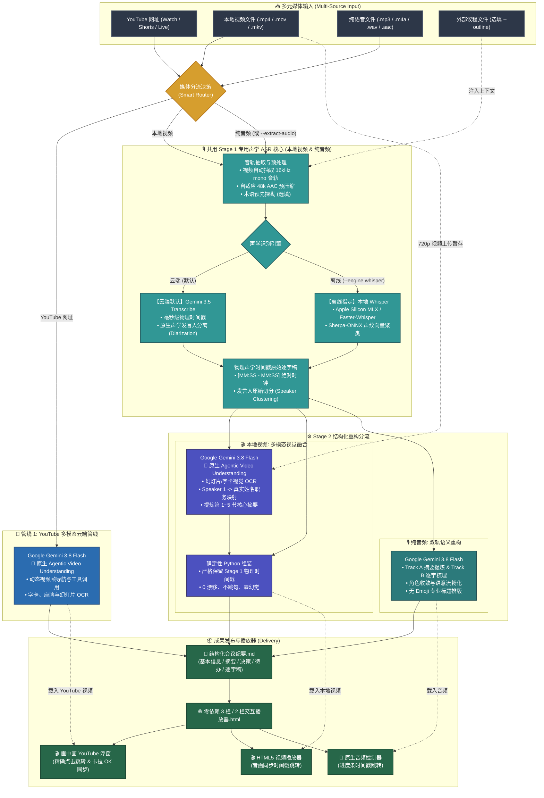

# Meeting Transcribe Agent

[](LICENSE)
[](https://github.com/google-gemini/generative-ai-python)
[](https://ai.google.dev/)
[](https://ai.google.dev/)

[English (en)](README.md) | [繁體中文 (zh-TW)](README.zh-TW.md) | [简体中文 (zh-CN)](README.zh-CN.md) | [日本語 (ja)](README.ja.md) | [한국어 (ko)](README.ko.md)

## 项目概述 (Overview)

**Meeting Transcribe Agent** 是一套基于 **Gemini 3.5 Transcribe** 与 **Gemini Agentic Video Understanding** 打造的全方位音视频会议记录生成 Agent，具备“多模态视频处理（YouTube / 本地视频）”与“纯音频高精度双层架构”。专为政务市政主管会议、跨国技术周会以及访谈法务存证等高度要求“时间戳绝对精准”、“发言人切分”与“结构化决策记录”的专业场景打造。

### 依据媒介分流的双轨智能流水线：

1. **YouTube 多模态云端管线 (YouTube 云端原生直连)**：
   - **单次 Request 极致效能**：直接由 **Gemini 3.8 Flash** 进行视觉多模态端到端分析，同步阅读演示幻灯片（Slide OCR）与现场领导桌牌／电视字幕，精确对应讲者姓名职务，节省 50% Token 消耗与等待时间（32 分钟视频仅需 ~44 秒）。
   - **Agentic Video Understanding (`--agentic`)**：支持动态多轮视频帧导航与工具调用，针对长达数小时的长视频或复杂图表进行深层视觉探索。
   - **画中画 YouTube 浮动播放器**：生成的独立 HTML 播放器内置 YouTube IFrame 控制器，支持即时点击时间轴跳转视频与卡拉 OK 歌词式精准同步。

2. **本地视频两阶段融合管线 (音频抽取 + 多模态视觉融合)**：
   - **内嵌字幕真值自动抽取**：自动探测视频容器之 WebRTC 内嵌字幕轨道（`mov_text`、`srt`、`vtt`）或侧载 `.srt` 文件，提取为确认与会者名册与宏观讨论大纲；贯彻“文字归文字，发言人归发言人”铁律，逐字稿正文与物理时间戳 100% 由 Stage 1 声学 ASR 权威掌控。
   - **第一阶段（专用声学 ASR 物理时钟）**：抽取 16kHz mono 音轨，由 **Google Gemini 3.5 Transcribe**（云端首选）或 **Apple Silicon MLX/Whisper + Sherpa-ONNX Diarization**（本地离线）建立毫秒级精确物理时间戳 `[MM:SS - MM:SS]` 与发言人分段。
   - **第二阶段（多模态视觉与摘要融合）**：将 720p 视频与生字稿、自动大纲送入 **Gemini 3.8 Flash**，同步审视画面幻灯片、架构图与发言人桌牌，输出支持时间范围的讲者映射表（`Speaker ID` + `Time Range` -> 真实姓名职务），彻底化解声学欠聚类，并提炼第 1~5 节核心摘要。
   - **三层式层级对齐与确定性组装**：Python 代码以三层式层级（Level 1: 字幕重叠真值 -> Level 2: 多模态时段规则 -> Level 3: 对话交接校准）精确替换发言人，并应用专有名词音意校正，严格保留实体时间戳与 0 漂移。

3. **纯音频高精度双层管线 (录音笔 / 播客 / 语音音频)**：
   - **底层声学转录 (Gemini 3.5 Transcribe)**：专职毫秒级“词级时间戳 (Word Timestamps)”与物理声学“发言人分离 (Diarization)”，确保每一句话皆有真实声波物理锚定，绝不跳漏。
   - **上层语义重构 (Gemini 3.8 Flash)**：前后文脉络理解、同音专有名词校正、发言人身份收敛与自然语意流畅化，提炼决策摘要与待办追踪。
   - **本地离线备用**：支持本地 Apple Silicon GPU (MLX) / faster-whisper 搭配 Sherpa-ONNX 声纹切分。

---

### 为什么架构要明确区分“YouTube”、“本地视频文件”与“纯音频”？

在会议转录的真实场景中，不同媒介所承载的信息与基础设施具有根本性差异：

1. **YouTube（云端原生，自带预建声学时钟）**：
   - YouTube 云端骨干已预先建立 ASR 自动字幕与时间戳索引。Gemini 3.8 Flash 云端直连分析无须重复音频解码，即可同步达成极速摘要与精确时间戳。
2. **本地视频文件（两阶段融合，确保 100% 音画对齐与幻灯片阅读）**：
   - 本地文件缺乏预建声学时钟，纯 LLM 单次推理必然引发严重的时间戳累积漂移与长度截断。两阶段融合以专用 ASR 提供精确时间戳，再由视觉模型读取画面字卡，兼得精准时钟与视觉情报。
3. **纯音频模式（物理声学分离，成本最经济）**：
   - 录音笔与播客本身完全没有画面。专用声学模型（Gemini 3.5 Transcribe / 离线 Whisper）提供毫秒级时间戳与发言人分段，每秒仅消耗 ~32 tokens，成本最经济。

---

### 运行模式与 Token 消耗量估算（经验分享）

> [!NOTE]
> 实际 Token 消耗会因会议发言密度、画面变动幅度与演示细节而异。以下倍率为内部实测长篇会议之估算经验分享，非绝对标准，供架构选型时参考：

* **1. 纯音频双层管线 (Pure Audio Pipeline) — `~1x` 基准消耗**：
  - **机制与消耗**：纯语音音频每秒约 32 tokens（一小时音频约在数万至十余万 Tokens 区间）。
  - **经验定位**：**成本最经济、最省 Token**。专为录音笔、播客、电话访谈等“无画面需求”之纯声音场景设计，由专用声学模型严格锚定字级时间戳与发言人切分。
* **2. Gemini Agentic Video Understanding — `~2x` 消耗**：
  - **机制与消耗**：采用 Google 最新推出的 [Gemini Agentic Video](https://blog.google/innovation-and-ai/models-and-research/gemini-models/introducing-agentic-video-in-gemini/) 技术。消耗约为纯音频的 **2 倍左右**。
  - **经验定位**：**本项目所有视频管线之原生默认模式**。模型不再盲目扫描所有视频帧，而是结合思考缓存（Thinking Cache）与动态工具调用，主动在关键时刻探索高分辨率画面。特别适合数小时长篇会议、图表密集、需跨时间轴深度推理的场景。
* **3. Traditional Gemini Video Understanding — `~3x` 消耗**：
  - **机制与消耗**：传统视频多模态多采每秒固定 1 帧（1 FPS Uniform Sampling）硬性抽样，Token 消耗量最高（约为纯音频的 **3 倍以上**）。
  - **经验定位**：**【本项目未采用，仅供对照参考】**。全片固定频率抽样会传入大量静止或无意义的冗余视频帧，造成 Token 与等待时间的浪费。本项目全面原生采用 Agentic 智能导航（`media_processing=types.MediaProcessing.AGENTIC`）取代了传统抽样方式。

---

## 核心功能与适用场景

### 核心亮点
- **直接支持 YouTube 链接与视频文件**：粘贴 YouTube 网址或视频路径即可一键输出完整会议记录与交互播放器。
- **内嵌字幕真值抽取与无 Emoji 结构大纲**：自动探测容器字幕（`mov_text`/`srt`）或侧载文件，提取 WebRTC 确定与会者名册与宏观时间轴，辅助大模型推理。
- **层级式发言人对齐与时间区间映射**：支持时间区间 Scoped Mapping 与三层式层级校准（字幕重叠 -> 多模态时段规则 -> 对话交接校准），彻底根除声学欠聚类与字典盲目覆盖问题。
- **视觉名牌与幻灯片辅助识别**：利用视频画面上的字卡、背板、演示标题，全自动推导真实人名与职务。
- **高精度发言人区分与逐字转录**：清楚标记每位与会者的发言起止与真实姓名职务。
- **前后文理解与语意流畅化**：超越死板字典转换，通过 LLM 前后文理解自动校正同音错字（如专有名词、头衔），并使转录内容符合自然语意表达。
- **高管级结构化会议纪要**：自动提取会议基本信息、执行摘要、重大决策事项表、讨论议题分析与具体待办追踪清单（Action Items）。
- **零外部依赖交互式 HTML 播放器**：生成单文件轻量 HTML，支持点击字句即时跳转音频或视频、发言人色彩标记、关键字即时搜索与多语言界面切换。

### 适用场景
1. **市政与政务公开会议**：许多公开会议直接在 YouTube 直播，系统可直接输入链接自动识别市长、各部门领导名牌字幕，免下载免抽音轨。
2. **长篇线上研讨会与技术发布会**：结合幻灯片画面与发言，提炼大纲与技术细节。
3. **多人线下会议录音**：数十位参会人轮流发言，精准记录案由、裁示要点并消除长音频声纹漂移。
4. **本地语音识别备用需求**：具备本地 Whisper 离线语音识别引擎，可在网络受限或特定音频处理需求下作为本地转录备用方案。

---

## 双引擎架构 (Dual-Engine Architecture)

### 1. 全云端极速模式（默认核心）
* **双模型架构**：采用 **Google Gemini 3.5 Transcribe**（多模态语音识别与声学切分）搭配 **Gemini 3.8 Flash**（结构化会议重构与摘要）。
* **智能音频预处理 (Smart Ingestion)**：自动探测音频比特率与体积。原始低码率文件免转码直传，高码率音频则自适应压缩至 16kHz mono 最佳语音格式。
* **双轨异步并行，发言人身份统一 (Dual-Track Concurrency with Unified Speaker Identity)**：
  * 先解析出唯一权威的发言人对照表，再将“核心决策摘要”与“长篇逐字稿修复”拆分为两个独立轨道并行生成，确保两轨输出的发言人称呼完全一致，同时彻底解决长篇文本顺序输出的阻塞问题。
  * 关闭思考预热延迟（Zero Thinking Budget），实现即时的首字流式响应。
* **零残留隐私保护**：媒体经由 Google Cloud Storage 暂存上传，转录完成后自动调用清理机制销毁云端暂存，不留数据隐患。

### 2. 本地语音识别备用模式（Whisper + Sherpa-ONNX）
* **本地声学识别备用**：支持在网络受限或特定本地 ASR 需求下，在第一阶段利用本地模型提取词级时间戳与声学切分。
* **跨平台硬件加速**：支持 Apple Silicon GPU 原生加速（`mlx-whisper`）或跨平台 CPU/CUDA（`faster-whisper`）。
* **声学特征向量聚类**：整合 **Sherpa-ONNX (3D-Speaker / PyAnnote)** 进行本地声学特征抽取与发言人区分。
* **双指针滑动窗口对齐 (Sliding Window)**：采用线性扫描算法实现单词时间戳与声纹区间的毫秒级精确匹配，确保发言人标记连续稳定。

---

## Agent 对话使用指南 (推荐情境与 Prompt 范例)

本项目主要作为 **AI Agent Skill** 使用。您**不需要**手动输入复杂的命令行参数，只需在对话框中向 Agent 提出需求：

### 常用情境与对话范例：

1. **YouTube 视频会议转录（极速视觉识别名牌与演示幻灯片）**：
   > “请帮我转录这场 YouTube 上的市政会议 `https://www.youtube.com/watch?v=VIDEO_ID`，利用画面上的领导名牌和幻灯片生成完整会议记录与交互播放器。”

2. **YouTube 长篇会议深度探索（启用 Agentic Video Understanding）**：
   > “这部 YouTube 研讨会长达 3 小时 `https://www.youtube.com/watch?v=...`，请使用 Agentic Video 模式帮我做深度视频帧导航，重点提炼各讲者的架构图和讨论结论。”

3. **本地视频文件转录（同步提取幻灯片内容）**：
   > “请转录这份会议视频 `tech_summit.mp4`，请一并参考演示文稿画面，校对讲者姓名与架构术语。”

4. **视频强制抽音轨（追求极致节省 Token）**：
   > “这份视频文件 `interview.mp4` 画面只是固定镜头，请直接帮我抽取音轨跑纯音频流程，以最省 Token 的方式生成摘要。”

5. **标准纯音频会议转录（全自动云端极速处理）**：
   > “请帮我转录这场会议录音 `meeting.mp3`，整理出重点摘要、决策事项与逐字稿播放器。”

6. **搭配会议大纲／通知文件（强烈推荐：人名与术语最精准）**：
   > “这是今天技术会议的录音 `backend_sync.m4a`，旁边附有会议通知 `agenda.md`。请帮我转录并校对人名职务与专有名词。”

7. **指定会议摘要语言（如跨国团队需英文记录）**：
   > “Please transcribe `executive_call.mp3`. Keep the verbatim transcript in original languages, but generate the executive summary and action items in English.”

---

## 核心处理流水线 (Pipeline Architecture)



### 处理管线详细步骤说明 (Pipeline Steps Explained)

系统在接收到输入后，依据媒体属性分为 **“分流决策”**、**“管线执行”** 与 **“成果发布”** 三大阶段：

#### 步骤 1：输入媒体检测与智能分流 (Smart Router)
- **YouTube 网址**（包含 `youtube.com/watch`, `youtu.be/`, Shorts 与 Live 录像）：自动分流至 **🎥 管线 1: YouTube 多模态云端管线**。
- **本地视频文件**（`.mp4`, `.mov`, `.mkv`, `.webm`）：自动分流至 **🎬 管线 2: 本地视频两阶段融合管线**。
- **纯语音文件**（`.mp3`, `.m4a`, `.wav`, `.aac`, `.flac`）或加入 `--extract-audio` 标志者：自动分流至 **🎙️ 管线 3: 纯音频双层管线**。

---

#### 步骤 2A：YouTube 多模态云端管线处理流程
1. **云端直传与零下载**：直接将 YouTube URL 传入 Gemini 多模态 API，免本地下载、免 `yt-dlp`，彻底规避 YouTube 429 频率限制。
2. **原生 Agentic Video Understanding**：
   - 全面原生启用 `types.MediaProcessing.AGENTIC`：结合动态视频帧导航与工具调用，专门在关键时间点深入探索幻灯片、字卡与长官座牌，极速（数十秒）产出高精准度摘要。
3. **一步到位提炼**：直接输出带真实姓名职务的 6 大章节会议记录与时间戳逐字稿。

---

#### 步骤 2B：本地视频两阶段融合管线处理流程
1. **第一阶段（共用专用声学 ASR 核心）**：
   - 自动抽取 16kHz mono 音频轨（具备缓存机制避免重复转码）。
   - **与纯音频 100% 共用相同的 Stage 1 声学 ASR 核心**（48k AAC 预压缩、Cloud Storage 暂存，调用 `gemini-3.5-transcribe` 或本地 `whisper`），产出毫秒级物理时间戳 `[MM:SS - MM:SS]` 与发言人分段。完全支持 `--only-transcript` 提前输出逐字稿。
2. **第二阶段（多模态视觉融合）**：
   - 视频压缩为 720p H.264 并上传至 Cloud Storage 暂存（处理后立即销毁）。
   - 将视频与第一阶段文字稿一同送交 `gemini-3.8-flash`，以**原生 Agentic Video Understanding** 观察画面桌牌、幻灯片 OCR，精确映射 `Speaker 1` 为真实讲者姓名，并产出第 1~5 节核心摘要。
3. **确定性组装**：
   - Python 代码自动将视觉映射应用至物理逐字稿，时间戳 100% 绝对零漂移。

---

#### 步骤 2C：纯音频双层处理流程 (纯语音录音)
1. **第一阶段（共用专用声学 ASR 核心）**：
   - 与本地视频共用相同的 Stage 1 声学 ASR 核心：比特率探测、自适应 48k AAC 预压缩，调用 `gemini-3.5-transcribe`（云端）或 `mlx-whisper` + Sherpa-ONNX（本地离线）。
   - 支持术语与角色预先探勘 (`--outline`)。
2. **第二阶段（上层语义重构）**：
   - 由 `gemini-3.8-flash` 进行双轨并发重构（Track A 摘要提炼 & Track B 逐字梳理），上下文理解、同音字校正、角色名称收敛平滑，产出干净无 Emoji 的专业会议纪要。

---

#### 步骤 3：成果发布与双栏播放器生成 (Delivery)
1. **结构化会议记录 Markdown**：保存为 `<文件名>_會議記錄.md`，内含会议信息、高管摘要、讨论议题、重大决策、待办追踪与发言逐字稿。
2. **零依赖交互式 HTML 播放器**：保存为 `<文件名>_player.html`：
   - **YouTube 输入**：右下角自动嵌入画中画可缩放的 YouTube 视频窗口，点击逐字稿秒数精确跳转播放位置。（*注：因 YouTube 官方安全政策强制要求 HTTP 来源，直接以 `file://` 打开会触发错误 153，建议搭配 `--serve` 参数或 `python3 -m http.server 8000` 启动本地服务打开*）。
   - **音频/本地视频**：底栏内置原生音频控制器，支持进度条拖曳、倍速调整与卡拉 OK 歌词式发言人即时高亮。

### 产出成果文件：
1. **`<文件名>_會議記錄.md`**：完整结构化会议记录。
2. **`<文件名>_player.html`**：独立零外部依赖的**双栏交互式审阅播放器**。
3. **`<文件名>_glossary.md`**：**全局权威术语与人员对照表**（若有启用探勘）。

---

## 安装与部署指南 (Installation & Deployment)

Meeting Transcribe Agent 支持两种不同的运作与安装部署流程：

| 运行平台 | 安装部署方式 | 必要环境变量配置 | 主要使用交互界面 |
| :--- | :--- | :--- | :--- |
| **Google Antigravity & Agent Plugins** | 本地 IDE / CLI / Agent Plugin & Skill | 项目根目录 `.env` 配置文件 | Antigravity IDE / CLI 对话窗口自然语言调度 (`SKILL.md`) |
| **Gemini Enterprise** | 通过 `deploy.sh` 部署至 Vertex AI Agent Runtime | `deploy.sh` 参数或 `gemini-enterprise/.env` | Gemini Enterprise 企业网页界面、Vertex AI Agent Engine、A2A 协议 |

---

### 基础环境要求 (Common Prerequisites)

1. **FFmpeg**（用于音频探测、时长分析与自适应预压缩）：
   - **macOS**: `brew install ffmpeg`
   - **Ubuntu/Debian**: `sudo apt update && sudo apt install ffmpeg`
   - **Windows**: `winget install Gyan.FFmpeg`

2. **Google Cloud 认证 (ADC)**：
   Gemini API 全面采用 Vertex AI 与 Application Default Credentials (ADC) 进行验证：
   ```bash
   gcloud auth application-default login
   ```

---

### 方式一：Google Antigravity 与 Agent Plugins 1.0 安装 (AI Agent 插件、技能与命令行)

可直接作为符合 [Agent Plugins 1.0](https://agent-plugins.org/) 规范的插件（Plugin）或 Agent Skill 安装至 Antigravity 与兼容的 AI Client 中，或通过 Python 命令行独立运行：

1. **安装为 Agent Plugin（推荐：自动加载 `plugin.json` 与 `rules/AGENTS.md` 只读保护规则）**：
   - **全局插件 (Global Plugin)**（所有项目工作区均可调用，推荐）：
     ```bash
     git clone https://github.com/sylphlin/meeting-transcribe-agent.git ~/.gemini/config/plugins/meeting-transcribe-agent
     ```
   - **工作区专属插件 (Workspace Plugin)**（仅当前项目工作区生效）：
     ```bash
     git clone https://github.com/sylphlin/meeting-transcribe-agent.git .agents/plugins/meeting-transcribe-agent
     ```

2. **或安装为 Agent Skill**：
   - **全局技能 (Global Skill)**：
     ```bash
     git clone https://github.com/sylphlin/meeting-transcribe-agent.git ~/.gemini/config/skills/meeting-transcribe-agent
     ```
   - **工作区专属技能 (Workspace Skill)**：
     ```bash
     git clone https://github.com/sylphlin/meeting-transcribe-agent.git .agent/skills/meeting-transcribe-agent
     ```

3. **安装 Python 运行环境依赖**：
   ```bash
   pip install google-genai google-cloud-storage
   ```
   *（可选离线 Whisper 备用：Apple Silicon 请安装 `pip install mlx-whisper sherpa-onnx`，Linux/Windows 请安装 `pip install faster-whisper sherpa-onnx`）。*

4. **初始化 Google Cloud 环境 (`./setup.sh`)**：
   运行自动化环境配置脚本，验证认证、启用必要 API (`aiplatform.googleapis.com`、`storage.googleapis.com`)、创建并配置 Cloud Storage 存储桶（自动应用 CORS 与 2天/30天生命周期销毁规则），并自动生成 `.env`：
   ```bash
   chmod +x setup.sh
   ./setup.sh
   ```
   *（亦可指定参数：`./setup.sh -p your-gcp-project-id -r us-central1`）。*
   在 Antigravity 中运行时，Agent 可直接调用 `./setup.sh` 完成云端环境与配置初始化，分层负责、免除手动配置负担。

5. **在 Antigravity 中使用**：
   Antigravity 会自动索引并读取 `SKILL.md`，您只需在对话窗口中提出需求：
   > “请帮我转录这份主管会议录音 `meeting.mp3`，生成重点摘要、决策事项与逐字稿播放器。”

---

### 方式二：Gemini Enterprise 安装 (云端 Vertex AI Agent Runtime 部署)

通过 Google ADK 2.0 与 `agents-cli`，将转录 Agent 部署至 Google Cloud Vertex AI Agent Runtime（Agent Engine / Reasoning Engine）作为企业级托管服务。

本部署流程采用 **100% 纯原生 `gcloud`** 进行资源创建，不依赖 Terraform 等任何第三方工具，在 Google Cloud Shell 中即可直接一键执行：

1. **安装部署工具 (`uv` 与 `google-agents-cli`)**：
   ```bash
   uv tool install google-agents-cli
   ```

2. **通过 `./deploy.sh` 一键自动部署**：
   项目内置的一键部署脚本遵循分层负责原则：底层 GCP 基础设施交由 `./setup.sh` 自动构建（启用 API、创建存储桶与 CORS/Lifecycle、配置服务账号 IAM 权限），接着调用 `agents-cli deploy` 打包部署至 Vertex AI Agent Runtime 并自动注册至 Gemini Enterprise：
   ```bash
   chmod +x setup.sh deploy.sh

   # 自动化部署（委托 setup.sh 构建云端基础设施、部署并自动关联 Gemini Enterprise）：
   ./deploy.sh

   # 或指定项目与区域：
   ./deploy.sh --project YOUR_GCP_PROJECT_ID --region us-central1

   # 模拟执行（Dry-Run）：
   ./deploy.sh --dry-run
   ```

3. **企业集成与成果交付**：
   - **网页操作界面**：部署后可直接在 Gemini Enterprise 官方网页的 Agent 扩展列表中调用。
   - **云端 Agent 引擎**：可通过 Vertex AI Reasoning Engine SDK 或 Agent-to-Agent (A2A) 跨 Agent 通信协议调用。
   - **企业成果交付**：生成的结构化 Markdown 会议记录与交互播放器 HTML 将自动上传至 GCS，并返回 **24 小时有效的安全签名链接 (Signed URLs)**，免登录点击即可在浏览器中审阅。

---

## 项目目录结构

```text
meeting-transcribe-agent/
├── SKILL.md                          # Agent Skill 专用作业手册与参数架构
├── README.md                         # 项目介绍、使用场景与技术架构 (英文)
├── README.zh-CN.md                   # 简体中文项目文档
├── README.zh-TW.md                   # 繁体中文项目文档
├── LICENSE                           # MIT 开源授权
├── .gitignore                        # 忽略测试媒体与本地缓存
├── .env.example                      # Antigravity Skill 环境变量示例
├── meeting_transcribe.py             # 根目录命令行入口
├── deploy.sh                         # 100% 原生 gcloud 一键部署脚本 (支持 Cloud Shell)
├── scripts/                          # 核心模块
│   ├── __init__.py
│   ├── meeting_transcribe.py         # 主流程调度器 (支持双引擎)
│   ├── audio_utils.py                # 智能码率探测与 FFmpeg 预压缩
│   ├── gemini_engine.py              # Gemini 3.5 Transcribe 转录与 3.8 Flash 双轨重构
│   ├── diarization.py                # 本地声学切分 (Sherpa-ONNX) 与滑动窗口对齐
│   ├── glossary.py                   # 双轨专有名词探勘
│   ├── canonicalizer.py              # 声学分群收敛与发言人正规化
│   └── html_generator.py             # 现代独立 HTML 播放器生成器
├── assets/                           # 播放器模板与提示词
│   ├── audio_player_template.html    # 独立离线双栏音频审阅播放器模板
│   ├── video_player_template.html    # 三栏式多模态视频审阅播放器模板
│   └── prompts/                      # 提示词模板目录
└── gemini-enterprise/                # Gemini Enterprise (ADK 2.0 / Vertex AI) 部署包
    ├── deploy.sh                     # 转发至根目录 deploy.sh
    ├── agents-cli-manifest.yaml      # agents-cli 部署配置文件
    └── app/                          # 企业 Agent 模块与工具
```

---

## 进阶：开发者与命令行调用 (Developer & Headless CLI)

> [!TIP]
> **普通用户注意**：如果您是通过 AI Agent（如 Antigravity / Claude Code）使用本系统，您**不需要手动输入这些命令**！Agent 会根据对话自动阅读 `SKILL.md` 并配置最佳参数。

### 基本执行（YouTube 视频）
```bash
# YouTube 视频直接转录与生成播放器（原生 Agentic Video 模式）
python3 meeting_transcribe.py "https://www.youtube.com/watch?v=VIDEO_ID"
```

### 基本执行（音频与本地视频文件）
```bash
# 云端纯音频默认模式
python3 meeting_transcribe.py "meeting_record.mp3"

# 本地视频两阶段融合（抽取音频共用 Stage 1 ASR，暂存视频走 Agentic 视觉融合）
python3 meeting_transcribe.py "presentation.mp4"

# 本地离线备用执行（Apple Silicon GPU / Sherpa-ONNX）
python3 meeting_transcribe.py "meeting_record.mp3" --engine whisper --whisper-backend auto
```

### 包含会议大纲与指定摘要语言
```bash
python3 meeting_transcribe.py "meeting_record.mp3" --outline "agenda.txt" --summary-language en
```

### 完整参数手册

| 参数 | 说明 | 默认值 |
| :--- | :--- | :--- |
| `input_source` | 音频/视频文件路径 (mp3, m4a, wav, mp4, mov 等) 或 YouTube 网址 | *(必填)* |
| `-o, --output` | 自定义 Markdown 会议记录输出路径 | `<文件名>_minutes.md` |
| `--agentic` | 所有视频来源均默认原生启用 Agentic Video Understanding 动态视频帧导航 | `True` |
| `--extract-audio` | 强制从视频文件抽取纯音频走纯音频流程 | `False` |
| `--engine` | 纯音频转录引擎：`gemini` (云端默认) 或 `whisper` (本地备用) | `gemini` |
| `--whisper-backend` | 离线模式后端：`auto` (自动探测 Apple Silicon MLX), `mlx`, `faster-whisper` | `auto` |
| `--whisper-model` | 离线模式模型大小 (`tiny`, `base`, `small`, `medium`, `large-v3`) | `small` |
| `--no-diarization` | 停用离线模式的声学声纹切分 | `False` |
| `--clustering-threshold` | Sherpa-ONNX 声学聚类阈值 | `0.68` |
| `--num-speakers` | 精确参会发言人数（已知时填写，-1 为自动探测） | `-1` |
| `--embedding-type` | Sherpa-ONNX 声纹特征抽取模型 (`eres2net`, `cam++`) | `eres2net` |
| `--project` | Vertex AI 的 GCP 项目 (默认读取 `GOOGLE_CLOUD_PROJECT`/`GCP_PROJECT`，或 ADC 默认项目) | `None` |
| `--region` | Vertex AI 的 GCP 区域 (默认读取 `GOOGLE_CLOUD_LOCATION` 或 `global`) | `global` |
| `--bucket` | 暂存本地音频/视频的 GCS bucket (默认读取 `MEETING_STORAGE_BUCKET`) | `None` |
| `--transcribe-model` | 云端转录语音识别模型 (默认读取 `TRANSCRIBE_MODEL`) | `gemini-3.5-transcribe-preview` |
| `--summary-model` | 结构化会议纪要与视觉模型 (默认读取 `SUMMARY_MODEL`) | `gemini-3.8-flash` |
| `--outline` | 外部会议通知、大纲或议程文件路径 (.txt / .md) | `None` |
| `--force-glossary` | 强制重新提取全局术语对照表 (覆盖缓存) | `False` |
| `--no-glossary` | 跳过全局术语对照表提取 | `False` |
| `--no-player` | 停用独立交互式 HTML 播放器生成 | `False` |
| `--no-compress` | 停用上传前 FFmpeg 自动预压缩 | `False` |
| `--summary-language` | 指定会议纪要语言 (`auto` 自动跟随对话；或 `en`, `zh-CN`, `ja` 等) | `None` (auto) |
| `--only-transcript` | 仅执行第一阶段转录输出纯逐字稿，跳过结构化摘要 | `False` |
| `--language` | 离线 Whisper 语音语言代码 (`auto`, `en`, `zh`, `ja`) | `auto` |
| `--serve` | 自动启动轻量本地 HTTP 服务器并打开浏览器（YouTube 视频同步推荐） | `False` |

---

## 开源许可证 (License)

本项目采用 [MIT License](LICENSE) 开源授权。
