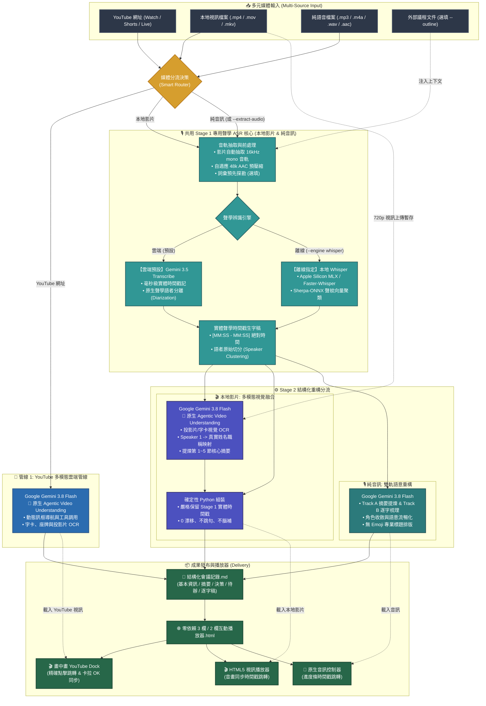

# Meeting Transcribe Agent

[](LICENSE)
[](https://github.com/google-gemini/generative-ai-python)
[](https://ai.google.dev/)
[](https://ai.google.dev/)

[English (en)](README.md) | [繁體中文 (zh-TW)](README.zh-TW.md) | [简体中文 (zh-CN)](README.zh-CN.md) | [日本語 (ja)](README.ja.md) | [한국어 (ko)](README.ko.md)

## 專案概述 (Overview)

**Meeting Transcribe Agent** 是一套基於 **Gemini 3.5 Transcribe** 與 **Gemini Agentic Video Understanding** 打造的全方位影音會議記錄生成 Agent，具備「多模態視訊處理（YouTube / 本地影片）」與「純音訊高精度雙層架構」。專為公務市政主管會議、跨國技術週會以及訪談法務存證等高度要求「時間戳絕對精準」、「發言人切分」與「結構化決策記錄」的專業場景所打造。

### 依據媒介分流的雙軌智慧流水線：

1. **YouTube 多模態雲端管線 (YouTube 雲端原生直入)**：
   - **單一 Request 極致效能**：直接由 **Gemini 3.8 Flash** 進行視覺多模態端到端分析，同步閱讀簡報投影片（Slide OCR）與現場長官名牌／電視鏡面字幕，精確對應講者姓名職稱，省下 50% Token 消耗與等待時間（32 分鐘影片僅需 ~44 秒）。
   - **Agentic Video Understanding (`--agentic`)**：支援動態多輪訊框導航與工具調用，針對多小時長影片或複雜圖表進行深層視覺探索。
   - **畫中畫 YouTube Dock 播放器**：產出的獨立 HTML 播放器內建 YouTube IFrame 控制器，支援即時點擊時間軸跳轉視訊與卡拉 OK 歌詞式精準同步。

2. **本地影片兩階段融合管線 (音訊抽取 + 多模態視覺融合)**：
   - **內嵌字幕真值自動萃取**：自動探測視訊容器之 WebRTC 內嵌字幕軌道（`mov_text`、`srt`、`vtt`）或側載 `.srt` 檔案，提取為確認與會者名冊與巨觀討論大綱；貫徹「文字歸文字，發言人歸發言人」鐵律，逐字稿內文與物理時間戳 100% 由 Stage 1 聲學 ASR 權威掌控。
   - **第一階段（專用聲學 ASR 錨定）**：抽取 16kHz mono 音軌，由 **Google Gemini 3.5 Transcribe**（雲端首選）或 **Apple Silicon MLX/Whisper + Sherpa-ONNX Diarization**（本地離線）建立毫秒級精確物理時間戳 `[MM:SS - MM:SS]` 與講者發言段落。
   - **第二階段（多模態視覺與摘要融合）**：將 720p 視訊與生字稿、自動大綱送入 **Gemini 3.8 Flash**，同步審視畫面投影片、架構圖與發言者名牌，輸出支援時間範圍的講者映射表（`Speaker ID` + `Time Range` -> 真實姓名職稱），徹底化解聲學欠聚類，並提煉第 1~5 節專業會議摘要。
   - **三層式階層對齊與確定性組裝**：Python 程式碼以三層式階層（Level 1: 字幕重疊真值 -> Level 2: 多模態時段規則 -> Level 3: 對話交棒校準）精確置換發言人，並套用專有名詞音意校正，嚴格保留實體時間戳與 0 漂移。

3. **純音訊高精度雙層管線 (錄音筆 / Podcast / 語音音檔)**：
   - **底層聲學轉譯 (Gemini 3.5 Transcribe)**：專職毫秒級「詞級時間戳記 (Word Timestamps)」與物理聲學「語者分離 (Diarization)」，確保每一句話皆有真實聲波物理錨定，絕不跳漏。
   - **上層語意重構 (Gemini 3.8 Flash)**：前後文脈絡理解、同音專有名詞校正、發言人身分收斂與上下文語意流暢化，提煉決策摘要與待辦追蹤。
   - **本地離線備援**：支援本地 Apple Silicon GPU (MLX) / faster-whisper 搭配 Sherpa-ONNX 聲紋切分。

---

### 為什麼架構要明確區分「YouTube」、「本地影片檔案」與「純音訊」？

在會議轉譯的真實場景中，不同媒介所乘載的情報與基礎設施具有根本性差異：

1. **YouTube（雲端原生，自帶預建聲學時鐘）**：
   - YouTube 雲端骨幹已預先建立 ASR 自動字幕與時間戳索引。Gemini 3.8 Flash 雲端直入分析無須重複音訊解碼，即可同步達成極速摘要與精確時間戳。
2. **本地影片檔案（兩階段融合，確保 100% 聲畫對齊與投影片閱讀）**：
   - 本地檔案缺乏預建聲學時鐘，純 LLM 單次推論必然引發嚴重的時間戳累積漂移與長度截斷。兩階段融合以專用 ASR 提供精確時間戳，再由視覺模型讀取畫面字卡，兼得精準時鐘與視覺情報。
3. **純音訊模式（物理聲學分離，成本最經濟）**：
   - 錄音筆與 Podcast 本身完全沒有畫面。專用聲學模型（Gemini 3.5 Transcribe / 離線 Whisper）提供毫秒級時間戳與語者分段，每秒僅消耗 ~32 tokens，成本最經濟。

---

### 運作模式與 Token 消耗量概估（經驗分享）

> [!NOTE]
> 實際 Token 消耗會因會議發言密度、畫面變動幅度與簡報細節而異。以下倍率僅為內部實測之概估經驗分享，非絕對標準，供架構選擇時參考：

* **1. 純音訊雙層管線 (Pure Audio Pipeline) — `~1x` 基準消耗**：
  - **機制與消耗**：純語音音訊每秒約 32 tokens（一小時音訊約在數萬至十多萬 Tokens 區間）。
  - **經驗定位**：**成本最經濟、最省 Token**。專為錄音筆、Podcast、電話訪談等「無畫面需求」之純聲音場景設計，由專用聲學模型嚴格錨定字級時間戳與語者切分。
* **2. Gemini Agentic Video Understanding — `~2x` 消耗**：
  - **機制與消耗**：採用 Google 最新推出的 [Gemini Agentic Video](https://blog.google/innovation-and-ai/models-and-research/gemini-models/introducing-agentic-video-in-gemini/) 技術。消耗約為純音訊的 **2 倍左右**。
  - **經驗定位**：**本專案所有視訊管線之原生預設模式**。模型不再盲目掃描所有訊框，而是結合思考快取（Thinking Cache）與動態工具調用，主動在關鍵時刻探索高解析畫面。特別適合數小時長篇會議、簡報圖表密集、需跨時間軸深度推論的場景。
* **3. Traditional Gemini Video Understanding — `~3x` 消耗**：
  - **機制與消耗**：傳統視訊多模態多採每秒固定 1 訊框（1 FPS Uniform Sampling）硬性取樣，Token 消耗量最高（約為純音訊的 **3 倍以上**）。
  - **經驗定位**：**【本專案未採用，僅供對照參考】**。全片固定頻率取樣會傳入大量靜止或無意義的冗餘訊框，造成 Token 與等待時間的浪費。本專案全面原生採用 Agentic 智慧導航（`media_processing=types.MediaProcessing.AGENTIC`）取代了傳統取樣方式。

---

## 核心功能與適用場景

### 它能為您做什麼？
- **直接支援 YouTube 連結與影片檔案**：貼上 YouTube 網址或影片路徑即可一鍵輸出完整會議記錄與互動播放器。
- **內嵌字幕真值萃取與無 Emoji 結構大綱**：自動偵測容器字幕（`mov_text`/`srt`）或側載檔案，提取 WebRTC 確定與會者名冊與巨觀時間軸，輔助大模型推論。
- **階層式發言人對齊與時間區段映射**：支援時間區段 Scoped Mapping 與三層式階層校準（字幕重疊 -> 多模態時段規則 -> 對話交棒校準），徹底根除聲學欠聚類與字典盲目覆蓋問題。
- **視覺名牌與投影片輔助辨識**：利用視訊畫面上的字卡、背板、簡報標題，全自動推導真實人名與公務職稱。
- **高精度語者區分與逐字轉譯**：清楚標記每位與會者的發言起訖與真實姓名職稱。
- **前後文理解與語意流暢化**：超越死板字典轉換，透過 LLM 前後文理解自動校正同音錯字（如專有名詞、官銜），並使轉譯內容符合自然語法與多語言環境。
- **高管級結構化會議記錄**：自動提取會議基本資訊、執行摘要、重大決策事項表、討論議題分析與具體待辦追蹤事項（Action Items）。
- **零外部依賴互動式 HTML 播放器**：產出單一輕量 HTML 檔案，支援點擊字句即時跳轉音訊或視訊、語者色彩標記、關鍵字即時搜尋與多國語系切換。

### 適用場景
1. **市政與公務公開會議**：許多政府公開會議直接於 YouTube 直播，系統可直接貼入連結自動辨識市長、局處長名牌字幕，免下載免抽音軌。
2. **長篇線上研討會與產品發表會**：結合投影片畫面與講者發言，提煉大綱與技術細節。
3. **公務機關實體會議錄音**：數十位局處長輪番發言，需精確紀錄案由、裁示要點並消除長音訊聲紋漂移。
4. **本機語音辨識備援需求**：具備本機 Whisper 離線語音辨識引擎，可在網路受限或特定音訊處理需求下作為本機轉譯備援方案。

---

## 雙引擎架構 (Dual-Engine Architecture)

### 1. 全雲端極速模式（預設核心）
* **雙模型架構**：採用 **Google Gemini 3.5 Transcribe**（多模態語音辨識與聲學切分）搭配 **Gemini 3.8 Flash**（結構化會議重構與摘要）。
* **智慧音訊預處理 (Smart Ingestion)**：自動探測音訊位元率與檔案體積。原始低碼率檔案免轉碼直傳，高碼率音訊則自適應壓縮至最佳串流品質，避免無謂的編碼與頻寬消耗。
* **雙軌非同步並行，發言人身分統一 (Dual-Track Concurrency with Unified Speaker Identity)**：
  * 先解析出唯一權威的發言人對照表，再將「核心決策摘要」與「長篇逐字稿修復」拆分為兩個獨立軌道並行生成，確保兩軌輸出的發言人稱呼完全一致，同時徹底解決長篇文本循序輸出的阻塞問題。
  * 關閉思考預熱延遲（Zero Thinking Budget），實現即時的首字串流響應。
* **零殘留隱私保護**：音訊經由 Google Cloud Storage 暫存上傳，轉譯完成後自動呼叫清理機制銷毀雲端暫存，不留資料隱患。

### 2. 本地語音辨識備援模式（Whisper + Sherpa-ONNX）
* **本機聲學辨識備援**：支援在網路受限或特定本機 ASR 需求下，於第一階段利用本機模型提取詞級時間戳記與聲學切分。
* **跨平台硬體加速**：支援 Apple Silicon GPU 原生加速（`mlx-whisper`）或跨平台 CPU/CUDA（`faster-whisper`）。
* **聲學特徵向量聚類**：整合 **Sherpa-ONNX (3D-Speaker / PyAnnote)** 進行本機聲學特徵抽取與語者區分。
* **雙指針滑動窗口對齊 (Sliding Window)**：採用線性掃描算法實現單詞時間戳記與聲紋區間的毫秒級精確匹配，確保語者標記連續穩定。

---

## Agent 對話使用指南 (推薦情境與 Prompt 範例)

本專案主要作為 **AI Agent Skill** 使用。您**不需要**手動輸入複雜的命令列參數，只需在對話框中向 Agent 提出需求，Agent 便會自主調度後台轉譯管線：

### 常用情境與對話範例：

1. **YouTube 影片會議轉譯（極速視覺辨識名牌與簡報）**：
   > "請幫我轉譯這部市政會議 YouTube 影片 `https://www.youtube.com/watch?v=VIDEO_ID`，並根據畫面中的長官名牌與投影片整理會議記錄與互動播放器。"

2. **長篇 YouTube 研討會（Agentic Video 深度多模態理解）**：
   > "這部 3 小時的技術研討會 `https://www.youtube.com/watch?v=...` 簡報內容很多，請開啟 Agentic 模式動態導航畫面，深入摘要各項架構圖與討論結論。"

3. **本地影片檔案轉譯（讀取投影片文字）**：
   > "請轉譯這份會議錄影 `tech_summit.mp4`，注意畫面上的簡報投影內容以確認講者姓名與架構術語。"

4. **抽取音軌轉譯（節省 Token 模式）**：
   > "這份錄影 `interview.mp4` 畫面固定，請幫我直接抽取音軌走純音訊流程，以最節省 Token 的方式轉譯。"

5. **一般純音訊會議記錄**：
   > "請轉譯這份主管會議錄音 `meeting.mp3`，產出包含執行摘要、決策事項與待辦清單的結構化會議記錄及互動播放器。"

6. **附帶會議大綱/議程（推薦，確保精確人名與專有名詞）**：
   > "這是今天的技術會議音訊 `backend_sync.m4a`，附上會議議程大綱 `agenda.md`，請對照會議大綱轉譯並校正術語。"

7. **指定產出語言（跨國團隊）**：
   > "請轉譯 `executive_call.mp3`，發言逐字稿請保持原始發言語言，但結構化摘要與待辦追蹤請以英文輸出。"

---

## 核心處理流水線 (Pipeline Architecture)



### 處理管線詳細步驟說明 (Pipeline Steps Explained)

系統在接收到輸入後，依據媒體屬性分為 **「分流決策」**、**「管線執行」** 與 **「成果發布」** 三大階段：

#### 步驟 1：輸入媒體檢測與智慧分流 (Smart Router)
- **YouTube 網址**（包含 `youtube.com/watch`, `youtu.be/`, Shorts 與 Live 錄影）：自動分流至 **🎥 管線 1: YouTube 多模態雲端管線**。
- **本地視訊檔案**（`.mp4`, `.mov`, `.mkv`, `.webm`）：自動分流至 **🎬 管線 2: 本地影片兩階段融合管線**。
- **純語音檔案**（`.mp3`, `.m4a`, `.wav`, `.aac`, `.flac`）或加入 `--extract-audio` 旗標者：自動分流至 **🎙️ 管線 3: 純音訊雙層管線**。

---

#### 步驟 2A：YouTube 多模態雲端管線處理流程
1. **雲端直傳與零下載**：直接將 YouTube URL 傳入 Gemini 多模態 API，免本地下載、免 `yt-dlp`，徹底規避 YouTube 429 頻率限制。
2. **原生 Agentic Video Understanding**：
   - 全面原生啟用 `types.MediaProcessing.AGENTIC`：結合動態訊框導航與工具調用，專門在關鍵時間點深入探索投影片、字卡與長官座牌，極速（數十秒）產出高精準度摘要。
3. **一步到位提煉**：直接輸出帶真實姓名職稱的 6 大章節會議記錄與時間戳記逐字稿。

---

#### 步驟 2B：本地影片兩階段融合管線處理流程
1. **第一階段（共用專用聲學 ASR 核心）**：
   - 自動抽取 16kHz mono 音軌（具備快取機制避免重複轉碼）。
   - **與純音訊 100% 共用相同的 Stage 1 聲學 ASR 核心**（48k AAC 預壓縮、Cloud Storage 暫存，調用 `gemini-3.5-transcribe` 或本地 `whisper`），產出毫秒級實體時間戳 `[MM:SS - MM:SS]` 與講者發言段落。完全支援 `--only-transcript` 提前輸出逐字稿。
2. **第二階段（多模態視覺融合）**：
   - 視訊壓縮為 720p H.264 並上傳至 Cloud Storage 暫存（處理後立即銷毀）。
   - 將視訊與第一階段文字稿一同送交 `gemini-3.8-flash`，以**原生 Agentic Video Understanding** 觀察畫面名牌、投影片 OCR，精確映射 `Speaker 1` 為真實講者姓名，並產出第 1~5 節核心摘要。
3. **確定性組裝**：
   - Python 程式碼自動將視覺映射套用至實體逐字稿，時間戳 100% 絕對零漂移。

---

#### 步驟 2C：純音訊雙層處理流程 (純語音錄音檔)
1. **第一階段（共用專用聲學 ASR 核心）**：
   - 與本地影片共用相同的 Stage 1 聲學 ASR 核心：位元率探測、自適應 48k AAC 預壓縮，調用 `gemini-3.5-transcribe`（雲端）或 `mlx-whisper` + Sherpa-ONNX（本地離線）。
   - 支援術語與角色預先探勘 (`--outline`)。
2. **第二階段（上層語意重構）**：
   - 由 `gemini-3.8-flash` 進行雙軌併發重構（Track A 摘要提煉 & Track B 逐字梳理），前後文理解、同音字校正、角色名稱收斂平滑，產出乾淨無 Emoji 的專業會議記錄。

---

#### 步驟 3：成果發布與雙欄播放器生成 (Delivery)
1. **結構化會議記錄 Markdown**：存檔為 `<檔名>_會議記錄.md`，內含會議資訊、高管摘要、討論議題、重大決策、待辦追蹤與發言逐字稿。
2. **零依賴互動式 HTML 播放器**：存檔為 `<檔名>_player.html`：
   - **YouTube 輸入**：右下角自動嵌入畫中畫可縮放之 YouTube 視訊視窗，點擊逐字稿秒數精確跳轉 YouTube 播放位置。（*註：因 YouTube 官方安全政策強制要求 HTTP/HTTPS 來源，直接以 `file://` 開啟會觸發錯誤 153，建議搭配 `--serve` 參數自動啟動本機伺服器，或以 `python3 -m http.server 8000` 開啟*）。
   - **音訊/本地影片**：底欄內建原生音訊控制器，支援進度條拖曳、倍速調整與卡拉 OK 歌詞式語者即時高亮。

### 產出成果檔案：
每次轉譯完成後，會在音訊同層目錄自動產出：
1. **📄 `<檔案名>_會議記錄.md`**：完整結構化會議記錄（基本資訊、重點摘要、專題討論、決策事項、待辦追蹤與帶時間戳記發言逐字稿）。
2. **🌐 `<檔案名>_player.html`**：獨立零外部依賴的**雙欄互動式音訊審閱播放器**。
3. **📚 `<檔案名>_glossary.md`**：**全域權威術語與人員對照表**（若有啟用探勘）。

---

## 安裝與部屬指南 (Installation & Deployment)

Meeting Transcribe Agent 支援兩種不同的運作與安裝部屬流程：

| 執行平台 | 安裝部屬方式 | 必要環境變數設定 | 主要使用操作介面 |
| :--- | :--- | :--- | :--- |
| **Google Antigravity** | 以 AI Agent Skill 形式安裝至工作區 | 專案根目錄 `.env` 設定檔 | Antigravity IDE / CLI 對話視窗自然語言調度 (`SKILL.md`) |
| **Gemini Enterprise** | 透過 `deploy.sh` 部屬至 Vertex AI Agent Runtime | `deploy.sh` 參數或 `gemini-enterprise/.env` | Gemini Enterprise 企業網頁介面、Vertex AI Agent Engine、A2A 協議 |

---

### 共通基礎相依工具 (Common Prerequisites)

1. **FFmpeg**（用於音訊探測、時間長度解析與自適應預壓縮）：
   - **macOS**: `brew install ffmpeg`
   - **Ubuntu/Debian**: `sudo apt update && sudo apt install ffmpeg`
   - **Windows**: `winget install Gyan.FFmpeg`

2. **Google Cloud 認證 (ADC)**：
   Gemini API 全面採用 Vertex AI 與 Application Default Credentials (ADC) 進行驗證：
   ```bash
   gcloud auth application-default login
   ```

---

### 方式一：Google Antigravity 安裝 (本機 AI Agent 技能與命令列)

直接將專案作為 Agent 技能安裝至 Antigravity，在 IDE 開發環境中透過自然語言對話進行會議記錄轉譯，或透過 Python 命令列獨立執行：

1. **安裝 Skill 至 Antigravity**：
   - **全域技能 (Global Skill)**（所有專案工作區皆可調用，推薦）：
     ```bash
     git clone https://github.com/sylphlin/meeting-transcribe-agent.git ~/.gemini/config/skills/meeting-transcribe-agent
     ```
   - **工作區專屬技能 (Workspace Skill)**（僅目前專案工作區生效）：
     ```bash
     git clone https://github.com/sylphlin/meeting-transcribe-agent.git .agent/skills/meeting-transcribe-agent
     ```

2. **安裝 Python 執行環境套件**：
   ```bash
   pip install google-genai google-cloud-storage
   ```
   *（可選離線 Whisper 備援：Apple Silicon 請安裝 `pip install mlx-whisper sherpa-onnx`，Linux/Windows 請安裝 `pip install faster-whisper sherpa-onnx`）。*

3. **設定環境變數 (`.env`)**：
   複製專案根目錄的 `.env.example` 為 `.env`，並將模型 location 設為 `global`、雲端基礎架構 region 設為 `us-central1`：
   ```bash
   cp .env.example .env
   ```
   `.env` 內容範例：
   ```bash
   GOOGLE_CLOUD_PROJECT=your-gcp-project-id
   GOOGLE_CLOUD_LOCATION=global
   GCP_REGION=us-central1
   MEETING_STORAGE_BUCKET=meeting-transcribe-your-gcp-project-id
   TRANSCRIBE_MODEL=gemini-3.5-transcribe-preview
   SUMMARY_MODEL=gemini-3.8-flash
   ```
   *（如需使用雲端 Gemini 處理本機檔案，可直接透過指令建立儲存桶：`gcloud storage buckets create gs://meeting-transcribe-your-gcp-project-id --location=us-central1`）。*

4. **於 Antigravity 中使用**：
   Antigravity 會自動探索並讀取 `SKILL.md`，您只需在對話視窗中提出需求：
   > "請幫我轉譯這份主管會議錄音 `meeting.mp3`，產出重點摘要、決策事項與逐字稿播放器。"

---

### 方式二：Gemini Enterprise 安裝 (雲端 Vertex AI Agent Runtime 部屬)

透過 Google ADK 2.0 與 `agents-cli`，將轉譯 Agent 部屬至 Google Cloud Vertex AI Agent Runtime（Agent Engine / Reasoning Engine）作為企業級託管服務。

本部屬流程採用 **100% 純原生 `gcloud`** 進行資源建立，不依賴 Terraform 等任何第三方工具，在 Google Cloud Shell 中即可直接一鍵執行：

1. **安裝部屬命令列工具 (`uv` 與 `google-agents-cli`)**：
   ```bash
   uv tool install google-agents-cli
   ```

2. **透過 `./deploy.sh` 一鍵自動部屬**：
   專案內建的一鍵部屬腳本會全自動處理端到端部屬流程：
   - 建立並檢驗 GCS 儲存桶 `gs://meeting-transcribe-${PROJECT_ID}`，自動套用 24 小時 CORS 與生命週期規則（`raw/` 暫存檔 2 天自動銷毀，會議記錄與播放器保存 30 天）。
   - 建立專屬服務帳戶 `meeting-transcribe-sa` 並配置最小權限 (`roles/storage.objectUser`, `roles/aiplatform.user`, `roles/logging.logWriter`)。
   - 調用 `agents-cli deploy` 打包程式碼並部屬至 Vertex AI Agent Runtime。
   - 自動探索並將 Agent 註冊關聯至企業的 Gemini Enterprise 擴充功能中。

   ```bash
   chmod +x deploy.sh

   # 自動化部屬（讀取 .env，透過 gcloud 全自動建立雲端資源、部屬並自動關聯 Gemini Enterprise）：
   ./deploy.sh

   # 或指定專案與區域：
   ./deploy.sh --project YOUR_GCP_PROJECT_ID --region us-central1

   # 模擬執行（Dry-Run）：
   ./deploy.sh --dry-run
   ```

3. **企業整合與成果發布**：
   - **網頁操作介面**：部屬後可直接在 Gemini Enterprise 官方網頁的 Agent 擴充列表中調用。
   - **雲端 Agent 引擎**：可透過 Vertex AI Reasoning Engine SDK 或 Agent-to-Agent (A2A) 跨 Agent 通訊協議調用。
   - **企業成果交付**：生成的結構化 Markdown 會議記錄與互動播放器 HTML 將自動上傳至 GCS，並回傳 **24 小時有效之安全簽署連結 (Signed URLs)**，免登入點擊即可於瀏覽器審閱。

---

## 專案目錄結構

```text
meeting-transcribe-agent/
├── SKILL.md                          # Agent Skill 專用作業手冊與參數架構
├── README.md                         # 專案介紹、使用情境與技術架構 (英文)
├── README.zh-TW.md                   # 繁體中文專案文件
├── LICENSE                           # MIT 開源授權
├── .gitignore                        # 忽略測試音訊與本機快取
├── .env.example                      # Antigravity Skill 環境變數範例
├── meeting_transcribe.py             # 根目錄命令列入口
├── deploy.sh                         # 100% 原生 gcloud 一鍵部屬腳本 (支援 Cloud Shell)
├── scripts/                          # 核心模組
│   ├── __init__.py
│   ├── meeting_transcribe.py         # 主流程調度器 (支援雙引擎)
│   ├── audio_utils.py                # 智慧碼率探測與 FFmpeg 預壓縮
│   ├── gemini_engine.py              # Gemini 3.5 Transcribe 轉譯與 3.8 Flash 雙軌重構
│   ├── diarization.py                # 本地聲學切分 (Sherpa-ONNX) 與滑動窗口對齊
│   ├── glossary.py                   # 雙軌專有名詞探勘
│   ├── canonicalizer.py              # 聲學分群收斂與語者正規化
│   └── html_generator.py             # 現代獨立 HTML 播放器生成器
├── assets/                           # 播放器模板與提示詞
│   ├── audio_player_template.html    # 獨立離線雙欄音訊審閱播放器模板
│   ├── video_player_template.html    # 三欄式多模態視訊審閱播放器模板
│   └── prompts/                      # 提示詞模板目錄
└── gemini-enterprise/                # Gemini Enterprise (ADK 2.0 / Vertex AI) 部屬包
    ├── deploy.sh                     # 轉發至根目錄 deploy.sh
    ├── agents-cli-manifest.yaml      # agents-cli 部屬設定檔
    └── app/                          # 企業 Agent 模組與工具
```

---

## 進階：開發者與命令列呼叫 (Developer & Headless CLI)

> [!TIP]
> **一般使用者注意**：如果您是透過 AI Agent（如 Antigravity / Claude Code）使用本系統，您**不需要手動輸入這些命令**！Agent 會依據對話自動閱讀 `SKILL.md` 並配置最佳參數。

### 基本執行（YouTube 影片）
```bash
# YouTube 影片直接轉譯與生成播放器（原生 Agentic Video 模式）
python3 meeting_transcribe.py "https://www.youtube.com/watch?v=VIDEO_ID"
```

### 基本執行（音訊與本地檔案）
```bash
# 雲端純音訊預設模式
python3 meeting_transcribe.py "meeting_record.mp3"

# 本地影片兩階段融合（抽取音軌共用 Stage 1 ASR，暫存視訊走 Agentic 視覺融合）
python3 meeting_transcribe.py "presentation.mp4"

# 本地離線備援執行（Apple Silicon GPU / Sherpa-ONNX）
python3 meeting_transcribe.py "meeting_record.mp3" --engine whisper --whisper-backend auto
```

### 帶會議大綱與指定輸出語言
```bash
python3 meeting_transcribe.py "meeting_record.mp3" --outline "agenda.txt" --summary-language en
```

### 完整參數手冊

| 參數 | 說明 | 預設值 |
| :--- | :--- | :--- |
| `input_source` | 音訊/影片檔案路徑 (mp3, m4a, wav, mp4, mov 等) 或 YouTube 網址 | *(必填)* |
| `-o, --output` | 自訂 Markdown 會議記錄輸出路徑 | `<檔名>_minutes.md` |
| `--agentic` | 所有視訊來源皆預設原生啟用 Agentic Video Understanding 動態訊框導航 | `True` |
| `--extract-audio` | 強制自視訊檔案抽取純音軌走純音訊流程 | `False` |
| `--engine` | 純音訊轉譯引擎：`gemini` (雲端預設) 或 `whisper` (本地離線備援) | `gemini` |
| `--whisper-backend` | 離線模式後端：`auto` (自動偵測 Apple Silicon MLX), `mlx`, `faster-whisper` | `auto` |
| `--whisper-model` | 離線模式模型大小 (`tiny`, `base`, `small`, `medium`, `large-v3`) | `small` |
| `--no-diarization` | 停用離線模式的聲學聲紋切分 | `False` |
| `--clustering-threshold` | Sherpa-ONNX 聲學聚類閥值 | `0.68` |
| `--num-speakers` | 精確與會發言人人數（已知時填寫，-1 為自動偵測） | `-1` |
| `--embedding-type` | Sherpa-ONNX 聲紋特徵抽取模型 (`eres2net`, `cam++`) | `eres2net` |
| `--project` | Vertex AI 的 GCP 專案 (預設讀取 `GOOGLE_CLOUD_PROJECT`/`GCP_PROJECT`，或 ADC 預設專案) | `None` |
| `--region` | Vertex AI 的 GCP 區域 (預設讀取 `GOOGLE_CLOUD_LOCATION` 或 `global`) | `global` |
| `--bucket` | 暫存本機音訊/影片的 GCS bucket (預設讀取 `MEETING_STORAGE_BUCKET`) | `None` |
| `--transcribe-model` | 雲端轉譯語音辨識模型 (預設讀取 `TRANSCRIBE_MODEL`) | `gemini-3.5-transcribe-preview` |
| `--summary-model` | 結構化會議記錄與視覺模型 (預設讀取 `SUMMARY_MODEL`) | `gemini-3.8-flash` |
| `--outline` | 外部會議通知、大綱或議程檔案路徑 (.txt / .md) | `None` |
| `--force-glossary` | 強制重新提取全域術語對照表 (覆蓋快取) | `False` |
| `--no-glossary` | 跳過全域術語對照表提取 | `False` |
| `--no-player` | 停用獨立互動式 HTML 播放器生成 | `False` |
| `--no-compress` | 停用上傳前 FFmpeg 自動預壓縮 | `False` |
| `--summary-language` | 指定會議記錄語言 (`auto` 自動跟隨對話；或 `en`, `zh-TW`, `ja` 等) | `None` (auto) |
| `--only-transcript` | 僅執行第一階段轉譯輸出純逐字稿，跳過結構化摘要 | `False` |
| `--language` | 離線 Whisper 語音語言代碼 (`auto`, `en`, `zh`, `ja`) | `auto` |
| `--serve` | 自動啟動輕量本機 HTTP 伺服器並開啟瀏覽器（YouTube 視訊同步播放推薦） | `False` |

---

## 授權條款 (License)

本專案採用 [MIT License](LICENSE) 開源授權。

