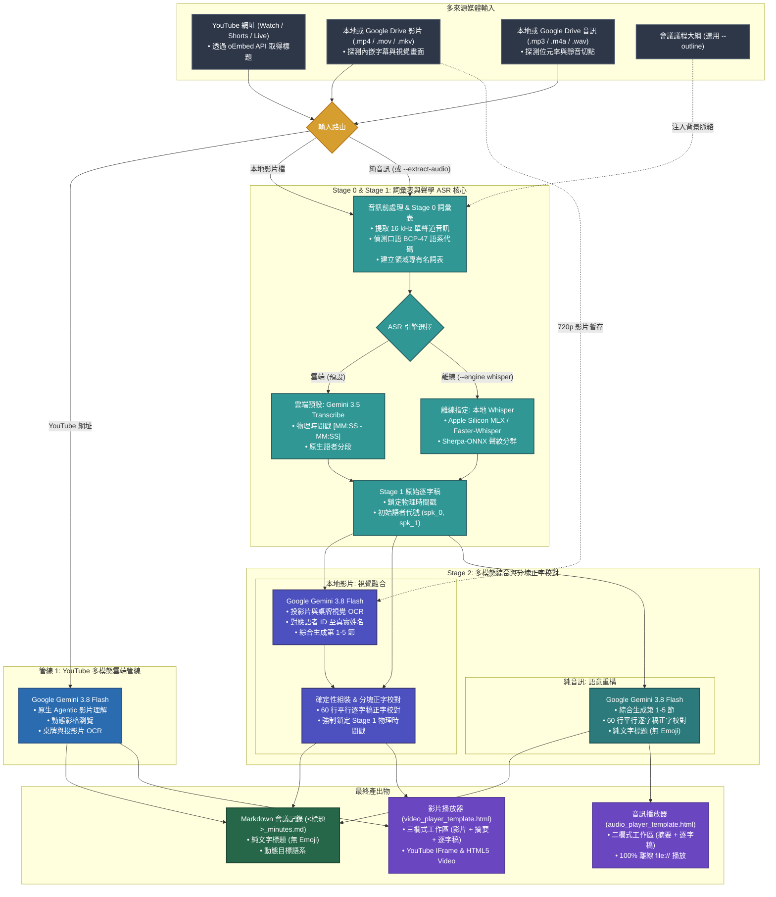

# Meeting Transcribe Agent

[](LICENSE)
[](https://github.com/google-gemini/generative-ai-python)
[](https://ai.google.dev/)
[](https://ai.google.dev/)

[English (en)](README.md) | [繁體中文 (zh-TW)](README.zh-TW.md) | [简体中文 (zh-CN)](README.zh-CN.md) | [日本語 (ja)](README.ja.md) | [한국어 (ko)](README.ko.md)

## 專案總覽 (Overview)

**Meeting Transcribe Agent** 是基於 **Google Gemini 3.5 Transcribe** 與 **Gemini 3.8 Flash** 的多模態會議記錄與逐字稿生成系統。系統支援 YouTube 網址、本地影片檔、Google Drive 分享連結與純音訊錄音檔。每次執行皆會產出結構化 Markdown 會議記錄與獨立的互動式 HTML 播放器。

### 三大專屬處理管線

1. **YouTube 多模態雲端管線 (Cloud Direct Ingestion)**：
   - **雲端直接串流**：將 YouTube 網址直接傳送至 **Gemini 3.8 Flash**，無須下載本地影片檔。
   - **Agentic 影片理解 (`--agentic`)**：自動瀏覽關鍵畫面以辨識簡報投影片、桌牌與畫面字卡（Lower-Thirds）。
   - **互動式 YouTube 播放器**：產出獨立三欄式 HTML 播放器，支援逐字稿同步捲動與點擊時間戳跳轉。

2. **本地影片雙階段融合管線 (Acoustic Ground Truth + Vision Fusion)**：
   - **內嵌字幕提取**：自動檢查影片容器中的內嵌字幕軌（`mov_text`, `srt`, `vtt`）或同名 `.srt` 字幕檔，作為與會者名單與議程參考。
   - **Stage 0（專有名詞表與語系偵測）**：建立領域專有名詞對照表，並偵測主要口語 `BCP-47` 語言代碼（例如 `cmn-Hant-TW`、`en-US`、`ja-JP`）。
   - **Stage 1（聲學基準語音轉錄）**：提取 16 kHz 單聲道音訊，透過 **Gemini 3.5 Transcribe**（預設）或 **本地 Whisper + Sherpa-ONNX**（`--engine whisper`）進行語音轉錄，鎖定物理時間戳 `[MM:SS - MM:SS]` 與語者分段。
   - **Stage 2（多模態視覺融合與分塊逐字稿校對）**：將 720p 影片與 Stage 1 逐字稿送入 **Gemini 3.8 Flash**。模型會讀取簡報畫面與桌牌以生成第 1–5 節摘要，並以 60 行對話為單位平行校對第 6 節逐字稿的字體（如轉換為臺灣正體中文）與專有名詞，同時強制鎖定原始時間戳。
   - **確定性語者組裝**：Python 程式依據字幕重疊、多模態時段規則與交接語氣整合真實人名與職稱，確保零時間戳偏移。

3. **純音訊高精準管線 (Voice Recorders & Podcasts)**：
   - **Stage 0（專有名詞表與語系偵測）**：從音訊提取專有名詞並識別主要口語語言代碼。
   - **Stage 1（聲學語音轉錄）**：使用 **Gemini 3.5 Transcribe**（或離線 Whisper + Sherpa-ONNX）產出帶時間戳的語者對話。
   - **Stage 2（高階摘要與字體校對）**：使用 **Gemini 3.8 Flash** 生成高階主管摘要、行動項目表，並平行校對第 6 節逐字稿字體與術語。

---

### 為何區分「YouTube」、「本地影片」與「純音訊」三種管線？

不同媒體來源具備不同的時間基準與視覺資訊密度：

1. **YouTube 影片**：
   - Google 雲端骨幹已預先建立 YouTube 影片的聲學時間軸索引。
   - 透過 **Gemini 3.8 Flash** 直接雲端串流即可在單次請求中同時分析影音，免除本地下載。
2. **本地影片檔**：
   - 本地影片缺乏雲端預先索引的聲學時鐘。
   - 先由 Stage 1 聲學 ASR 鎖定物理時間戳，再由 Stage 2 視覺融合讀取投影片與桌牌，可避免長影片時間軸漂移與輸出截斷。
3. **純音訊錄音**：
   - 錄音筆與 Podcast 不含視覺畫面。
   - 使用專用聲學模型處理語音，每秒僅消耗約 32 Tokens，具備最佳 Token 經濟效益。

---

### Token 消耗基準估算 (Benchmarks)

> [!NOTE]
> 實際 Token 消耗取決於語音密度與畫面變化頻率。以下倍數為長篇會議之實測基準參考。

* **1. 純音訊管線（`~1x` 基準值）**：
  - **消耗量**：每秒約 32 Tokens（每小時約 10 萬 Tokens）。
  - **適用場景**：純音訊檔案（`meeting_recording.mp3`、Podcast、訪談），兼具精準時間戳與最低 Token 成本。
* **2. Gemini Agentic 影片理解（`~2x` 基準值）**：
  - **消耗量**：約為純音訊基準值的 2 倍。
  - **適用場景**：所有影片管線的預設模式（`media_processing=types.MediaProcessing.AGENTIC`）。模型僅在投影片或語者切換時動態調閱高解析度影格。
* **3. 傳統 1 FPS 固定取樣（`~3x+` 基準值）**：
  - **消耗量**：純音訊基準值的 3 倍以上。
  - **狀態**：本專案不採用此模式，僅列出供基準對照。

---

## 核心功能與適用場景

### 核心功能
- **多來源媒體輸入**：支援 YouTube 網址、Google Drive 分享連結、本地影片檔與本地音訊檔。
- **內嵌字幕提取**：自動探測影片容器中的 `mov_text`、`srt` 與 `vtt` 字幕軌以建立出席名單與時間軸參考。
- **階層式語者正名**：結合畫面桌牌、字卡與口頭介紹，將代號（`spk_0`, `spk_1`）對應至真實姓名與職稱。
- **Stage 2 分塊逐字稿正字校對**：以 60 行對話為單位平行校對第 6 節逐字稿，統一目標正體/繁體字形與領域專有名詞，且不更動時間戳。
- **動態多語系在地化**：第 1–5 節標題、屬性欄位與表格依目標語系動態生成，第 6 節則嚴格保留各語者的原始發言語言。
- **純文字專業排版**：遵守零 Emoji 規範，所有章節標題與表格皆採用純文字企業級排版。
- **零依賴互動式 HTML 播放器**：產出三欄式影片播放器（`video_player_template.html`）或支援 100% 離線 `file://` 開啟的二欄式音訊播放器（`audio_player_template.html`）。

### 適用場景
1. **政府與市政會議**：直接處理 YouTube 直播會議，從畫面桌牌自動辨識官員姓名與職稱。
2. **技術研討會與演講**：結合簡報投影片文字與演講內容，整理出結構化技術摘要。
3. **多人高階主管會議**：在數小時的長篇會議中精準追蹤語者切換與待辦行動項目。
4. **離線本地轉錄需求**：在網路受限環境下，指定 `--engine whisper` 使用本地 `mlx-whisper` 或 `faster-whisper` 搭配 Sherpa-ONNX。

---

## 雙引擎架構 (Dual-Engine Architecture)

### 1. 雲端 Vertex AI 模式（`--engine gemini`，預設）
* **雙模型協同**：由 **Gemini 3.5 Transcribe**（`TRANSCRIBE_MODEL`）負責聲學語音轉錄，**Gemini 3.8 Flash**（`SUMMARY_MODEL`）負責多模態分析與分塊校對。
* **智慧音訊前處理**：自動檢測音訊位元率，並將超過 25 分鐘的長音訊於靜音處切分為 20 分鐘音訊塊平行轉錄。
* **確定性前綴鎖定**：在第 6 節每個校對後的語句前強制還原 Stage 1 的 `[MM:SS - MM:SS] **spk_X**:` 前綴，杜絕時間戳錯位或輸出截斷。
* **GCS 雙層生命週期管理**：暫存於 `gs://<bucket>/raw/` 的原始媒體於 2 天後自動刪除，最終產出物則保留 15 天。

### 2. 本地離線模式（`--engine whisper`，僅限明確指定）
* **明確啟用機制**：僅在使用者明確指定 `--engine whisper` 時啟動，系統絕不自動降級或靜默切換。
* **硬體加速**：支援 Apple Silicon GPU 原生加速（`mlx-whisper`）或跨平台 CPU/CUDA（`faster-whisper`）。
* **聲學聲紋分群**：整合 **Sherpa-ONNX**（`eres2net` 或 `cam++`）提取本地聲紋特徵並對齊逐字時間戳。

---

## AI Agent 對話指令指南

當本專案作為 **Antigravity Plugin** 或 **Agent Skill** 使用時，可直接在對話視窗以自然語言下達指令：

1. **YouTube 影片轉錄**：
   > 「請轉錄這部 YouTube 會議影片 `https://www.youtube.com/watch?v=VIDEO_ID`，讀取畫面上的桌牌與簡報來產出會議記錄與互動式播放器。」

2. **YouTube 深度簡報分析**：
   > 「請以 Agentic Video 模式分析 `https://www.youtube.com/watch?v=VIDEO_ID`，擷取架構圖重點並彙整所有決議事項。」

3. **本地影片檔處理**：
   > 「請轉錄 `conference_video.mp4`，並比對畫面上的投影片以確認講者姓名與技術專有名詞。」

4. **影片純音訊提取（節省 Token）**：
   > 「請從 `conference_video.mp4` 提取音軌，直接執行純音訊管線。」

5. **標準純音訊轉錄**：
   > 「請轉錄會議錄音 `meeting_recording.mp3`，並產出高階主管摘要、行動項目表與互動式音訊播放器。」

6. **搭配會議議程大綱**：
   > 「請轉錄 `meeting_recording.mp3` 並參考議程檔 `agenda.md`，校正與會者職稱與技術名詞。」

7. **指定跨語系摘要語言**：
   > 「請轉錄 `meeting_recording.mp3`，第 6 節保留原始發言語言，第 1 至 5 節摘要與行動項目請以英文撰寫。」

---

## 管線架構圖 (Pipeline Architecture)



---

## 安裝與部署 (Installation & Deployment)

請依執行環境選擇以下兩種安裝部署方式之一：

| 部署方式 | 目標環境 | 安裝工具 | 主要操作介面 |
| :--- | :--- | :--- | :--- |
| **方式一：Google Antigravity & Agent Plugins** | 本地 IDE、Agent Skill 或 Python CLI | `pip` / `uv` + `./setup.sh` | Antigravity IDE 對話視窗或終端機 CLI |
| **方式二：Gemini Enterprise** | Cloud Vertex AI Agent Runtime | `./deploy.sh`（原生 `gcloud`） | Gemini Enterprise Web UI、Agent Engine、A2A |

---

### 系統前置需求

1. **安裝 FFmpeg**：
   - **macOS**：`brew install ffmpeg`
   - **Ubuntu / Debian**：`sudo apt update && sudo apt install ffmpeg`
   - **Windows**：`winget install Gyan.FFmpeg`

2. **設定 Google Cloud ADC 驗證**：
   執行以下指令以授權 Vertex AI 與 Cloud Storage 存取權限：
   ```bash
   gcloud auth application-default login
   ```

---

### 方式一：Google Antigravity Plugin、Skill 與本地 CLI 安裝

1. **安裝為 Agent Plugin（建議方式）**：
   - **全域安裝（Global Plugin）**：
     ```bash
     git clone https://github.com/sylphlin/meeting-transcribe-agent.git ~/.gemini/config/plugins/meeting-transcribe-agent
     ```
   - **工作區安裝（Workspace Plugin）**：
     ```bash
     git clone https://github.com/sylphlin/meeting-transcribe-agent.git .agents/plugins/meeting-transcribe-agent
     ```

2. **或安裝為獨立 Agent Skill**：
   - **全域安裝（Global Skill）**：
     ```bash
     git clone https://github.com/sylphlin/meeting-transcribe-agent.git ~/.gemini/config/skills/meeting-transcribe-agent
     ```
   - **工作區安裝（Workspace Skill）**：
     ```bash
     git clone https://github.com/sylphlin/meeting-transcribe-agent.git .agent/skills/meeting-transcribe-agent
     ```

3. **安裝 Python 相依套件**：
   ```bash
   pip install google-genai google-cloud-storage requests
   ```
   *（選用離線 Whisper 套件：Apple Silicon 請執行 `pip install mlx-whisper sherpa-onnx`；Linux/Windows 請執行 `pip install faster-whisper sherpa-onnx`）。*

4. **初始化 Google Cloud 環境 (`./setup.sh`)**：
   執行 `setup.sh` 自動完成雲端環境設定：
   - 驗證 ADC 憑證狀態。
   - 啟用 Vertex AI、Cloud Storage 與 Google Drive API。
   - 建立儲存桶並設定 CORS 與雙層生命週期規則（`raw/`：2 天；產出物：15 天）。
   - 自動產生 `.env` 設定檔。
   ```bash
   chmod +x setup.sh
   ./setup.sh --project YOUR_GCP_PROJECT_ID
   ```

5. **在 Antigravity 中開始使用**：
   直接在 Antigravity 對話視窗輸入指令：
   > 「請轉錄 `meeting_recording.mp3` 並產出高階主管會議記錄與互動式播放器。」

### 專案目錄結構（Agent Plugins 1.0 標準規範）
```text
meeting-transcribe-agent/
├── plugin.json                                           # Agent Plugins 1.0 宣告清單
├── rules/
│   └── AGENTS.md                                         # 打包於 Plugin 內的客戶端執行期守則（唯讀、直接呼叫 CLI 與 Fail-Fast）
├── skills/
│   └── meeting-transcribe-agent/                         # 標準技能套件主幹（Single Source of Truth）
│       ├── SKILL.md                                      # 技能規範與自動化執行手冊
│       ├── scripts/                                      # 核心轉錄、視覺融合與播放器模組實體目錄 (SSOT)
│       └── assets/                                       # 播放器模板與提示詞規範實體目錄 (SSOT)
├── SKILL.md -> skills/meeting-transcribe-agent/SKILL.md  # 根目錄 POSIX Symlink
├── scripts -> skills/meeting-transcribe-agent/scripts    # 根目錄 POSIX Symlink
├── assets -> skills/meeting-transcribe-agent/assets      # 根目錄 POSIX Symlink
├── AGENTS.md                                             # 工作區與開發工程規範（Part I 執行守則 & Part II 開發規範）
├── meeting_transcribe.py                                 # 根目錄 CLI 啟動入口
└── setup.sh / deploy.sh                                  # 原生 gcloud 雲端環境配置與部署腳本
```

---

### 方式二：Gemini Enterprise 雲端部署 (Vertex AI Agent Runtime)

透過 ADK 2.0 與 `agents-cli` 將代理部署至 Google Cloud Vertex AI Agent Runtime。`deploy.sh` 全程採用原生 `gcloud` 指令，無須安裝 Terraform。

1. **安裝 `google-agents-cli`**：
   ```bash
   uv tool install google-agents-cli
   ```

2. **執行一鍵部署 (`./deploy.sh`)**：
   `deploy.sh` 會自動呼叫 `setup.sh` 配置雲端資源、部署至 Vertex AI Agent Runtime 並註冊至 Gemini Enterprise：
   ```bash
   chmod +x setup.sh deploy.sh

   # 依 .env 或 gcloud 預設專案部署：
   ./deploy.sh

   # 明確指定專案 ID 與區域：
   ./deploy.sh --project YOUR_GCP_PROJECT_ID --region us-central1

   # 預覽執行指令而不實際變更雲端資源：
   ./deploy.sh --dry-run
   ```

---

## 命令列使用說明 (Standalone CLI)

### YouTube 影片處理
```bash
python3 scripts/meeting_transcribe.py "https://www.youtube.com/watch?v=VIDEO_ID"
```

### 本地音訊與影片處理
```bash
# 純音訊雲端預設模式
python3 scripts/meeting_transcribe.py "meeting_recording.mp3"

# 本地影片雙階段融合（音訊 ASR + Agentic 視覺融合）
python3 scripts/meeting_transcribe.py "conference_video.mp4"

# 明確指定本地離線 Whisper + Sherpa-ONNX 模式
python3 scripts/meeting_transcribe.py "meeting_recording.mp3" --engine whisper --whisper-backend auto
```

### 指定會議大綱與目標摘要語言
```bash
python3 scripts/meeting_transcribe.py "meeting_recording.mp3" --outline "agenda.md" --summary-language zh-TW
```

### CLI 參數對照表

| 參數 | 說明 | 預設值 |
| :--- | :--- | :--- |
| `input_source` | 本地音視訊路徑、Google Drive 連結或 YouTube 網址 | *(必填)* |
| `-o, --output` | 自訂輸出 Markdown 檔案路徑 | `<filename>_minutes.md` |
| `--agentic` | 為影片輸入啟用 Agentic 影片理解模式 | `True` |
| `--extract-audio` | 強制從影片提取音軌並執行純音訊管線 | `False` |
| `--engine` | 語音轉錄引擎：`gemini`（雲端預設）或 `whisper`（明確指定離線） | `gemini` |
| `--whisper-backend` | 離線 Whisper 後端：`auto`、`mlx` 或 `faster-whisper` | `auto` |
| `--whisper-model` | 離線 Whisper 模型大小（`tiny`, `base`, `small`, `medium`, `large-v3`） | `small` |
| `--no-diarization` | 停用離線 Sherpa-ONNX 語者分段 | `False` |
| `--clustering-threshold` | 設定 Sherpa-ONNX 聲紋分群門檻值 | `0.68` |
| `--num-speakers` | 指定確切語者人數（`-1` 為自動偵測） | `-1` |
| `--embedding-type` | 選擇 Sherpa-ONNX 聲紋模型（`eres2net` 或 `cam++`） | `eres2net` |
| `--project` | 設定 Google Cloud 專案 ID（`GOOGLE_CLOUD_PROJECT`） | `None` |
| `--region` | 設定 Vertex AI 區域（`GOOGLE_CLOUD_LOCATION`） | `global` |
| `--bucket` | 設定 Cloud Storage 暫存桶名稱（`MEETING_STORAGE_BUCKET`） | `None` |
| `--transcribe-model` | 設定雲端 ASR 模型（`TRANSCRIBE_MODEL`） | `gemini-3.5-transcribe-preview` |
| `--summary-model` | 設定摘要與視覺融合模型（`SUMMARY_MODEL`） | `gemini-3.8-flash` |
| `--outline` | 提供會議議程或大綱檔案路徑（`.txt` 或 `.md`） | `None` |
| `--force-glossary` | 強制重新擷取 Stage 0 專有名詞表 | `False` |
| `--no-glossary` | 跳過 Stage 0 專有名詞表擷取 | `False` |
| `--no-player` | 停用互動式 HTML 播放器生成 | `False` |
| `--no-compress` | 停用 FFmpeg 音訊前處理壓縮 | `False` |
| `--summary-language` | 設定第 1–5 節目標語言（如 `en`, `zh-TW`, `ja`） | `None` (自動) |
| `--only-transcript` | 僅輸出第 6 節逐字稿 | `False` |
| `--language` | 設定離線 Whisper 語言代碼（`auto`, `en`, `zh`, `ja`） | `auto` |
| `--serve` | 啟動本地 HTTP 伺服器並開啟播放器（YouTube 嵌入播放必備） | `False` |

---

## Google Drive 分享連結與 GCS 生命週期規則

`meeting-transcribe-agent` 支援透過 ADC（`drive.readonly` 權限）直接下載 Google Drive 檔案，並透過遠端 MD5 雜湊值進行本地快取驗證與 UTF-8 中日韓檔名自動還原。

### 1. 初始化雲端與 Google Drive 存取權限 (`./setup.sh`)
```bash
# 步驟 1：授權包含 Google Drive 唯讀權限的 ADC
gcloud auth application-default login --scopes="https://www.googleapis.com/auth/cloud-platform,https://www.googleapis.com/auth/drive.readonly"

# 步驟 2：啟用 Vertex AI / GCS / Drive API 並建立雙層生命週期規則
./setup.sh --project YOUR_GCP_PROJECT_ID
```

### 2. 支援的 Google Drive 應用情境

| 情境 | 指令語法 | 快取與自動化處理行為 |
| :--- | :--- | :--- |
| **情境 A：Google Drive 上的會議影片**<br/>*(MP4 / MOV)* | `python3 scripts/meeting_transcribe.py "https://drive.google.com/file/d/FILE_ID/view"` | 透過 Drive API v3 檢查 `md5Checksum`、快取至 `gdrive_inputs/`、還原 UTF-8 檔名、提取 16 kHz 音訊、暫存 720p 影片至 GCS `raw/`，並執行 Stage 1 + Stage 2 視覺融合。 |
| **情境 B：Google Drive 上的會議錄音**<br/>*(M4A / MP3 / WAV)* | `python3 scripts/meeting_transcribe.py "https://drive.google.com/file/d/FILE_ID/view" --outline agenda.md` | 驗證 MD5 快取、執行 Stage 0 語系與專有名詞偵測，並以 Gemini 3.5 Transcribe 與 Gemini 3.8 Flash 產出會議記錄。 |

### 3. GCS 儲存桶雙層自動清理規則（`raw/` 2 天 / 產出物 15 天）

| GCS 路徑前綴 (`matchesPrefix`) | 儲存內容 | 保留天數 (`age`) | 規則說明 |
| :--- | :--- | :--- | :--- |
| **`raw/`** | 暫存音訊切片與 720p 影片 (`raw/<filename>`) | **2 天 (`age: 2`)** | 保留短期暫存供重複執行時快取命中，滿 2 天由 GCS 自動刪除。 |
| **`minutes/`**、**`players/`**、**`output/`**、**`deliverables/`** | Markdown 會議記錄 (`.md`) 與互動式播放器 (`.html`) | **15 天 (`age: 15`)** | 保留最終產出物 15 天供團隊檢視與下載，期滿自動清理。 |

---

## 授權條款 (License)

本專案採用 [MIT License](LICENSE) 授權。
