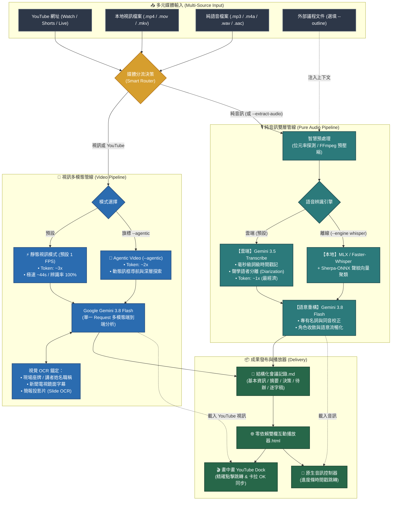

# Meeting Transcribe Agent

[](LICENSE)
[](https://github.com/google-gemini/generative-ai-python)
[](https://ai.google.dev/)
[](https://ai.google.dev/)

[English (en)](README.md) | [繁體中文 (zh-TW)](README.zh-TW.md) | [简体中文 (zh-CN)](README.zh-CN.md) | [日本語 (ja)](README.ja.md) | [한국어 (ko)](README.ko.md)

## 📖 專案概述 (Overview)

**Meeting Transcribe Agent** 是一套基於 **Gemini 3.5 Transcribe** 與 **Gemini Agentic Video Understanding** 打造的全方位影音會議記錄生成 Agent，具備「多模態視訊處理（YouTube / 本地影片）」與「純音訊高精度雙層架構」。專為公務市政主管會議、跨國技術週會以及訪談法務存證等高度要求「時間戳絕對精準」、「發言人切分」與「結構化決策記錄」的專業場景所打造。

### 依據媒介分流的雙軌智慧流水線：

1. **🎥 多模態視訊管線 (YouTube 連結 / 本地影片檔案)**：
   - **單一 Request 極致效能**：直接由 **Gemini 3.8 Flash** 進行視覺多模態端到端分析，同步閱讀簡報投影片（Slide OCR）與現場長官名牌／電視鏡面字幕，精確對應講者姓名職稱，省下 50% Token 消耗與等待時間（32 分鐘影片僅需 ~44 秒）。
   - **Agentic Video Understanding (`--agentic`)**：支援動態多輪訊框導航與工具調用，針對多小時長影片或複雜圖表進行深層視覺探索。
   - **畫中畫 YouTube Dock 播放器**：產出的獨立 HTML 播放器內建 YouTube IFrame 控制器，支援即時點擊時間軸跳轉視訊與卡拉 OK 歌詞式精準同步。

2. **🎙️ 純音訊高精度管線 (錄音筆 / Podcast / 語音音檔)**：
   - **底層聲學轉譯 (Gemini 3.5 Transcribe)**：專職毫秒級「詞級時間戳記 (Word Timestamps)」與物理聲學「語者分離 (Diarization)」，確保每一句話皆有真實聲波物理錨定，絕不跳漏。
   - **上層語意重構 (Gemini 3.8 Flash)**：前後文脈絡理解、同音專有名詞校正、發言人身分收斂與上下文語意流暢化，提煉決策摘要與待辦追蹤。
   - **本地離線備援**：支援本地 Apple Silicon GPU (MLX) / faster-whisper 搭配 Sherpa-ONNX 聲紋切分。

---

### 💡 為什麼要將「視訊（YouTube / 本地影片）」與「純音訊」分流處理？

在會議轉譯的真實場景中，「有畫面」與「純聲音」所乘載的情報密度具有根本性差異：

1. **視訊模式（保留畫面視覺脈絡，辨識率 100%）**：
   - **視覺 OCR 錨定**：會議經常包含座席名牌、電視台或直播下標字卡、投影簡報等。若一律抽取音軌降級為純聲音，便會完全喪失這些畫面線索，導致許多未在發言中自報姓名的長官、局處首長無法被識別。
   - **單一 Request 極致效率**：視訊直接透過多模態大模型（Gemini 3.8 Flash）進行端到端分析，能在單一請求中同步融合視覺字卡與語音語意，省下「先 ASR 轉文字、再送 LLM 重構」的往返延遲與重複 Prompt Token 消耗。
2. **純音訊模式（物理聲學分離，成本最經濟）**：
   - **缺乏畫面，依賴專用聲學模型**：錄音筆、Podcast 或電話訪談本身完全沒有影像畫面。此時專用的聲學語音辨識模型（Gemini 3.5 Transcribe 詞級時間戳與聲學分離 / 離線 Whisper + Sherpa-ONNX 聲紋向量聚類）能提供嚴格的聲波物理錨定，確保不跳句、不漏字。
   - **極致節省 Token**：純音訊每秒僅約 32 tokens，能以最低成本完成長時間錄音轉譯。

---

### 📊 運作模式與 Token 消耗量概估（經驗分享）

> [!NOTE]
> 實際 Token 消耗會因會議發言密度、畫面變動幅度與簡報細節而異。以下倍率僅為內部實測之概估經驗分享，非絕對標準，供架構選擇時參考：

* **1. 純音訊雙層管線 (Pure Audio Pipeline) — `~1x` 基準消耗**：
  - **機制與消耗**：純語音音訊每秒約 32 tokens（一小時音訊約在數萬至十多萬 Tokens 區間）。
  - **經驗定位**：**成本最經濟、最省 Token**。專為錄音筆、Podcast、電話訪談等「無畫面需求」之純聲音場景設計，由專用聲學模型嚴格錨定字級時間戳與語者切分。
* **2. Gemini Agentic Video Understanding — `~2x` 消耗**：
  - **機制與消耗**：採用 Google 最新推出的 [Gemini Agentic Video](https://blog.google/innovation-and-ai/models-and-research/gemini-models/introducing-agentic-video-in-gemini/) 技術。消耗約為純音訊的 **2 倍左右**。
  - **經驗定位**：**本專案推薦之視訊深度理解模式（`--agentic`）**。模型不再盲目掃描所有訊框，而是結合思考快取（Thinking Cache）與動態工具調用，主動在關鍵時刻探索高解析畫面。特別適合數小時長篇會議、簡報圖表密集、需跨時間軸深度推論的場景。
* **3. Traditional Gemini Video Understanding — `~3x` 消耗**：
  - **機制與消耗**：傳統視訊多模態多採每秒固定 1 訊框（1 FPS Uniform Sampling）硬性取樣，Token 消耗量最高（約為純音訊的 **3 倍以上**）。
  - **經驗定位**：**【本專案未採用，僅供對照參考】**。全片固定頻率取樣會傳入大量靜止或無意義的冗餘訊框，造成 Token 與等待時間的浪費。本專案透過 YouTube 原生直傳與 Agentic 智慧導航徹底取代了此種傳統方式。

---

## 🎯 核心功能與適用場景

### 它能為您做什麼？
- 📺 **直接支援 YouTube 連結與影片檔案**：貼上 YouTube 網址或影片路徑即可一鍵輸出完整會議記錄與互動播放器。
- 👁️ **視覺名牌與投影片輔助辨識**：利用視訊畫面上的字卡、背板、簡報標題，全自動推導真實人名與公務職稱。
- 🎙️ **高精度語者區分與逐字轉譯**：清楚標記每位與會者的發言起訖與真實姓名職稱。
- ✍️ **前後文理解與語意流暢化**：超越死板字典轉換，透過 LLM 前後文理解自動校正同音錯字（如專有名詞、官銜），並使轉譯內容符合自然語法與多語言環境。
- 📋 **高管級結構化會議記錄**：自動提取會議基本資訊、執行摘要、重大決策事項表、討論議題分析與具體待辦追蹤事項（Action Items）。
- 🌐 **零外部依賴互動式 HTML 播放器**：產出單一輕量 HTML 檔案，支援點擊字句即時跳轉音訊或視訊、語者色彩標記、關鍵字即時搜尋與多國語系切換。

### 適用場景
1. **市政與公務公開會議**：許多政府公開會議直接於 YouTube 直播，系統可直接貼入連結自動辨識市長、局處長名牌字幕，免下載免抽音軌。
2. **長篇線上研討會與產品發表會**：結合投影片畫面與講者發言，提煉大綱與技術細節。
3. **公務機關實體會議錄音**：數十位局處長輪番發言，需精確紀錄案由、裁示要點並消除長音訊聲紋漂移。
4. **本機語音辨識備援需求**：具備本機 Whisper 離線語音辨識引擎，可在網路受限或特定音訊處理需求下作為本機轉譯備援方案。

---

## 🚀 雙引擎架構 (Dual-Engine Architecture)

### 1. 全雲端極速模式（預設核心）
* **雙模型架構**：採用 **Google Gemini 3.5 Transcribe**（多模態語音辨識與聲學切分）搭配 **Gemini 3.8 Flash**（結構化會議重構與摘要）。
* **智慧音訊預處理 (Smart Ingestion)**：自動探測音訊位元率與檔案體積。原始低碼率檔案免轉碼直傳，高碼率音訊則自適應壓縮至最佳串流品質，避免無謂的編碼與頻寬消耗。
* **雙軌非同步並行，發言人身分統一 (Dual-Track Concurrency with Unified Speaker Identity)**：
  * 先解析出唯一權威的發言人對照表，再將「核心決策摘要」與「長篇逐字稿修復」拆分為兩個獨立軌道並行生成，確保兩軌輸出的發言人稱呼完全一致，同時徹底解決長篇文本循序輸出的阻塞問題。
  * 關閉思考預熱延遲（Zero Thinking Budget），實現即時的首字串流響應。
* **零殘留隱私保護**：音訊經由 Google Cloud Storage 暫存上傳，轉譯完成後自動呼叫清理機制銷毀雲端暫存，不留資料隱患。

### 2. 本地語音辨識備援模式（Whisper + Sherpa-ONNX）
* **本機聲學辨識備援**：支援在網路受限或特定本機 ASR 需求下，於第一階段利用本機模型提取詞級時間戳記與聲學切分。
* **跨平台硬體加速**：支援 Apple Silicon GPU 原生加速（`mlx-whisper`）或跨平台 CPU/CUDA（`faster-whisper`）。
* **聲學特徵向量聚類**：整合 **Sherpa-ONNX (3D-Speaker / PyAnnote)** 進行本機聲學特徵抽取與語者區分。
* **雙指針滑動窗口對齊 (Sliding Window)**：採用線性掃描算法實現單詞時間戳記與聲紋區間的毫秒級精確匹配，確保語者標記連續穩定。

---

## 🤖 Agent 對話使用指南 (推薦情境與 Prompt 範例)

本專案主要作為 **AI Agent Skill** 使用。您**不需要**手動輸入複雜的命令列參數，只需在對話框中向 Agent 提出需求，Agent 便會自主調度後台轉譯管線：

### 常用情境與對話範例：

1. **📺 YouTube 影片會議轉譯（極速視覺辨識名牌與簡報）**：
   > 「請幫我轉譯這場 YouTube 上的市政會議 `https://www.youtube.com/watch?v=VIDEO_ID`，利用畫面上的首長名牌和簡報投影片產出完整會議記錄與互動播放器。」

2. **🤖 YouTube 長篇會議深層探索（啟用 Agentic Video Understanding）**：
   > 「這部 YouTube 研討會長達 3 小時 `https://www.youtube.com/watch?v=...`，請使用 Agentic Video 模式幫我做深度訊框導航，重點提煉各講者的架構圖和討論結論。」

3. **🎥 本地影片檔案轉譯（同步提取投影片內容）**：
   > 「請轉譯這份會議影片 `tech_summit.mp4`，請一併參考簡報投影片畫面，校對講者姓名與架構術語。」

4. **⚡ 影片強制抽音軌（追求極致節省 Token）**：
   > 「這份影片檔 `interview.mp4` 畫面只是固定鏡頭，請直接幫我抽取音軌跑純音訊流程，以最省 Token 的方式產出摘要。」

5. **🎙️ 標準純音訊會議轉譯（全自動雲端極速處理）**：
   > 「請幫我轉譯這場會議錄音 `meeting.mp3`，整理出重點摘要、決策事項與逐字稿播放器。」

6. **📑 搭配會議大綱／通知文件（強烈推薦：人名與術語最精準）**：
   > 「這是今天技術會議的錄音 `backend_sync.m4a`，旁邊附有會議通知 `agenda.md`。請幫我轉譯並校對人名職稱與專有名詞。」

7. **🌐 指定會議摘要語言（如跨國團隊需英文記錄）**：
   > 「Please transcribe `executive_call.mp3`. Keep the verbatim transcript in original languages, but generate the executive summary and action items in English.」

---

## 🏗️ 核心處理流水線 (Pipeline Architecture)



### 🔄 處理管線詳細步驟說明 (Pipeline Steps Explained)

系統在接收到輸入後，依據媒體屬性分為 **「分流決策」**、**「雙軌處理」** 與 **「成果發布」** 三大階段：

#### 步驟 1：輸入媒體檢測與智慧分流 (Smart Router)
- **YouTube 網址**（包含 `youtube.com/watch`, `youtu.be/`, Shorts 與 Live 錄影）或 **本地影片**（`.mp4`, `.mov`, `.mkv`, `.webm`）：自動分流至 **🎥 視訊多模態管線**。
- **純語音檔案**（`.mp3`, `.m4a`, `.wav`, `.aac`, `.flac`）或加入 `--extract-audio` 旗標者：自動分流至 **🎙️ 純音訊雙層管線**。

---

#### 步驟 2A：視訊多模態處理流程 (YouTube 與本地影片)
1. **雲端直傳與暫存優化**：
   - **YouTube**：直接將 YouTube URL 傳入 Gemini 多模態 API，免本地下載、免 `yt-dlp`，徹底規避 YouTube 429 頻率限制。
   - **本地影片**：若檔案超過 250MB，後台自動轉碼為 720p 輕量 H.264，上傳至 Google Cloud Storage 暫存（並於處理完畢後立即自動銷毀）。
2. **多模態端到端分析 (Single-Request)**：
   - **預設模式 (靜態訊框 1 FPS)**：極速（約數十秒）同步完成簡報 Slide OCR、現場長官座牌字卡與語音對齊。
   - **Agentic 模式 (`--agentic`)**：啟用動態訊框導航與工具調用，專門深入探索數小時長影片的細部投影片與關鍵段落。
3. **一步到位提煉**：直接輸出帶真實姓名職稱的 6 大章節會議記錄與時間戳記逐字稿，無需二度呼叫 LLM 重構。

---

#### 步驟 2B：純音訊雙層處理流程 (純語音錄音檔)
1. **智慧預處理 (Smart Ingestion)**：自動探測音訊位元率，低碼率直傳免轉碼；高碼率音訊自動以 FFmpeg 預壓縮為 16kHz mono 最佳語音格式。
2. **術語與角色預先探勘 (選填)**：若有傳入議程大綱 (`--outline`)，提煉與會名單與專有名詞對照表。
3. **底層聲學轉譯 (ASR & Diarization)**：
   - **雲端模式 (預設)**：透過 `gemini-3.5-transcribe` 進行聲波物理分離與詞級時間戳記提取（Cloud Storage 暫存自動銷毀）。
   - **本地模式 (`--engine whisper`)**：在 Apple Silicon GPU 或 CPU 本地執行 Whisper 辨識，並結合 Sherpa-ONNX 進行聲學特徵向量聚類與滑動窗口對齊。
4. **上層語意重構 (Semantic Restructuring)**：
   - 由 `gemini-3.8-flash` 進行前後文理解、同音字校正、角色名稱收斂平滑與語法流暢化，提煉出決策摘要與待辦表格。

---

#### 步驟 3：成果發布與雙欄播放器生成 (Delivery)
1. **結構化會議記錄 Markdown**：存檔為 `<檔名>_會議記錄.md`，內含會議資訊、高管摘要、討論議題、重大決策、待辦追蹤與發言逐字稿。
2. **零依賴互動式 HTML 播放器**：存檔為 `<檔名>_player.html`：
   - **YouTube 輸入**：右下角自動嵌入畫中畫可縮放之 YouTube 視訊視窗，點擊逐字稿秒數精確跳轉 YouTube 播放位置。（*註：因 YouTube 官方安全政策強制要求 HTTP/HTTPS 來源，直接以 `file://` 開啟會觸發錯誤 153，建議搭配 `--serve` 參數自動啟動本機伺服器，或以 `python3 -m http.server 8000` 開啟*）。
   - **音訊/本地影片**：底欄內建原生音訊控制器，支援進度條拖曳、倍速調整與卡拉 OK 歌詞式語者即時高亮。

### 產出成果檔案：
每次轉譯完成後，會在音訊同層目錄自動產出：
1. **📄 `<檔案名>_會議記錄.md`**：完整結構化會議記錄（基本資訊、重點摘要、專題討論、決策事項、待辦追蹤與帶時間戳記發言逐字稿）。
2. **🌐 `<檔案名>_player.html`**：獨立零外部依賴的**雙欄互動式音訊審閱播放器**。
3. **📚 `<檔案名>_glossary.md`**：**全域權威術語與人員對照表**（若有啟用探勘）。

---

## 📦 安裝與環境設定 (Quick Setup)

### 1. 系統依賴 (FFmpeg)
用於音訊格式探測與預壓縮：
- **macOS**: `brew install ffmpeg`
- **Ubuntu/Debian**: `sudo apt update && sudo apt install ffmpeg`
- **Windows**: `winget install Gyan.FFmpeg`

### 2. 安裝 Python 套件

**雲端預設模式套件**：
```bash
pip install google-genai google-cloud-storage
```

**離線備援模式可選套件（如需使用本機 Whisper 與聲紋切分）**：
```bash
# Apple Silicon Mac (推薦 GPU 加速)
pip install mlx-whisper sherpa-onnx

# 通用平台 (CPU / NVIDIA CUDA)
pip install faster-whisper sherpa-onnx
```

### 3. 建立 GCS 暫存 Bucket
Gemini 呼叫全面改用 **Vertex AI + Application Default Credentials**，不再支援 AI Studio API Key。本機音訊/影片需要先暫存到 GCS，才能以 `gs://` URI 餵給 Gemini（YouTube 網址與 `--engine whisper` 不需要）：
```bash
gcloud auth application-default login

cd terraform
terraform init
terraform apply -var="project_id=YOUR_GCP_PROJECT_ID" -var="region=us-central1"
```
這會一併建立 `raw/` 前綴的生命週期規則（上傳後約 2 天自動刪除）與一個專屬服務帳號。

接著設定環境變數（或複製 `.env.example` 為 `.env` 填入）：
```bash
export GOOGLE_CLOUD_PROJECT="your-gcp-project-id"
export GOOGLE_CLOUD_LOCATION="us-central1"
export MEETING_STORAGE_BUCKET="your-bucket-name"
```

### 4. 安裝為 Agent Skill
本專案符合通用 Agent Skill 規格，可直接安裝至您的 AI 工作區：
- **Google Antigravity 全域技能**：
  ```bash
  git clone https://github.com/sylphlin/meeting-transcribe-agent.git ~/.gemini/config/skills/meeting-transcribe-agent
  ```
- **工作區專屬技能 (Workspace Skill)**：
  ```bash
  git clone https://github.com/sylphlin/meeting-transcribe-agent.git .agent/skills/meeting-transcribe-agent
  ```
- **Claude Code / Cursor / Windsurf**：
  Clone 至相應平台的 skills 目錄（如 `~/.claude/skills/`）即可自動被 Agent 索引調用。

---

## 📂 專案目錄結構

```text
meeting-transcribe-agent/
├── SKILL.md                          # Agent Skill 專用作業手冊與參數架構
├── README.md                         # 專案介紹、使用情境與技術架構
├── LICENSE                           # MIT 開源授權
├── .gitignore                        # 忽略測試音訊與本機快取
├── .env.example                      # API Key 環境變數範例
├── meeting_transcribe.py             # 根目錄命令列入口
├── scripts/                          # 核心模組
│   ├── __init__.py
│   ├── meeting_transcribe.py         # 主流程調度器 (支援雙引擎)
│   ├── audio_utils.py                # 智慧碼率探測與 FFmpeg 預壓縮
│   ├── gemini_engine.py              # Gemini 3.5 Transcribe 轉譯與 3.8 Flash 雙軌重構
│   ├── diarization.py                # 本地聲學切分 (Sherpa-ONNX) 與滑動窗口對齊
│   ├── glossary.py                   # 雙軌專有名詞探勘
│   ├── canonicalizer.py              # 聲學分群收斂與語者正規化
│   └── html_generator.py             # 現代獨立 HTML 播放器生成器
└── assets/                           # 播放器模板與提示詞
    ├── player_template.html          # 互動式會議播放器模板
    └── prompts/                      # 提示詞模板目錄
```

---

## 💻 進階：開發者與命令列呼叫 (Developer & Headless CLI)

> [!TIP]
> **一般使用者注意**：如果您是透過 AI Agent（如 Antigravity / Claude Code）使用本系統，您**不需要手動輸入這些命令**！Agent 會依據對話自動閱讀 `SKILL.md` 並配置最佳參數。
>
> 以下內容僅供開發者進行本機除錯、批次腳本自動化或無頭伺服器排程參考：

### 基本執行（YouTube 影片）
```bash
# YouTube 影片直接轉譯與生成播放器（高鐵極速多模態模式）
python3 meeting_transcribe.py "https://www.youtube.com/watch?v=VIDEO_ID"

# 啟用 Agentic Video Understanding 動態訊框導航
python3 meeting_transcribe.py "https://www.youtube.com/watch?v=VIDEO_ID" --agentic
```

### 基本執行（音訊與本地檔案）
```bash
# 雲端純音訊預設模式
python3 meeting_transcribe.py "會議錄音.mp3"

# 本地離線備援執行（Apple Silicon GPU / Sherpa-ONNX）
python3 meeting_transcribe.py "會議錄音.mp3" --engine whisper --whisper-backend auto
```

### 帶會議大綱與指定輸出語言
```bash
python3 meeting_transcribe.py "會議錄音.mp3" --outline "agenda.txt" --summary-language en
```

### 完整參數手冊

| 參數 | 說明 | 預設值 |
| :--- | :--- | :--- |
| `input_source` | 音訊/影片檔案路徑 (mp3, m4a, wav, mp4, mov 等) 或 YouTube 網址 | *(必填)* |
| `-o, --output` | 自訂 Markdown 會議記錄輸出路徑 | `<檔名>_minutes.md` |
| `--agentic` | 啟用 Agentic Video Understanding 動態訊框導航與工具調用（視訊/YouTube） | `False` |
| `--extract-audio` | 強制自視訊檔案抽取純音軌走純音訊流程 | `False` |
| `--engine` | 純音訊轉譯引擎：`gemini` (雲端預設) 或 `whisper` (本地離線備援) | `gemini` |
| `--whisper-backend` | 離線模式後端：`auto` (自動偵測 Apple Silicon MLX), `mlx`, `faster-whisper` | `auto` |
| `--whisper-model` | 離線模式模型大小 (`tiny`, `base`, `small`, `medium`, `large-v3`) | `small` |
| `--no-diarization` | 停用離線模式的聲學聲紋切分 | `False` |
| `--clustering-threshold` | Sherpa-ONNX 聲學聚類閥值 | `0.68` |
| `--num-speakers` | 精確與會發言人人數（已知時填寫，-1 為自動偵測） | `-1` |
| `--embedding-type` | Sherpa-ONNX 聲紋特徵抽取模型 (`eres2net`, `cam++`) | `eres2net` |
| `--project` | Vertex AI 的 GCP 專案 (預設讀取 `GOOGLE_CLOUD_PROJECT`/`GCP_PROJECT`，或 ADC 預設專案) | `None` |
| `--region` | Vertex AI 的 GCP 區域 (預設讀取 `GOOGLE_CLOUD_LOCATION`/`GCP_REGION`) | `us-central1` |
| `--bucket` | 暫存本機音訊/影片的 GCS bucket (預設讀取 `MEETING_STORAGE_BUCKET`) | `None` |
| `--transcribe-model` | 雲端轉譯語音辨識模型 | `gemini-3.5-transcribe` |
| `--summary-model` | 結構化會議記錄與視覺模型 | `gemini-3.8-flash` |
| `--outline` | 外部會議通知、大綱或議程檔案路徑 (.txt / .md) | `None` |
| `--force-glossary` | 強制重新提取全域術語對照表 (覆蓋快取) | `False` |
| `--no-glossary` | 跳過全域術語對照表提取 | `False` |
| `--no-player` | 停用獨立互動式 HTML 播放器生成 | `False` |
| `--no-compress` | 停用上傳前 FFmpeg 自動預壓縮 | `False` |
| `--summary-language` | 指定會議記錄語言 (`auto` 自動跟隨對話；或 `en`, `zh-TW`, `ja` 等) | `None` (auto) |
| `--only-transcript` | 僅執行第一階段轉譯輸出純逐字稿，跳過結構化摘要 | `False` |
| `--language` | 離線 Whisper 語音語言代碼 (`auto`, `en`, `zh`, `ja`) | `auto` |
| `--serve` | 自動啟動輕量本機 HTTP 伺服器並開啟瀏覽器（YouTube 視訊同步播放推薦） | `False` |

---

## 📄 授權條款 (License)

本專案採用 [MIT License](LICENSE) 開源授權。

