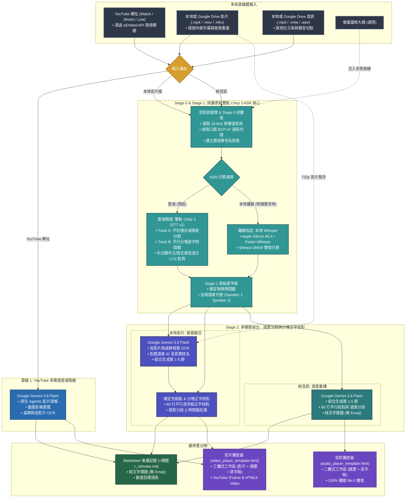

# Meeting Transcribe Agent

[](LICENSE)
[](https://github.com/google-gemini/generative-ai-python)
[](https://cloud.google.com/speech-to-text)
[](https://ai.google.dev/)

[English (en)](README.md) | [繁體中文 (zh-TW)](README.zh-TW.md) | [简体中文 (zh-CN)](README.zh-CN.md) | [日本語 (ja)](README.ja.md) | [한국어 (ko)](README.ko.md)

## 專案總覽 (Overview)

**Meeting Transcribe Agent** 是基於 **Google Cloud Speech-to-Text v2 雙軌 Chirp 3 (`chirp_3`)** 與 **Gemini 3.8 Flash (`gemini-3.8-flash`)** 的多模態會議記錄與逐字稿生成系統。系統支援 YouTube 網址、本地影片檔、Google Drive 分享連結與純音訊錄音檔。每次執行皆會產出結構化 Markdown 會議記錄與獨立的互動式 HTML 播放器。

### 三大專屬處理管線

1. **YouTube 多模態雲端管線 (Cloud Direct Ingestion)**：
   - **雲端直接串流**：將 YouTube 網址直接傳送至 **Gemini 3.8 Flash**，無須下載本地影片檔。
   - **Agentic 影片理解**：自動瀏覽關鍵畫面以辨識簡報投影片、桌牌與畫面字卡（Lower-Thirds）。
   - **互動式 YouTube 播放器**：產出獨立三欄式 HTML 播放器，支援逐字稿同步捲動與點擊時間戳跳轉。

2. **本地影片雙階段融合管線 (Acoustic Ground Truth + Vision Fusion)**：
   - **內嵌字幕提取**：自動檢查影片容器中的內嵌字幕軌（`mov_text`, `srt`, `vtt`）或同名 `.srt` 字幕檔，作為與會者名單與議程參考。
   - **Stage 0（專有名詞表與語系偵測）**：建立領域專有名詞對照表，並偵測主要口語 `BCP-47` 語言代碼（例如 `cmn-Hant-TW`、`en-US`、`ja-JP`）。
   - **Stage 1（雙軌 Chirp 3 聲學基準語音轉錄）**：提取 16 kHz 單聲道 MP3 音訊，透過 **雙軌 Cloud Speech-to-Text v2 Chirp 3 (`chirp_3`)**（預設）或 **本地 Whisper + Sherpa-ONNX**（明確指定離線模式時）進行語音轉錄，鎖定全域一致的語者代號（`Speaker 1`, `Speaker 2`）與物理逐字時間戳 `[MM:SS - MM:SS]`。
   - **Stage 2（多模態視覺融合、語意分段與分塊校對）**：大型影片（>250 MB）自動以 Apple Silicon `VideoToolbox` 硬體加速壓縮為 720p H.264（`10 fps`、`1 秒 GOP -g 10`、`+faststart`，具備 `libx264` 自動降級）以加速雲端上傳與 Agentic 投影片跳轉抽幀，並連同 Stage 1 逐字稿送入 **Gemini 3.8 Flash**。模型讀取簡報畫面與桌牌以生成第 1–5 節摘要，並以 60 行對話為單位平行校對第 6 節逐字稿的字體（如轉換為臺灣正體中文）、專有名詞與長篇獨白語意分段（`<PARA>`），再由系統將語意段落精準反推回物理逐字時間戳。
   - **確定性語者組裝**：Python 程式依據字幕重疊、多模態時段規則與交接語氣整合真實人名與職稱，確保零時間戳偏移。

3. **純音訊高精準管線 (Voice Recorders & Podcasts)**：
   - **Stage 0（專有名詞表與語系偵測）**：從音訊提取專有名詞並識別主要口語語言代碼。
   - **Stage 1（雙軌 Chirp 3 聲學語音轉錄）**：使用 **雙軌 Chirp 3 (`chirp_3`)**（或離線 Whisper + Sherpa-ONNX）產出全域語者分群與帶時間戳的語者對話。
   - **Stage 2（高階摘要、語意分段與字體校對）**：使用 **Gemini 3.8 Flash** 生成高階主管摘要、行動項目表，並針對第 6 節逐字稿進行平行正字校對與語意段落切分。

---

### 為何採用「雙軌 Chirp 3 (Dual-Pass Chirp 3)」架構？

傳統將長音訊切塊（Chunking）進行語音轉錄的做法，在長篇會議中會面臨兩大結構性瓶頸：
1. **跨區塊語者代號重置與交接吞噬 (Speaker Drift & Handover Swallowing)**：每 15 分鐘切分音訊會導致各區塊的語者聲紋代號重置（`spk_0`, `spk_1` 無法跨區塊連貫）；且自回歸模型在主持人引言交接給下一位講者時，容易將兩人的發言合併為同一語者。
2. **Cloud STT v2 逐字時間戳的 20 分鐘上限**：Google Cloud Speech-to-Text v2 (`chirp_3`) 在開啟 `enableWordTimeOffsets=True` 時，單次 `BatchRecognize` 限制音訊長度不得超過 20 分鐘；但當 `enableWordTimeOffsets=False` 時，單次請求可直接處理長達 8 小時的完整音訊並維持全域語者分群。

為了同時兼顧**「跨數小時的全域語者一致性」**與**「毫秒級逐字時間戳」**，Stage 1 採用雙軌平行架構：
- **Track A — 全域巨觀語者分群 (Macro Global Diarization)**：以不切塊的完整 16 kHz 單聲道音訊執行單次 `BatchRecognize`（`enableSpeakerDiarization=True`、`enableWordTimeOffsets=False`），在整場會議中維持單一全域聲紋空間，精準捕捉快速語者切換。
- **Track B — 微觀逐字時間戳提取 (Micro Word Timestamps)**：將音訊切分為 18 分鐘（`1080s`）並帶 5 秒重疊視窗的平行分塊（`enableWordTimeOffsets=True`、`enableSpeakerDiarization=False`），於重疊區間中點自動去重，確保時間戳嚴格單調遞增。
- **Track B 物理時間軸為主 + LCS 語者標籤指派 (`AlignmentEngine`)**：以 Track B 的物理逐字時間戳為主時間軸，透過混合式中日韓單字元 + 西文單詞最長公共子序列（LCS）演算法，將 Track A 的全域語者標籤指派到每個字詞（Track A 在比對前先做簡繁轉換）。以 FFmpeg `silencedetect` 偵測物理語音起點，濾除開頭靜音內的雜訊 token。發言起點取 `floor`、結束取 `ceil`，確保跳轉不會落在前一位語者的尾音內。雙軌皆內建重複迴圈抑制（Repetition Loop Suppression）。
- **Stage 2 語意段落分段與物理時間戳反推**：當單一講者進行數分鐘長篇發言時，**Gemini 3.8 Flash** 會在 Stage 2 校對時依主題轉換插入 `<PARA>` 語意分段標記；`AlignmentEngine` 隨即根據底層逐字時間戳反推出每個語意段落的精準起訖秒數，並在互動式播放器中以同語者視覺串接卡片（`isGrouped`）呈現，兼顧閱讀舒適度與獨立跳轉播放。

---

### 為何區分「YouTube」、「本地影片」與「純音訊」三種管線？

不同媒體來源具備不同的時間基準與視覺資訊密度：

1. **YouTube 影片**：
   - Google 雲端骨幹已預先建立 YouTube 影片的聲學時間軸索引。
   - 透過 **Gemini 3.8 Flash** 直接雲端串流即可在單次請求中同時分析影音，免除本地下載。
2. **本地影片檔**：
   - 本地影片缺乏雲端預先索引的聲學時鐘。
   - 先由 Stage 1 雙軌 Chirp 3 鎖定全域語者與物理時間戳，再由 Stage 2 視覺融合讀取投影片與桌牌，可避免長影片時間軸漂移與輸出截斷。
3. **純音訊錄音**：
   - 錄音筆與 Podcast 不含視覺畫面。
   - 使用專用聲學模型處理全域語者分群與逐字時間戳，具備最佳成本與準確度效益。

---

### Token 消耗基準估算 (Benchmarks)

> [!NOTE]
> 實際 Token 消耗取決於語音密度與畫面變化頻率。以下倍數為長篇會議之實測基準參考。

* **1. 純音訊管線（`~1x` 基準值）**：
  - **消耗量**：Stage 1 由 Cloud STT v2 (`chirp_3`) 執行聲學轉錄，Stage 2 由 **Gemini 3.8 Flash** 處理純文字合成與校對。
  - **適用場景**：純音訊檔案（`meeting_recording.mp3`、Podcast、訪談），兼具精準時間戳與最低 Token 成本。
* **2. Gemini Agentic 影片理解（`~2x` 基準值）**：
  - **消耗量**：約為純音訊基準值的 2 倍。
  - **適用場景**：所有影片管線的預設模式（`media_processing=types.MediaProcessing.AGENTIC`）。模型僅在投影片或語者切換時動態調閱高解析度影格。
* **3. 傳統 1 FPS 固定取樣（`~3x+` 基準值）**：
  - **消耗量**：純音訊基準值的 3 倍以上。
  - **狀態**：本專案不採用此模式，僅列出供基準對照。

---

## 核心功能與適用場景

### 核心功能
- **多來源媒體輸入**：支援 YouTube 網址、Google Drive 分享連結、本地影片檔與本地音訊檔。
- **雙軌 Chirp 3 全域語者分群**：徹底消除長篇會議跨切塊語者代號漂移與主持人交接吞噬問題。
- **內嵌字幕提取**：自動探測影片容器中的 `mov_text`、`srt` 與 `vtt` 字幕軌以建立出席名單與時間軸參考。
- **階層式語者正名**：結合畫面桌牌、字卡與口頭介紹，將代號（`Speaker 1`, `spk_0`）對應至真實姓名與職稱。
- **Stage 2 分塊正字校對與語意分段**：以 60 行對話為單位平行校對第 6 節逐字稿，統一目標正體/繁體字形與領域專有名詞，並將長篇獨白切分為具備物理時間戳的語意段落。
- **動態多語系在地化**：第 1–5 節標題、屬性欄位與表格依目標語系動態生成，第 6 節則嚴格保留各語者的原始發言語言。
- **純文字專業排版**：遵守零 Emoji 規範，所有章節標題與表格皆採用純文字企業級排版。
- **零依賴互動式 HTML 播放器**：產出三欄式影片播放器（`video_player_template.html`）或支援 100% 離線 `file://` 開啟的二欄式音訊播放器（`audio_player_template.html`），支援同語者連續段落視覺合併（`isGrouped`）。

### 適用場景
1. **政府與市政會議**：直接處理 YouTube 直播會議，從畫面桌牌自動辨識官員姓名與職稱。
2. **技術研討會與演講**：結合簡報投影片文字與演講內容，整理出結構化技術摘要。
3. **多人高階主管會議**：在數小時的長篇會議中維持全域一致的語者追蹤與待辦行動項目。
4. **離線本地轉錄需求**：在網路受限或機密環境下，明確指定本地離線模式（`mlx-whisper` 或 `faster-whisper` 搭配 Sherpa-ONNX）。

---

## 雙引擎架構 (Dual-Engine Architecture)

### 1. 雲端雙軌 Chirp 3 + Vertex AI 模式（預設）
* **雙模型協同**：由 **Cloud Speech-to-Text v2 Chirp 3**（`TRANSCRIBE_MODEL=chirp_3`，僅限 Chirp 系列模型）負責雙軌聲學語者分群與逐字時間戳，**Gemini 3.8 Flash**（`SUMMARY_MODEL=gemini-3.8-flash`）負責多模態分析、語意分段與分塊校對。
* **雙軌平行執行**：同時啟動 Track A（不切塊全域語者分群）與 Track B（18 分鐘平行切塊逐字時間戳 + 5 秒重疊區間中點去重）。
* **確定性物理時間軸語者指派與反推**：以 Track B 逐字時間戳為主，透過中日韓字元與西文單詞混合 LCS 演算法指派 Track A 語者標籤，濾除 FFmpeg 語音起點之前的 token，並將 Stage 2 語意分段反推回物理逐字邊界。
* **GCS 雙層生命週期管理**：暫存於 `gs://<bucket>/raw/` 的原始媒體於推論完成後在 `finally` 區塊即時清理（並由 2 天生命週期規則兜底），最終產出物則保留 15 天。

### 2. 本地離線模式（僅限明確要求）
* **明確啟用機制**：僅在使用者於對話中明確要求「本地/離線轉錄」時啟動，系統絕不自動降級或靜默切換。
* **硬體加速**：支援 Apple Silicon GPU 原生加速（`mlx-whisper`）或跨平台 CPU/CUDA（`faster-whisper`）。
* **聲學聲紋分群**：整合 **Sherpa-ONNX**（`eres2net` 或 `cam++`）提取本地聲紋特徵並對齊逐字時間戳。

---

## Antigravity 操作方式與使用情境 (Usage & Scenarios)

在 Antigravity 中，您可以透過以下兩種方式操作 **Meeting Transcribe Agent**：

1. **極簡指令（`/` 指定技能 + `@` 標記檔案，推薦）**：輸入 `/meeting-transcribe-agent` 選取技能，並用 `@` 標記音訊、影片或議程檔案，僅需列出關鍵欄位（如 `檔案: @XX, 議程: @YY`），無須多餘說明。
2. **口語表達（自然語言自動觸發）**：直接用日常口語描述轉錄與摘要需求，Antigravity 會自動識別意圖並呼叫此 Plugin。

所有產出檔案（`<標題>_minutes.md`、`<標題>_player.html` 與專有名詞表）預設皆會自動隔離儲存於原始媒體目錄下的 `output/` 子目錄。

### 情境 1：純音訊會議錄音轉錄與結構化紀要
適用於錄音筆、電話會議或訪談音訊，自動產出 6 大結構化章節與可離線開啟的二欄式互動音訊播放器。

- **極簡指令**：
  ```text
  /meeting-transcribe-agent 檔案: @meeting_recording.mp3, 主題: Executive_Board_Meeting, 與會者: John Doe, Jane Smith
  ```
- **口語表達**：
  ```text
  幫我把 @meeting_recording.mp3 轉成會議記錄與逐字稿，主題是「Executive_Board_Meeting」，與會者有 John Doe 和 Jane Smith。
  ```

### 情境 2：本地影片或 YouTube 演講轉錄（含投影片與桌牌視覺辨識）
自動辨識畫面上的簡報標題、架構圖、名牌與字卡，產出三欄式影音同步播放器。

- **極簡指令**：
  ```text
  /meeting-transcribe-agent 影片: @conference_video.mp4, 語言: 繁體中文
  ```
  *（YouTube 連結寫法：`/meeting-transcribe-agent 連結: https://www.youtube.com/watch?v=VIDEO_ID, 語言: 繁體中文`）*
- **口語表達**：
  ```text
  請分析 @conference_video.mp4 的畫面投影片與講者發言，產出繁體中文會議紀要與互動式播放器。
  ```

### 情境 3：搭配會議議程或背景文件校正專有名詞
提供會議議程或出席名單檔案，讓系統自動對齊與會者真實職稱與領域術語。

- **極簡指令**：
  ```text
  /meeting-transcribe-agent 檔案: @meeting_recording.mp3, 議程: @agenda.md
  ```
- **口語表達**：
  ```text
  請參考 @agenda.md 的議程與出席名單，將 @meeting_recording.mp3 轉成逐字稿與會議紀要。
  ```

### 情境 4：跨語系會議摘要（第 6 節保留原音，第 1–5 節指定語言）
適用於跨國會議：第 6 節逐字稿嚴格保留各講者的原始發言語言，而第 1–5 節高階主管摘要與待辦事項則以指定語言撰寫。

- **極簡指令**：
  ```text
  /meeting-transcribe-agent 檔案: @meeting_recording.mp3, 摘要語言: 繁體中文
  ```
- **口語表達**：
  ```text
  請轉錄這場英文會議 @meeting_recording.mp3，第 6 節保留英文原音逐字稿，第 1 到 5 節摘要與行動項目請用繁體中文撰寫。
  ```

### 情境 5：機密會議指定本地離線模式轉錄
在需要離線處理音訊時，明確要求使用本地 Whisper 與 Sherpa-ONNX 聲紋分群。

- **極簡指令**：
  ```text
  /meeting-transcribe-agent 檔案: @meeting_recording.mp3, 模式: 本地離線轉錄, 語者人數: 4
  ```
- **口語表達**：
  ```text
  這場會議請用本地離線模式轉錄 @meeting_recording.mp3，現場共有 4 位與會者。
  ```

---

## 管線架構圖 (Pipeline Architecture)


```mermaid
flowchart TD
    classDef inputStyle fill:#2D3748,stroke:#4A5568,stroke-width:2px,color:#fff;
    classDef routerStyle fill:#D69E2E,stroke:#B7791F,stroke-width:2px,color:#fff;
    classDef videoStyle fill:#2B6CB0,stroke:#2C5282,stroke-width:2px,color:#fff;
    classDef fusionStyle fill:#4C51BF,stroke:#3C366B,stroke-width:2px,color:#fff;
    classDef audioStyle fill:#2C7A7B,stroke:#234E52,stroke-width:2px,color:#fff;
    classDef asrStyle fill:#319795,stroke:#285E61,stroke-width:2px,color:#fff;
    classDef outputStyle fill:#276749,stroke:#1C4532,stroke-width:2px,color:#fff;
    classDef playerStyle fill:#6B46C1,stroke:#553C9A,stroke-width:2px,color:#fff;

    subgraph Input["多來源媒體輸入"]
        Y["YouTube 網址 (Watch / Shorts / Live)<br>• 透過 oEmbed API 取得標題"]:::inputStyle
        V["本地或 Google Drive 影片 (.mp4 / .mov / .mkv)<br>• 探測內嵌字幕與視覺畫面"]:::inputStyle
        A["本地或 Google Drive 音訊 (.mp3 / .m4a / .wav)<br>• 探測位元率與靜音切點"]:::inputStyle
        O["會議議程大綱 (選用)"]:::inputStyle
    end

    Router{"輸入路由"}:::routerStyle

    Y --> Router
    V --> Router
    A --> Router

    subgraph YouTubeTrack["管線 1: YouTube 多模態雲端管線"]
        GeminiFlash["Google Gemini 3.8 Flash<br>• 原生 Agentic 影片理解<br>• 動態影格瀏覽<br>• 桌牌與投影片 OCR"]:::videoStyle
    end

    subgraph SharedASR["Stage 0 & Stage 1: 詞彙表與雙軌 Chirp 3 ASR 核心"]
        ExtractTrack["音訊前處理 & Stage 0 詞彙表<br>• 提取 16 kHz 單聲道音訊<br>• 偵測口語 BCP-47 語系代碼<br>• 建立領域專有名詞表"]:::asrStyle
        ASREngine{"ASR 引擎選擇"}:::asrStyle
        ASR_Chirp["雲端預設: 雙軌 Chirp 3 (STT v2)<br>• Track A: 不切塊全域語者分群<br>• Track B: 平行分塊逐字時間戳<br>• 中日韓字元/西文單詞混合 LCS 對齊"]:::asrStyle
        ASR_Whisper["離線指定: 本地 Whisper<br>• Apple Silicon MLX / Faster-Whisper<br>• Sherpa-ONNX 聲紋分群"]:::asrStyle
        RawTranscript["Stage 1 原始逐字稿<br>• 鎖定物理時間戳<br>• 全域語者代號 (Speaker 1, Speaker 2)"]:::asrStyle

        ExtractTrack --> ASREngine
        ASREngine -- "雲端 (預設)" --> ASR_Chirp --> RawTranscript
        ASREngine -- "本地離線 (明確要求時)" --> ASR_Whisper --> RawTranscript
        O -. "注入背景脈絡" .-> ExtractTrack
    end

    subgraph Stage2Divergence["Stage 2: 多模態綜合、語意分段與分塊正字校對"]
        subgraph LocalVideoStage2["本地影片: 視覺融合"]
            Stage2Video["Google Gemini 3.8 Flash<br>• 投影片與桌牌視覺 OCR<br>• 對應語者 ID 至真實姓名<br>• 綜合生成第 1-5 節"]:::fusionStyle
            Deterministic["確定性組裝 & 分塊正字校對<br>• 60 行平行逐字稿正字校對<br>• 語意分段 (<PARA>) 時間戳反推"]:::fusionStyle
            Stage2Video --> Deterministic
        end

        subgraph AudioStage2["純音訊: 語意重構"]
            Restructure["Google Gemini 3.8 Flash<br>• 綜合生成第 1-5 節<br>• 60 行平行校對與 <PARA> 語意分段<br>• 純文字標題 (無 Emoji)"]:::audioStyle
        end
    end

    Router -- "YouTube 網址" --> GeminiFlash
    Router -- "本地影片檔" --> ExtractTrack
    Router -- "純音訊" --> ExtractTrack

    RawTranscript --> Stage2Video
    V -. "720p 影片暫存" .-> Stage2Video
    RawTranscript --> Deterministic
    RawTranscript --> Restructure

    subgraph Delivery["最終產出物"]
        MD["Markdown 會議記錄 (<標題>_minutes.md)<br>• 純文字標題 (無 Emoji)<br>• 動態目標語系"]:::outputStyle
        VPlayer["影片播放器 (video_player_template.html)<br>• 三欄式工作區 (影片 + 摘要 + 逐字稿)<br>• YouTube IFrame & HTML5 Video"]:::playerStyle
        APlayer["音訊播放器 (audio_player_template.html)<br>• 二欄式工作區 (摘要 + 逐字稿)<br>• 100% 離線 file:// 播放"]:::playerStyle
    end

    GeminiFlash --> MD
    GeminiFlash --> VPlayer
    Deterministic --> MD
    Deterministic --> VPlayer
    Restructure --> MD
    Restructure --> APlayer
```

---

## 安裝與部署 (Installation & Deployment)

請依執行環境選擇以下兩種安裝部署方式之一：

| 部署方式 | 目標環境 | 安裝工具 | 主要操作介面 |
| :--- | :--- | :--- | :--- |
| **方式一：Google Antigravity & Agent Plugins** | 本地 Antigravity IDE 與 Agent Skill | `pip` / `uv` + `./setup.sh` | Antigravity IDE 對話視窗 |
| **方式二：Gemini Enterprise** | Cloud Vertex AI Agent Runtime | `./deploy.sh`（原生 `gcloud`） | Gemini Enterprise Web UI、Agent Engine、A2A |

---

### 系統前置需求

1. **安裝 FFmpeg**：
   - **macOS**：`brew install ffmpeg`
   - **Ubuntu / Debian**：`sudo apt update && sudo apt install ffmpeg`
   - **Windows**：`winget install Gyan.FFmpeg`

2. **設定 Google Cloud ADC 驗證**：
   執行以下指令以授權 Vertex AI、Cloud Speech-to-Text v2 與 Cloud Storage 存取權限：
   ```bash
   gcloud auth application-default login
   ```

---

### 方式一：Google Antigravity Plugin 與 Skill 安裝

1. **安裝為 Agent Plugin（建議方式）**：
   - **全域安裝（Global Plugin）**：
     ```bash
     git clone https://github.com/sylphlin/meeting-transcribe-agent.git ~/.gemini/config/plugins/meeting-transcribe-agent
     ```
   - **工作區安裝（Workspace Plugin）**：
     ```bash
     git clone https://github.com/sylphlin/meeting-transcribe-agent.git .agents/plugins/meeting-transcribe-agent
     ```
   - **舊版獨立 Skill 目錄安裝（`~/.gemini/config/skills/` 相容方式）**：
     若要在僅支援舊版單一 Skill 目錄的環境中使用，請將內層 `skills/meeting-transcribe-agent` 子目錄連結至 `skills/`：
     ```bash
     git clone https://github.com/sylphlin/meeting-transcribe-agent.git ~/.gemini/config/plugins/meeting-transcribe-agent
     ln -s ~/.gemini/config/plugins/meeting-transcribe-agent/skills/meeting-transcribe-agent ~/.gemini/config/skills/meeting-transcribe-agent
     ```

2. **安裝 Python 相依套件**：
   ```bash
   pip install google-genai google-cloud-storage requests
   ```
   *（選用離線 Whisper 套件：Apple Silicon 請執行 `pip install mlx-whisper sherpa-onnx`；Linux/Windows 請執行 `pip install faster-whisper sherpa-onnx`）。*

3. **初始化 Google Cloud 環境 (`./setup.sh`)**：
   執行 `setup.sh` 自動完成雲端環境設定：
   - 驗證 ADC 憑證狀態。
   - 啟用 Vertex AI、Cloud Speech-to-Text、Cloud Storage 與 Google Drive API。
   - 建立儲存桶並設定 CORS 與雙層生命週期規則（`raw/`：2 天；產出物：15 天）。
   - 自動產生 `.env` 設定檔（`TRANSCRIBE_MODEL=chirp_3`、`SUMMARY_MODEL=gemini-3.8-flash`、`STT_LOCATION=us`）。
   ```bash
   cd ~/.gemini/config/plugins/meeting-transcribe-agent
   chmod +x setup.sh
   ./setup.sh --project YOUR_GCP_PROJECT_ID
   ```

4. **在 Antigravity 中開始使用**：
   直接在 Antigravity 對話視窗輸入：
   ```text
   /meeting-transcribe-agent 檔案: @meeting_recording.mp3
   ```

### 專案目錄結構（Agent Plugins 1.0 標準規範）
```text
meeting-transcribe-agent/
├── plugin.json                                           # Agent Plugins 1.0 宣告清單
├── rules/
│   └── AGENTS.md                                         # 打包於 Plugin 內的客戶端執行期守則（唯讀與 Fail-Fast）
├── skills/
│   └── meeting-transcribe-agent/                         # 標準技能套件主幹（Single Source of Truth）
│       ├── SKILL.md                                      # 技能規範與 Agent 專用 CLI 參數參考手冊
│       ├── scripts/                                      # 核心轉錄、雙軌 Chirp 3、對齊引擎與視覺融合模組 (SSOT)
│       └── assets/                                       # 播放器模板與提示詞規範實體目錄 (SSOT)
├── AGENTS.md                                             # 工作區與開發工程規範（Part I 執行守則 & Part II 開發規範）
└── setup.sh / deploy.sh                                  # 原生 gcloud 雲端環境配置與部署腳本
```

---

### 方式二：Gemini Enterprise 雲端部署 (Vertex AI Agent Runtime)

透過 ADK 2.0 與 `agents-cli` 將代理部署至 Google Cloud Vertex AI Agent Runtime。`deploy.sh` 全程採用原生 `gcloud` 指令，無須安裝 Terraform。

1. **安裝 `google-agents-cli`**：
   ```bash
   uv tool install google-agents-cli
   ```

2. **執行一鍵部署 (`./deploy.sh`)**：
   `deploy.sh` 會自動呼叫 `setup.sh` 配置雲端資源、部署至 Vertex AI Agent Runtime 並註冊至 Gemini Enterprise：
   ```bash
   chmod +x setup.sh deploy.sh

   # 依 .env 或 gcloud 預設專案部署：
   ./deploy.sh

   # 明確指定專案 ID 與區域：
   ./deploy.sh --project YOUR_GCP_PROJECT_ID --region us-central1

   # 預覽執行指令而不實際變更雲端資源：
   ./deploy.sh --dry-run
   ```

---

## Google Drive 分享連結與 GCS 生命週期規則

`meeting-transcribe-agent` 支援透過 ADC（`drive.readonly` 權限）直接下載 Google Drive 檔案，並透過遠端 MD5 雜湊值進行本地快取驗證與 UTF-8 中日韓檔名自動還原。

### 1. 初始化雲端與 Google Drive 存取權限 (`./setup.sh`)
```bash
# 步驟 1：授權包含 Google Drive 唯讀權限的 ADC
gcloud auth application-default login --scopes="https://www.googleapis.com/auth/cloud-platform,https://www.googleapis.com/auth/drive.readonly"

# 步驟 2：啟用 Vertex AI / Cloud Speech-to-Text / GCS / Drive API 並建立雙層生命週期規則
./setup.sh --project YOUR_GCP_PROJECT_ID
```

### 2. 支援的 Google Drive 應用情境

| 情境 | Antigravity 指令範例 | 快取與自動化處理行為 |
| :--- | :--- | :--- |
| **情境 A：Google Drive 上的會議影片**<br/>*(MP4 / MOV)* | `/meeting-transcribe-agent 影片: https://drive.google.com/file/d/FILE_ID/view` | 透過 Drive API v3 檢查 `md5Checksum`、快取至 `gdrive_inputs/`、還原 UTF-8 檔名、提取 16 kHz 音訊、暫存 720p 影片至 GCS `raw/`，並執行 Stage 1 雙軌 Chirp 3 + Stage 2 視覺融合。 |
| **情境 B：Google Drive 上的會議錄音**<br/>*(M4A / MP3 / WAV)* | `/meeting-transcribe-agent 檔案: https://drive.google.com/file/d/FILE_ID/view, 議程: @agenda.md` | 驗證 MD5 快取、執行 Stage 0 語系與專有名詞偵測，並以雙軌 Chirp 3 (`chirp_3`) 與 Gemini 3.8 Flash 產出會議記錄。 |

### 3. GCS 儲存桶雙層自動清理規則（`raw/` 2 天 / 產出物 15 天）

| GCS 路徑前綴 (`matchesPrefix`) | 儲存內容 | 保留天數 (`age`) | 規則說明 |
| :--- | :--- | :--- | :--- |
| **`raw/`** | 暫存音訊切片與 720p 影片 (`raw/<filename>`) | **2 天 (`age: 2`)** | 保留短期暫存供重複執行時快取命中，滿 2 天由 GCS 自動刪除。 |
| **`minutes/`**、**`players/`**、**`output/`**、**`deliverables/`** | Markdown 會議記錄 (`.md`) 與互動式播放器 (`.html`) | **15 天 (`age: 15`)** | 保留最終產出物 15 天供團隊檢視與下載，期滿自動清理。 |

---

## 授權條款 (License)

本專案採用 [MIT License](LICENSE) 授權。
